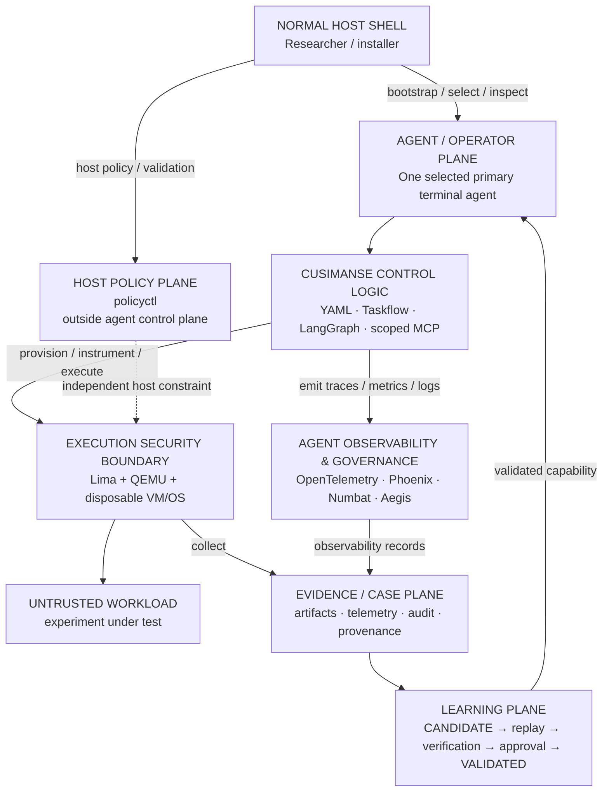

# 🦝 Cusimanse

> **Autonomous, agentic security research platform for controlled workload detonation, runtime analysis, anomaly detection and evidence extraction inside disposable virtual machines.**

Cusimanse lets a researcher define a security experiment, select one primary terminal agent, execute the workload in a disposable Lima/QEMU VM, collect evidence, verify findings, and preserve artifacts before destroying the VM.

> **Markdown specifies. YAML configures. Agent adapters operate. Policy constrains. Audit records. Evidence proves. Learning reuses only what has been verified.**

Cusimanse is a security research platform, not a production malware sandbox or a claim of sandbox-escape resistance.

## Architecture

Cusimanse separates the **host policy plane**, **agent/operator plane**, **agent observability & governance plane**, **execution boundary**, **evidence plane**, and **learning plane**.




### Components

| Plane / component | Responsibility |
|---|---|
| **Host shell** | Installation, execute-bit repair, environment setup, preflight and result inspection |
| **Host policy plane** | `policyctl`; independent host-side policy/configuration controls |
| **Agent/operator plane** | One selected primary terminal agent drives the research workflow |
| **Control logic** | YAML contracts, campaigns, Taskflow stages, LangGraph state and scoped MCP |
| **Observability & governance plane** | OpenTelemetry traces/metrics/logs plus Phoenix, Numbat and Aegis integrations when verified adapters are deployed |
| **VM execution boundary** | Lima/QEMU/VM/OS isolation, mounts, credentials, privilege and network controls |
| **Evidence/case plane** | Durable artifacts, telemetry, findings, execution records and provenance |
| **Learning plane** | Candidate skills, replay, independent verification, approval and validated reuse |

**Security boundary:** the VM/OS and its configured resource, filesystem, credential, privilege and network controls. Agents, prompts, skills, MCP, observability systems, LangGraph, Taskflow and vector stores are not isolation mechanisms.

## System requirements

- Linux or macOS research host
- 4+ CPU cores recommended; 8 GB RAM minimum, 16 GB+ recommended
- 20 GB free disk minimum; 50 GB+ recommended for VM images/evidence
- Lima + QEMU with hardware virtualization where available
- Git, Bash, curl, Go, Python 3 and Ruby
- One supported primary terminal agent
- Network access for installation and permitted research enrichment

See [`docs/system-requirements.md`](docs/system-requirements.md) for host configuration, environment and observability details.

## Researcher testing

### 1. Host shell — prepare

```bash
git clone https://github.com/Opposum0112/Cusimanse.git
cd Cusimanse
git checkout architecture-refactor

./scripts/prerequisites.sh
./scripts/agent-preflight.sh
./policyctl validate
bash ./scripts/tests/validate-project.sh
```

The host installer repairs and verifies required script execute bits and configures `PATH`, `GOPATH` and `GOBIN`.

For the complete research profile and observability foundation:

```bash
CUSIMANSE_INSTALL_PRODUCTION_PROFILE=1 ./scripts/prerequisites.sh
CUSIMANSE_INSTALL_OBSERVABILITY=1 ./scripts/prerequisites.sh
bash ./scripts/tests/production-validation.sh
```

A Go host setup entrypoint is also available:

```bash
go run ./cmd/cusimanse-host
```

It interactively selects mandatory setup, the full optional research profile, or observability setup while reusing the trusted prerequisite script.

### 2. Agent shell — operate

Start exactly one primary terminal agent from the host shell. The agent shell is the operator boundary: it reads contracts, drives the case, provisions the VM, directs workload execution into the VM, collects evidence, analyzes and verifies results, and handles learning.

```bash
export CUSIMANSE_PRIMARY_ADAPTER=prime-agent
prime-agent --help
prime-agent
```

Or:

```bash
export CUSIMANSE_PRIMARY_ADAPTER=hermes
hermes --help
hermes
```

**Prompt boundary:** host setup and `policyctl` remain outside the agent prompt. Never ask the agent to invoke `policyctl`. Workload commands execute inside the disposable VM through the agent-driven workflow, not on the host.

### 3. Agent shell — run a reference test

```text
Run experiments/go-install-001 using the Cusimanse research workflow.

Maintain case state according to the orchestration contract. Provision the
Lima/QEMU disposable VM, execute the workload inside that VM, collect telemetry
and evidence, independently verify the result, preserve artifacts, then destroy
the disposable VM.

Do not modify policyctl or bypass approval controls.

Return PASS, PARTIAL, FAIL or NOT_DEPLOYED according to preserved evidence.
PASS requires actual runtime evidence.
```

### 4. Host shell — inspect

```bash
find evidence blackboard experiments/go-install-001 -maxdepth 4 -type f -print 2>/dev/null
find runs -maxdepth 4 -type f -print 2>/dev/null
./policyctl validate
bash ./scripts/tests/validate-project.sh
bash ./scripts/tests/production-validation.sh
```

`PASS` requires actual runtime evidence. Static validation is not runtime PASS.

## Self-learning

```text
Evidence → CANDIDATE skill → replay on distinct artifact
        → independent verification → human approval
        → VALIDATED skill → indexed retrieval
```

A successful LLM interaction does not become trusted knowledge. Skills retain provenance, capability metadata and evaluation history.

## Repository structure

```text
Cusimanse/
├── .agents/                 # agent instructions, skills and MCP configuration
├── recipes/                 # campaigns, agents, workflows, orchestration, tools, MCP
├── skills/validated/        # versioned validated capabilities
├── tools/                   # project tool integrations
├── experiments/             # reference experiments
├── scripts/                 # host/bootstrap/test scripts
├── cmd/cusimanse-host/      # Go host configuration entrypoint
├── cmd/policyctl/           # host-side policy utility
└── docs/                    # architecture and operational documentation
```

## Validation

```bash
bash ./scripts/tests/production-validation.sh
```

Validation checks architecture contracts, script execute bits, shell/YAML structure, Go validation, host environment configuration, observability requirements, reference-experiment compatibility, policyctl separation, VM-boundary documentation and skill-promotion requirements.

## Security invariants

- Untrusted workloads execute in disposable VMs.
- Workload execution is separated from the normal host shell.
- `policyctl` remains outside the agent control plane.
- Host credentials are not exposed to learned skills.
- Unrestricted host-root mounts are denied.
- Destructive/privileged actions require approval.
- Public MCP exposure is denied by default.
- Observability is for tracing, governance and audit—not isolation.
- Retrieval does not grant execution authority.
- Evidence is preserved before VM destruction.
- Learned capabilities require replay and independent verification before promotion.
