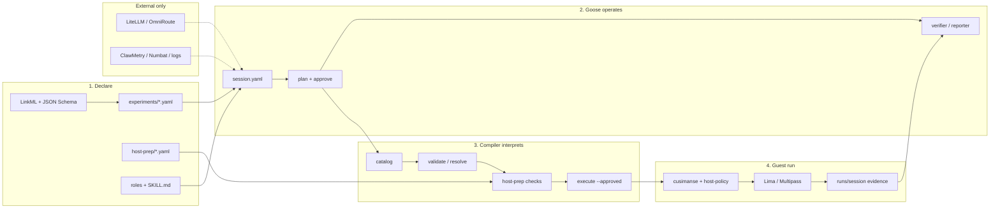

# Cusimanse (`agentic-native-goose`)

Goose-driven research lab. One typed YAML experiment. Goose plans, installs from a declared host-prep list, orchestrates roles, requests approval, runs the compiler, reads evidence, and writes the report.

Beta. Not a certified sandbox.

## Table of contents

1. [Layers](#layers)
2. [Architecture](#architecture)
3. [Components](#components)
4. [Repository structure](#repository-structure)
5. [Which shell](#which-shell)
6. [Install](#install)
7. [Example: npm-install-001 end to end](#example-npm-install-001-end-to-end)
8. [Access and observability](#access-and-observability)
9. [Report generation](#report-generation)
10. [Compiler commands](#compiler-commands)
11. [Tests and CI](#tests-and-ci)
12. [Safety](#safety)

## Layers

| Layer | Files | Who runs it |
|---|---|---|
| Contract schema | `schemas/cusimanse.yaml`, `schemas/experiment.schema.json` | Maintainer |
| Experiment | `experiments/<id>.yaml` | Researcher |
| Host bootstrap catalog | `host-prep/default.yaml` | Goose via compiler |
| Roles / skills | `roles/`, `skills/` | Goose Summon |
| Operator recipe | `recipes/goose/session.yaml` | Goose |
| Compiler | `cmd/compile` | Goose or bash |
| Provision | `cmd/cusimanse` after `--approved` | Compiler |
| Guest | Lima or Multipass | Compiler/engine |
| Gateway / observability | LiteLLM, OmniRoute, ClawMetry, Numbat | External |

## Architecture



Same drawing: `docs/architecture/agentic-native-goose.mmd`.

**Read left to right.** The researcher writes YAML. Goose is the only session operator. The compiler is the only thing allowed to turn YAML ids into host-prep, provision, and the pinned workload. Gateways and metrics sit beside Goose; they do not authorize a run.

## Components

| Component | Short job |
|---|---|
| **LinkML schema** | Legal fields and enums (`workload`, `os`, `roles`, …). |
| **Experiment YAML** | One study: question, scope, workload id, acceptance. |
| **Goose recipe** | Plans the session, asks for approval, Summons specialists. |
| **Roles + skills** | Operator may call compile. Verifier/reporter only read `runs/`. |
| **Host-prep YAML** | Allow-listed host tools (essential, compute, observability, gateway). |
| **Compiler** | `catalog` / `validate` / `host-prep` / `resolve` / `execute`. Fail-closed. |
| **cusimanse + policy** | After `--approved`, start the guest and enforce `policies/host-policy.yaml`. |
| **Disposable VM** | Where `npm-install` (or other handler) actually runs. |
| **runs/** | Hashed evidence, verification, research report. |
| **LiteLLM / OmniRoute** | Model transport only. |
| **ClawMetry / Numbat** | Observe the agent and the session; optional. |

## Repository structure

```text
schemas/              LinkML + JSON Schema
experiments/          researcher contracts
host-prep/            declared install catalog
roles/ skills/        specialist roles
recipes/goose/        one Goose recipe
cmd/compile           YAML interpreter
cmd/cusimanse         VM/policy engine (called by execute)
internal/compiler     compiler library
internal/policy       used at execute time
policies/host-policy.yaml
scripts/install.sh    optional installer referenced by host-prep
scripts/tests/        compiler + integration
```

## Which shell

| Task | Where |
|---|---|
| git clone, install.sh, go test | Normal bash/zsh |
| Drive the experiment | Goose |
| Debug YAML | Normal shell + `go run ./cmd/compile` |
| npm install under test | Guest only, after execute |

## Install

Normal shell:

```bash
git clone https://github.com/Opposum0112/Cusimanse.git
cd Cusimanse
git checkout agentic-native-goose
./scripts/install.sh
export PATH="$HOME/.local/bin:$HOME/go/bin:$PATH"
go version
goose --version
```

## Example: npm-install-001 end to end

### 1. Contract (already in repo)

See `experiments/npm-install-001.yaml`. Workload id `npm-install` maps to a trusted handler. Do not put npm flags in that file.

### 2. Validate the catalog (normal shell)

```bash
go run ./cmd/compile catalog
go run ./cmd/compile validate npm-install-001
go run ./cmd/compile host-prep npm-install-001
go run ./cmd/compile resolve npm-install-001
```

### 3. Operate in Goose

```bash
goose recipe validate recipes/goose/session.yaml
goose run --recipe recipes/goose/session.yaml --params experiment=npm-install-001
```

Goose calls validate → host-prep → resolve → you approve → `compile execute --approved`. Evidence lands under `runs/<session>/`.

### 4. Report

Verifier writes `runs/<session>/verification/result.md`. Reporter writes `runs/<session>/research-report/report.md` from hashed evidence.

## Access and observability

Declared on the experiment (`spec.observability`) and in `host-prep/default.yaml`. They do not authorize `execute`.

## Report generation

Acceptance lines in the experiment YAML are the checklist. `PARTIAL` if a collector was `NOT_DEPLOYED`.

## Compiler commands

```bash
go run ./cmd/compile catalog
go run ./cmd/compile validate <id>
go run ./cmd/compile host-prep <id>
go run ./cmd/compile resolve <id>
go run ./cmd/compile execute <id> --approved
```

## Tests and CI

```bash
go test ./internal/compiler ./cmd/compile ./cmd/cusimanse ./internal/validation
bash ./scripts/tests/integration.sh
```

## Safety

Do not run the workload on the host. `--approved` is required. Unknown workload ids fail closed.
