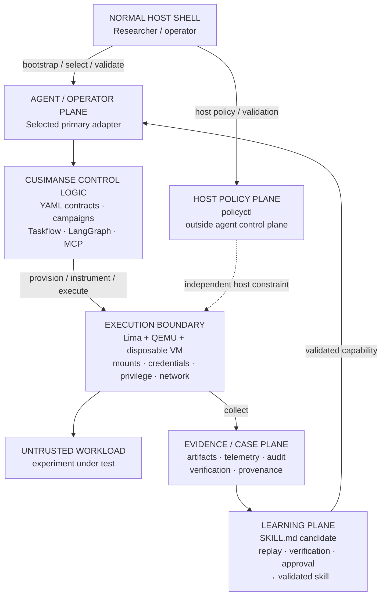

# 🦝 Cusimanse

> **Autonomous, agentic security research platform for controlled workload detonation, runtime analysis, anomaly detection and evidence extraction inside disposable virtual machines.**

Cusimanse lets a researcher define a security experiment, select one primary terminal agent, execute the workload in a disposable Lima/QEMU VM, collect evidence, verify findings, and preserve artifacts before destroying the VM.

> **Markdown specifies. YAML configures. Agent adapters operate. Policy constrains. Audit records. Evidence proves. Learning reuses only what has been verified.**

Cusimanse is a security research platform, not a production malware sandbox or a claim of sandbox-escape resistance.

## Architecture

Cusimanse separates the **host policy plane**, **agent/operator plane**, **execution boundary**, **evidence plane**, and **learning plane**.




### Components

| Plane / component | Responsibility |
|---|---|
| **Host shell** | Installation, preflight, adapter selection and result inspection |
| **Host policy plane** | `policyctl`; independent policy/configuration and observability controls |
| **Agent/operator plane** | One selected primary agent drives the research workflow |
| **YAML / Taskflow / LangGraph** | Campaign semantics, task sequence and stateful execution |
| **MCP** | Scoped research tools and data access |
| **VM execution boundary** | Lima/QEMU/VM/OS isolation, mounts, credentials, privilege and network controls |
| **Evidence/case plane** | Durable artifacts, telemetry, findings, execution records and provenance |
| **Learning plane** | Candidate skills, replay, independent verification, approval and validated reuse |

**Security boundary:** the VM/OS and its configured resource, filesystem, credential, privilege and network controls. Agents, prompts, skills, MCP, LangGraph, Taskflow and vector stores are not isolation mechanisms.

## Researcher testing

Use this section as the short path for testing Cusimanse. Detailed engineering notes remain in `docs/`.

### 1. Host shell — prepare the test environment

```bash
git clone https://github.com/Opposum0112/Cusimanse.git
cd Cusimanse
git checkout production-architecture

./scripts/prerequisites.sh
./scripts/agent-preflight.sh
./policyctl validate
bash ./scripts/tests/validate-project.sh
```

For the architecture/runtime integration profile:

```bash
CUSIMANSE_INSTALL_ARCH_REFACTOR=1 ./scripts/prerequisites.sh
bash ./scripts/tests/architecture-refactor.sh
```

The environment variable is retained for compatibility with the existing installer; the architecture itself is now production-oriented and is no longer described as a refactor in the user-facing documentation.

### 2. Agent shell — select the primary operator

Start one supported primary agent from the **host shell**, then operate the test through that agent shell.

```bash
export CUSIMANSE_PRIMARY_ADAPTER=prime-agent
prime-agent --help
prime-agent
```

Or:

```bash
export CUSIMANSE_PRIMARY_ADAPTER=hermes
hermes --help
hermes
```

The agent shell is the operator boundary: it reads the Cusimanse contracts, plans and drives the case, provisions the disposable VM, executes the workload through the VM, collects evidence, analyzes and verifies results, and performs the learning workflow.

**Prompt boundary:** host setup and `policyctl` stay outside the agent prompt. Do not ask the agent to invoke `policyctl`. Workload commands are directed into the disposable VM; they are not host commands.

Paste this into the selected agent:

```text
Act as the primary operator for one Cusimanse security-research case.

Read:
  recipes/agents/self-learning-primary.yaml
  recipes/campaigns/security-research-learning.yaml
  recipes/workflows/security-research-taskflow.yaml
  recipes/orchestration/langgraph.yaml
  recipes/learning/skill-promotion.yaml

Run:
  Discover → Validate → Retrieve → Plan → Review → Approve →
  Provision VM → Instrument → Execute → Collect → Analyze →
  Verify → Learn → Promote → Preserve → Destroy

Boundaries:
- The disposable Lima/QEMU VM is the execution boundary for the workload.
- Workload commands execute inside the VM through the agent-driven workflow.
- Do not invoke policyctl; it is host-side and outside the agent control plane.
- Never expose host credentials to the workload or learned skills.
- Retrieval ranking never grants execution permission.
- Preserve evidence, telemetry, audit records, verification results and hashes before VM destruction.
- New learned procedures are CANDIDATE until replay, distinct-artifact testing, independent verification, provenance, capability checks and human approval are complete.
- If a required capability is unavailable, report NOT_DEPLOYED.
- Never report PASS without runtime evidence.

At completion report case ID, campaign, state, commands/tools used, VM state,
evidence paths, verification result, skill state and failed gates.
```

### 3. Agent shell — run the reference workload

Ask the same selected agent:

```text
Run experiments/go-install-001 using the Cusimanse research workflow.

Maintain case state according to the orchestration contract. Provision the
Lima/QEMU disposable VM, execute the workload inside that VM, collect telemetry
and evidence, independently verify the result, preserve artifacts, then destroy
the disposable VM.

Do not modify policyctl or bypass approval controls.

Return PASS, PARTIAL, FAIL or NOT_DEPLOYED according to preserved evidence.
PASS requires actual runtime evidence.
```

### 4. Host shell — inspect and validate

After the agent finishes, return to the normal host shell:

```bash
find evidence blackboard experiments/go-install-001 -maxdepth 4 -type f -print 2>/dev/null
find runs -maxdepth 4 -type f -print 2>/dev/null
./policyctl validate
bash ./scripts/tests/validate-project.sh
bash ./scripts/tests/architecture-refactor.sh
```

`PASS` means runtime behavior was demonstrated with preserved evidence. Static validation alone is never runtime PASS.

## Self-learning

```text
Evidence → CANDIDATE skill → replay on distinct artifact
        → independent verification → human approval
        → VALIDATED skill → indexed retrieval
```

A successful LLM interaction does not become trusted knowledge. Skills retain provenance, capability metadata and evaluation history.

## Repository structure

```text
Cusimanse/
├── .agents/                 # agent instructions, skills and MCP configuration
├── recipes/
│   ├── agents/              # primary-agent contracts
│   ├── campaigns/           # campaign semantics
│   ├── experiments/         # experiment definitions
│   ├── install/             # installation/bootstrap
│   ├── instrumentation/     # runtime instrumentation
│   ├── learning/            # learning/promotion
│   ├── lima/                # VM profiles
│   ├── mcp/                 # MCP profiles/registries
│   ├── orchestration/       # execution/state contracts
│   ├── routing/             # adapter routing
│   ├── stages/              # reusable stages
│   ├── tools/               # tool contracts
│   └── workflows/           # Taskflow-style workflows
├── skills/validated/        # versioned validated capabilities
├── tools/                   # project tool integrations
├── experiments/             # reference experiments
├── scripts/                 # host/bootstrap/test scripts
├── cmd/policyctl/           # host-side policy utility
└── docs/                    # architecture and operational documentation
```

## Validation

```bash
bash ./scripts/tests/architecture-refactor.sh
```

The architecture validation checks contracts, shell/YAML structure, Go validation, compatibility with the reference experiment, policyctl separation, VM-boundary documentation and skill-promotion requirements.

## Security invariants

- Untrusted workloads execute in disposable VMs.
- Workload execution is separated from the normal host shell.
- `policyctl` remains outside the agent control plane.
- Host credentials are not exposed to learned skills.
- Unrestricted host-root mounts are denied.
- Destructive/privileged actions require approval.
- Public MCP exposure is denied by default.
- Retrieval does not grant execution authority.
- Evidence is preserved before VM destruction.
- Learned capabilities require replay and independent verification before promotion.
