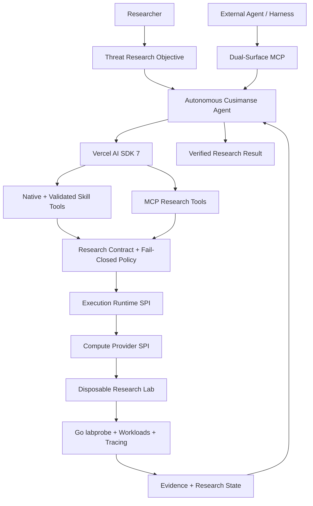

# Cusimanse

**Composable Autonomous Threat Research Agent Platform**

Cusimanse is a dedicated security-research agent that plans investigations, calls governed research tools, operates disposable labs, observes behavior, analyzes evidence, verifies findings, and produces reproducible research results.

> **The agent decides what to investigate next. Cusimanse policy decides what it is allowed to execute.**

Cusimanse is provider-neutral across **models, agent tools, execution runtimes, and compute backends**. Vercel AI SDK 7 provides the model and tool-calling substrate; Cusimanse provides the security-research methodology, governance, isolation, evidence, and research state.

## What can it investigate?

Cusimanse is designed for repeatable, evidence-driven security research:

- **Software supply-chain research** — observe package installation and build behavior.
- **Malware analysis** — investigate suspicious workloads inside disposable compute.
- **Vulnerability validation** — reproduce declared behavior within a bounded research scope.
- **Detection engineering** — collect process, filesystem, network, and kernel evidence.
- **Threat research** — test hypotheses and iteratively investigate observations.
- **Agentic security experiments** — let the researcher agent autonomously select the next governed research action.

## The autonomous research loop

A Cusimanse investigation is not just one model response. It is a controlled research loop:

```text
Research objective
       │
       ▼
     PLAN
       │
       ▼
Select capability / tool
       │
       ▼
Policy + approval ───────► DENY
       │
       ▼
    EXECUTE
       │
       ▼
    OBSERVE
       │
       ▼
Analyze evidence
       │
       ▼
Update research state
       │
       ├──── More evidence needed ────► PLAN
       │
       ▼
     VERIFY
       │
       ▼
  Seal evidence
       │
       ▼
 Research result
```

Autonomy does **not** mean unrestricted shell access. Model decisions are translated into typed research operations and remain subject to the declared research contract and fail-closed policy.

## Try it in minutes

### 1. Install

```bash
git clone https://github.com/Opposum0112/Cusimanse.git
cd Cusimanse
npm install
npm run build
npm link
```

### 2. Compile a research recipe

```bash
cusimanse compile recipes/examples/npm-install.yaml
```

The recipe is validated and compiled before execution.

### 3. Run with the hermetic Mock lab

```bash
cusimanse run recipes/examples/npm-install.yaml --provider mock --runtime local
```

Use `mock` for development and CI when you want a deterministic provider without a hypervisor.

### 4. Run on disposable compute

```bash
cusimanse run recipes/examples/npm-install.yaml --provider lima --runtime local
```

or:

```bash
cusimanse run recipes/examples/npm-install.yaml --provider multipass --runtime local
```

Lima requires `limactl`; Multipass requires `multipass`. Cloud/Firecracker is exposed through the compute-provider SPI and requires a configured adapter.

## Research recipes

Recipes describe **research intent**, not arbitrary shell commands.

```yaml
research_question:
  question: What happens when this package is installed?

scope:
  paths:
    - /workspace
  egress:
    mode: declared-only

allowed_capabilities:
  - vm.create
  - workload.npm.install
  - evidence.collect
  - network.observe

evidence_required:
  - type: process
  - type: network
  - type: log
```

The complete example is `recipes/examples/npm-install.yaml`. See `docs/recipe-authoring.md` for the contract.

## Agent tools and composable skills

The agent operates through typed research tools rather than unrestricted commands:

```text
create_lab
execute_workload
observe_processes
observe_network
observe_filesystem
query_telemetry
inspect_artifact
analyze_evidence
verify_finding
seal_evidence
destroy_lab
```

Validated skills extend this toolset without changing the agent core:

```text
skills/validated/<skill>/
├── SKILL.md       # research instructions
└── schema.json    # typed input contract
```

Cusimanse converts validated schemas into AI SDK tools and routes execution through policy and the active compute provider. Candidate skills remain non-executable until validated and promoted:

```bash
cusimanse skills promote skills/candidate/my-skill
```

## Model neutrality with Vercel AI SDK 7

Vercel AI SDK 7 is the **agent/model/tool-calling substrate**, not the security policy engine.

Supported provider families include:

| Provider | Typical use |
|---|---|
| OpenAI | Hosted models |
| Anthropic | Hosted models |
| Google | Gemini models |
| DeepSeek | API or OpenAI-compatible endpoint |
| Ollama | Local models through OpenAI-compatible endpoint |

Credentials can be supplied with:

- CLI: `--model`, `--api-key`, `--base-url`
- Environment: `ANTHROPIC_API_KEY`, `OPENAI_API_KEY`, `GEMINI_API_KEY`, `DEEPSEEK_API_KEY`, `OLLAMA_BASE_URL`
- Project/user configuration files

Secrets are configuration inputs and are not part of research recipes.

## Tool calling and governance

The model can choose the next tool, but a tool call is **not** an authorization.

```text
AI SDK 7 tool call
       │
       ▼
Typed Cusimanse operation
       │
       ▼
Research contract
       │
       ▼
Fail-closed policy
       │
       ▼
Approval where required
       │
       ▼
Execution runtime
       │
       ▼
Disposable compute
```

Unknown capabilities and operations are denied. The agent cannot use a model response to bypass scope, network, filesystem, lifecycle, or evidence requirements.

## Unified observability

Every investigation should be traceable from model activity through the security lab:

```text
AI/model event
      │
Tool call
      │
Policy decision
      │
Runtime step
      │
Compute operation
      │
labprobe telemetry
      │
Evidence
      │
Research state
```

Cusimanse correlates agent, model, tool, policy, runtime, compute, and evidence events using a shared `runId`/`traceId`. Application telemetry describes observable execution; it does not expose private model chain-of-thought.

## Provider-neutral execution

### Execution runtimes

```bash
cusimanse run recipe.yaml --runtime local --provider mock
cusimanse run recipe.yaml --runtime temporal --provider lima
cusimanse run recipe.yaml --runtime graph --provider lima
```

### Compute providers

| Provider | Purpose |
|---|---|
| `mock` | Hermetic development and CI |
| `lima` | Disposable VM research |
| `multipass` | Disposable Ubuntu VM research |
| `cloud` / Firecracker | Isolated provider boundary |

The model, execution runtime, and compute provider are independent choices.

## Dual-surface MCP interoperability

MCP is an **interoperability surface**, not the internal agent framework.

Cusimanse can expose an MCP surface for external agents/harnesses and can consume MCP-compatible research capabilities alongside native AI SDK tools:

```text
External Agent ──► Cusimanse MCP ──► Agent Core

Cusimanse Agent ──► Native Tools
              └──► MCP Research Tools
                         │
                         ▼
                   Policy Boundary
```

This keeps Cusimanse useful as a dedicated autonomous researcher while allowing other agents and research-tool ecosystems to interoperate with it.

## Operator API

Run the gateway when another application or agent should operate Cusimanse:

```bash
cusimanse serve --host 127.0.0.1 --port 8080
```

The Operator ABI provides HTTP/REST, JSON-RPC 2.0, and SSE telemetry. Primary operations include:

```text
experiment.run
evidence.inspect
skills.promote
providers.list
```

See `docs/operator-abi.md` for the interface.

## Architecture



### Architecture in one sentence

**The agent researches; AI SDK 7 provides model/tool calling; policy governs; runtimes orchestrate; compute isolates; labprobe observes; evidence verifies.**

## Development

```bash
npm run check-types
npm run lint
npm test
npm run test:coverage
```

Before contributing, read `CONTRIBUTING.md` and `SECURITY.md`.

## Project status

Cusimanse is under active development. The autonomous agent loop, full AI SDK observability, dual-surface MCP implementation, and production-grade provider integrations should be treated as incremental work rather than assumed complete merely from the architecture documentation.
