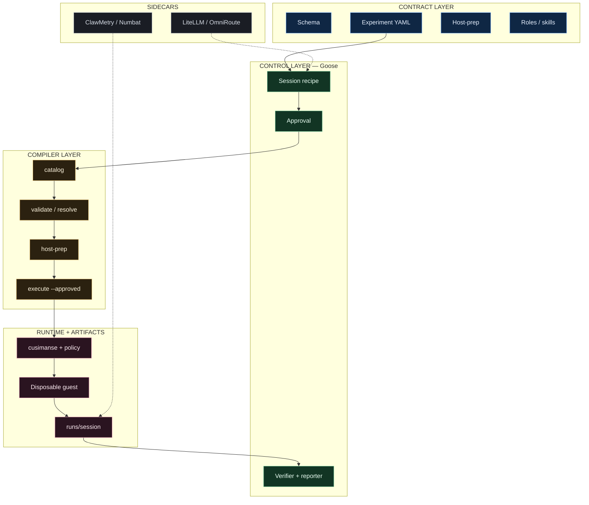

# Cusimanse (`agentic-native-goose`)

Goose-driven research lab. One typed YAML experiment. Goose plans, installs from a declared host-prep list, orchestrates roles, requests approval, runs the compiler, reads evidence, and writes the report.

Beta. Not a certified sandbox.

## Table of contents

1. [Layers](#layers)
2. [Architecture](#architecture)
3. [Components](#components)
4. [Research outputs (`runs/`)](#research-outputs-runs)
5. [Repository structure](#repository-structure)
6. [Which shell](#which-shell)
7. [Install](#install)
8. [Researcher workflow (npm-install-001)](#researcher-workflow-npm-install-001)
9. [YAML configuration set](#yaml-configuration-set)
10. [Access and observability](#access-and-observability)
11. [Report generation](#report-generation)
12. [Compiler commands](#compiler-commands)
13. [Validation and integration tests](#validation-and-integration-tests)
14. [Safety](#safety)

## Layers

| Layer | Files | Who runs it |
|---|---|---|
| Contract schema | `schemas/cusimanse.yaml`, `schemas/experiment.schema.json` | Maintainer |
| Experiment | `experiments/<id>.yaml` | Researcher |
| Host bootstrap catalog | `host-prep/default.yaml` | Goose via compiler |
| Roles / skills | `roles/`, `skills/` | Goose Summon |
| Operator recipe | `recipes/goose/session.yaml` | Goose |
| Compiler | `cmd/compile` | Goose or bash |
| Provision | `cmd/cusimanse` after `--approved` | Compiler |
| Guest | Lima or Multipass | Compiler/engine |
| Gateway / observability | LiteLLM, OmniRoute, ClawMetry, Numbat | External |

Policy file still used at execute time: `policies/host-policy.yaml`.

## Architecture

The lab is five stacked planes. The researcher never talks to the VM. Goose never invents a provision step. Sidecars never grant `--approved`.

1. **Contract** — LinkML schema plus one experiment YAML, a host-prep catalog, and role/skill files. This is the only place new studies are authored.
2. **Control** — Goose loads `recipes/goose/session.yaml`, plans the session, asks a human to approve, then Summons verifier and reporter.
3. **Compiler** — `cmd/compile` reads those YAML files: `catalog` → `validate` / `resolve` → `host-prep` → `execute --approved`. Unknown workload ids fail closed.
4. **Runtime** — after approval, `cusimanse` plus `policies/host-policy.yaml` start a disposable Lima or Multipass guest, run the pinned handler, hash evidence, then destroy the guest.
5. **Sidecars** — LiteLLM / OmniRoute carry models. ClawMetry / Numbat / Goose logs observe. Missing sidecars become `NOT_DEPLOYED` in the evidence index.

Authority moves **down** that stack. Evidence moves **up** into `runs/<session>/`.




## Components

| Layer | Component | Responsibility |
|---|---|---|
| Contract | LinkML + JSON Schema | Legal fields and enums |
| Contract | Experiment YAML | One study |
| Contract | Host-prep YAML | Allow-listed host tools |
| Contract | Roles + skills | Who may compile vs who only reads `runs/` |
| Control | Goose session | Plan, approve, Summon |
| Compiler | `cmd/compile` | Only interpreter of declarative YAML |
| Runtime | cusimanse + `host-policy.yaml` | Approved provision |
| Runtime | Disposable VM | Pinned workload |
| Runtime | `runs/` | Evidence, verification, report |
| Sidecar | LiteLLM / OmniRoute | Model transport |
| Sidecar | ClawMetry / Numbat | Optional observability |

## Research outputs (`runs/`)

Every approved execute creates **one session directory**. That tree is the citable research record. Chat text is not evidence.

```text
runs/<session-id>/
  session.yaml
  evidence/
    index.yaml
    audit/events.jsonl
    audit/manifest.sha256
    process/   syscall/   filesystem/   network/
  provenance/manifest.sha256
  analysis/summary.md
  verification/result.md
  research-report/report.md
  research-report/report.yaml
  preservation/manifest.yaml
  observability/token-usage.yaml
  observability/dashboard.yaml
```

`<session-id>` is typically `YYYYMMDDTHHMMSSZ-<experiment-id>`.

| Artifact | Key research output |
|---|---|
| `session.yaml` | Experiment, operator, lifecycle state |
| `evidence/*` | Guest observations |
| `*.sha256` | Integrity |
| `verification/result.md` | VERIFIED / NOT_VERIFIED / PARTIAL |
| `research-report/report.md` | Publishable findings |
| `preservation/manifest.yaml` | Kept before destroy |

Hashes are written **before** destroy. Verifier then reporter fill the markdown outputs.

## Repository structure

```text
Cusimanse/
  schemas/
    cusimanse.yaml                 LinkML source of truth
    experiment.schema.json         editor / CI schema
  experiments/
    npm-install-001.yaml
    npm-lifecycle-001.yaml
    npm-threat-001.yaml
    go-install-001.yaml
  host-prep/
    default.yaml                   declared host bootstrap
  roles/
    operator.yaml  verifier.yaml  reporter.yaml
    bindings.yaml  skill-registry.yaml
  skills/
    experiment-operate/SKILL.md
    host-prep-declared/SKILL.md
    evidence-read/SKILL.md
    verification/SKILL.md
    report/SKILL.md
  recipes/
    goose/session.yaml             only Goose operator recipe
    subrecipes/                    evidence-analysis, verification, report
    lima/  profiles/  gateway/     provision backends (engine)
  cmd/
    compile/                       YAML compiler Goose calls
    cusimanse/                     approved provision engine
  internal/
    compiler/  policy/  execution/ evidence/ model/
  policies/
    host-policy.yaml               loaded at execute
  scripts/
    install.sh
    tests/validate.sh
    tests/integration.sh
  .github/workflows/
    validate.yml
    agentic-native.yml
  runs/                            generated sessions (not source)
```

## Which shell

| Task | Where |
|---|---|
| git clone, `install.sh`, `go test` | Normal bash / zsh |
| Drive the experiment | Goose |
| Debug YAML | Normal shell + `go run ./cmd/compile` |
| Read artifacts | `ls runs/<session>/` |
| Workload (`npm install`) | Guest only |

## Install

```bash
git clone https://github.com/Opposum0112/Cusimanse.git
cd Cusimanse
git checkout agentic-native-goose
./scripts/install.sh
export PATH="$HOME/.local/bin:$HOME/go/bin:$PATH"
go version
goose --version
```

## Researcher workflow (npm-install-001)

### 1. Author the experiment (already in repo)

`experiments/npm-install-001.yaml` is the only researcher contract:

```yaml
apiVersion: cusimanse.dev/v1
kind: Experiment
metadata:
  id: npm-install-001
  title: Pinned npm install baseline
spec:
  question: Observe a pinned lodash install in a disposable Linux VM with lifecycle scripts disabled.
  hostPrep: default
  roles: [operator, verifier, reporter]
  scope:
    exclude: [host-execution, credentials, extra-mounts, postinstall-payloads, agent-escape]
  requirements:
    execution: disposable
    os: linux
    workload: npm-install
    network: localhost-only
    instrumentation: [process, syscall, filesystem, network]
  policyChecks: [vm, network, mounts]
  acceptance:
    - resolve binds npm-install handler
    - lodash installed with ignore-scripts in the guest
    - evidence hashed before destroy
  operator: goose
  observability:
    host: [clawmetry, goose-logs, token-usage]
    experiment: [session, evidence-hash, numbat]
```

Do not put `npm` argv in this file. `workload: npm-install` binds a trusted handler.

### 2. Validate in a normal shell

```bash
go run ./cmd/compile catalog
go run ./cmd/compile validate npm-install-001
go run ./cmd/compile host-prep npm-install-001
go run ./cmd/compile resolve npm-install-001
```

### 3. Operate in Goose

```bash
goose recipe validate recipes/goose/session.yaml
goose run --recipe recipes/goose/session.yaml --params experiment=npm-install-001
```

Goose: validate → host-prep → resolve → you approve → `compile execute --approved` → Summon verifier → reporter.

### 4. Read outputs

```bash
ls runs/
# open runs/<session>/verification/result.md
# open runs/<session>/research-report/report.md
```

## YAML configuration set

These files together define one experiment. Goose does not invent extra ones.

| File | Kind |
|---|---|
| `schemas/cusimanse.yaml` | Contract language |
| `experiments/npm-install-001.yaml` | This study |
| `host-prep/default.yaml` | Host tools + lima/multipass fallback |
| `recipes/goose/session.yaml` | Goose operator recipe |
| `roles/operator.yaml` `verifier.yaml` `reporter.yaml` | Specialist roles |
| `roles/bindings.yaml` | Role → skill map |
| `roles/skill-registry.yaml` | Skill index |
| `policies/host-policy.yaml` | Execute-time policy |

`recipes/goose/session.yaml` (shape):

```yaml
version: "1.0.0"
title: Cusimanse Goose session
parameters:
  - key: experiment
    requirement: required
instructions: |
  Load experiments/{{ experiment }}.yaml.
  Call compile validate, host-prep, resolve, then execute --approved.
  Then Summon verifier and reporter.
extensions:
  - type: builtin
    name: developer
  - type: platform
    name: summon
```

`host-prep/default.yaml` categories: `essential`, `compute` (lima/qemu, multipass fallback), `observability`, `gateway`.

## Access and observability

Declared on the experiment (`spec.observability`) and in host-prep. Missing tools are `NOT_DEPLOYED` in `evidence/index.yaml`.

- LiteLLM: `http://127.0.0.1:4000` when deployed
- OmniRoute: `http://127.0.0.1:20128` when deployed
- ClawMetry / Numbat: optional host dashboards

## Report generation

Acceptance lines in the experiment YAML are the checklist. `PARTIAL` if a collector was `NOT_DEPLOYED`. Cite hashed `evidence/` paths.

## Compiler commands

```bash
go run ./cmd/compile catalog
go run ./cmd/compile validate <id>
go run ./cmd/compile host-prep <id>
go run ./cmd/compile resolve <id>
go run ./cmd/compile execute <id> --approved
```

`execute` without `--approved` must fail.

## Validation and integration tests

Local:

```bash
go test ./internal/compiler ./cmd/compile ./cmd/cusimanse ./internal/validation
bash ./scripts/tests/validate.sh
bash ./scripts/tests/integration.sh
```

What they cover:

- compiler loads all four experiments
- catalog cross-checks host-prep, roles, skills, bindings
- `execute` without `--approved` is rejected
- script syntax

CI:

- `.github/workflows/agentic-native.yml` — this branch
- `.github/workflows/validate.yml` — compiler + integration

## Safety

Do not run the workload on the host. `--approved` is required. Hash evidence before destroy. Unknown workload ids fail closed.
