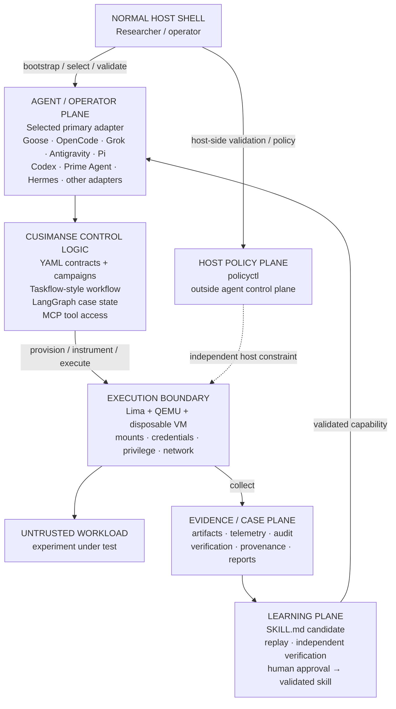

# 🦝 Cusimanse

> **Autonomous, agentic security research platform for controlled workload detonation, runtime analysis, anomaly detection and evidence extraction inside disposable virtual machines.**

**Architecture Refactor branch:** stateful orchestration, Taskflow-style campaign recipes, self-learning primary-agent contracts, evidence-bounded skill promotion, additional tools and MCP profiles. **`main` is unchanged.**

## What Cusimanse does

Cusimanse lets a researcher define a security experiment, select a primary terminal agent, execute the workload in a disposable Lima/QEMU VM, collect evidence, verify findings, and preserve artifacts before destroying the VM.

> **Markdown specifies. YAML configures. Agent adapters operate. Policy constrains. Audit records. Evidence proves. Learning reuses only what has been verified.**

Cusimanse is a research platform, not a production malware sandbox or a claim of sandbox-escape resistance.

## Architecture

The important distinction is between the **host/control plane**, the **agent/operator plane**, and the **VM execution boundary**:



### Component responsibilities

| Component | Responsibility |
|---|---|
| **Normal host shell** | Git, installation, adapter selection, preflight, validation, post-run inspection |
| **`policyctl`** | Host-side policy/configuration and token observability; **never an agent command** |
| **Agent adapter** | Primary operator that drives the research workflow |
| **YAML recipes/contracts** | Campaign semantics, agent contract, workflow and promotion rules |
| **Taskflow-style workflow** | Task dependencies, stages and handoffs |
| **LangGraph** | Stateful case execution/checkpoints; not the evidence archive |
| **MCP** | Scoped tool/research-data access; not a security boundary |
| **Lima + QEMU + VM/OS** | **Security boundary for the workload** |
| **Evidence/case store** | Durable artifacts, findings, execution records and provenance |
| **SKILL.md** | Portable reusable procedure package |
| **Learning/promotion** | Candidate → replay → independent verification → human approval → validated skill |

**Security boundary:** VM/OS isolation, mounts, credentials, privilege and network controls. AI agents, prompts, skills, MCP, LangGraph, Taskflow and vector stores are **not** isolation mechanisms.

## Runtime usage

There are only three places to run commands. Every command below is labelled deliberately.

### 1. 🖥️ NORMAL HOST SHELL — researcher runs these

Clone and select the Architecture Refactor branch:

```bash
# NORMAL HOST SHELL

git clone https://github.com/Opposum0112/Cusimanse.git
cd Cusimanse
git checkout architecture-refactor

./scripts/prerequisites.sh
./scripts/agent-preflight.sh
./policyctl validate
bash ./scripts/tests/validate-project.sh
```

Optional Architecture Refactor dependencies:

```bash
# NORMAL HOST SHELL
CUSIMANSE_INSTALL_ARCH_REFACTOR=1 ./scripts/prerequisites.sh
bash ./scripts/tests/architecture-refactor.sh
```

Select the primary agent. This is still the normal host shell:

```bash
# NORMAL HOST SHELL
export CUSIMANSE_PRIMARY_ADAPTER=prime-agent
prime-agent --help
prime-agent
```

Or Hermes:

```bash
# NORMAL HOST SHELL
export CUSIMANSE_PRIMARY_ADAPTER=hermes
hermes --help
hermes
```

Other supported adapters can be selected through the same adapter contract. Provider credentials stay outside Git.

### 2. 🤖 AGENT SHELL — selected primary agent runs the workflow

Once `prime-agent`, `hermes`, or another primary adapter is running, give it the following operator prompt:

```text
# AGENT SHELL — paste this into the selected primary agent

Act as the primary operator for one Cusimanse security-research case.

First read:
  recipes/agents/self-learning-primary.yaml
  recipes/campaigns/security-research-learning.yaml
  recipes/workflows/security-research-taskflow.yaml
  recipes/orchestration/langgraph.yaml
  recipes/learning/skill-promotion.yaml

Execute this lifecycle:
  Discover → Validate → Retrieve → Plan → Review → Approve →
  Provision VM → Instrument → Execute → Collect → Analyze →
  Verify → Learn → Promote → Preserve → Destroy

Rules:
- The disposable Lima/QEMU VM is the execution boundary for the workload.
- Do not invoke policyctl. It is host-side and outside the agent control plane.
- Do not expose host credentials to the workload or learned skills.
- Retrieval ranking never grants permission to execute a capability.
- Preserve raw evidence, telemetry, audit records, reductions, verification
  results and hashes before destroying the VM.
- A new learned procedure must first be CANDIDATE.
- Promotion requires replay, distinct-artifact testing, independent verification,
  provenance, capability checks and human approval.
- If a required capability is unavailable, report NOT_DEPLOYED.
- Never claim PASS without runtime evidence.

At completion report:
  case ID, campaign, current state, commands/tools used, VM state,
  evidence paths, verification result, skill state and failed gates.
```

**The agent now operates the experiment.** It reads the recipes, maintains case state, requests/observes approval gates, provisions the VM, instruments and executes the workload, collects evidence, analyzes and verifies results, and handles the learning workflow.

### 3. 🧪 INSIDE THE DISPOSABLE VM — workload execution

Commands that act on the workload belong **inside the VM**, not on the host. The primary agent orchestrates this execution.

For the existing reference experiment, tell the agent:

```text
# AGENT SHELL — prompt to the selected primary agent

Run the existing experiments/go-install-001 reference experiment using the
Architecture Refactor workflow while preserving compatibility with the existing
Cusimanse architecture.

Use the campaign and Taskflow-style workflow. Maintain case state according to
the orchestration contract. Operate the workload inside the disposable Lima/QEMU
VM, collect telemetry and evidence, perform independent verification, preserve
all artifacts and only then destroy the disposable VM.

Do not modify policyctl or bypass approval controls.

At the end report PASS, PARTIAL, FAIL or NOT_DEPLOYED according to evidence.
PASS requires actual runtime evidence.
```

The important distinction is:

```text
NORMAL HOST SHELL
    │
    ├── install / preflight / validate
    ├── select primary agent
    ├── policyctl
    └── inspect results
    │
    ▼
AGENT SHELL
    │
    ├── load recipes
    ├── plan / approve
    ├── provision / instrument
    ├── analyze / verify
    └── preserve / learn
    │
    ▼
DISPOSABLE VM
    │
    └── execute untrusted workload
```

### After the agent finishes

Exit the agent and return to the **normal host shell**:

```bash
# NORMAL HOST SHELL

exit

find evidence blackboard experiments/go-install-001 \
  -maxdepth 4 -type f -print 2>/dev/null

find runs -maxdepth 4 -type f -print 2>/dev/null

./policyctl validate
bash ./scripts/tests/validate-project.sh
bash ./scripts/tests/architecture-refactor.sh
```

### Runtime acceptance

| State | Meaning |
|---|---|
| `PASS` | Runtime behavior demonstrated with preserved evidence |
| `PARTIAL` | Worked, but coverage or evidence is incomplete |
| `FAIL` | Tested behavior did not meet the contract |
| `NOT_DEPLOYED` | Required capability is unavailable/disabled |
| `CANDIDATE` | Skill derived from evidence but not promoted |
| `VALIDATED` | Skill passed required replay, verification and approval gates |

Static validation is **not** runtime PASS. A runtime PASS requires actual execution and preserved evidence.

## Self-learning

The learning loop is deliberately evidence-bounded:

```text
Execute
  ↓
Observe evidence
  ↓
Create CANDIDATE skill
  ↓
Replay on distinct artifact
  ↓
Independent verification
  ↓
Human approval
  ↓
VALIDATED skill
  ↓
Index / retrieve for future cases
```

A single successful LLM interaction does not become trusted knowledge. Skills retain provenance, capability metadata and evaluation history.

Prime Agent and Hermes may provide their own skills, memory, subagents or self-improvement mechanisms. Those capabilities remain **agent capabilities**, not security boundaries. Cusimanse promotion still requires evidence and verification.

## Recipes and orchestration

The Architecture Refactor separates concerns instead of putting everything into one framework:

```text
recipes/campaigns/       → what the research campaign means
recipes/workflows/       → Taskflow-style task sequence
recipes/orchestration/   → LangGraph execution/state contract
recipes/agents/          → primary-agent contract
recipes/learning/        → skill promotion gates
recipes/mcp/             → scoped tool/data profiles
```

GitHub Security Lab Taskflow is a reference for taskflow semantics; it is not the whole Cusimanse platform. LangGraph provides stateful execution, while the durable evidence/case store remains authoritative for evidence and provenance.

## MCP and tools

MCP exposes scoped tools and research references. It does not grant unrestricted authority and is not the VM boundary.

Optional Architecture Refactor tools can be requested with:

```bash
# NORMAL HOST SHELL
CUSIMANSE_INSTALL_ARCH_REFACTOR=1 ./scripts/prerequisites.sh
```

The profile covers runtime/data tooling, binary and network analysis, detection tooling, LangGraph/PyYAML, retrieval clients and OpenTelemetry. Missing optional capabilities are reported as `NOT_DEPLOYED` rather than silently assumed.

## Repository structure

```text
Cusimanse/
├── .agents/                 # agent instructions, skills and MCP configuration
├── recipes/
│   ├── agents/              # primary-agent contracts
│   ├── campaigns/           # campaign semantics
│   ├── experiments/         # experiment definitions
│   ├── install/             # installation/bootstrap
│   ├── instrumentation/     # runtime instrumentation
│   ├── learning/            # learning/promotion
│   ├── lima/                # VM profiles
│   ├── mcp/                 # MCP profiles/registries
│   ├── orchestration/       # execution/state contracts
│   ├── routing/             # adapter routing
│   ├── stages/              # reusable stages
│   ├── tools/               # tool contracts
│   └── workflows/           # Taskflow-style workflows
├── skills/validated/        # versioned validated capabilities
├── tools/                   # project tool integrations
├── experiments/             # reference experiments
├── scripts/                 # host/bootstrap/test scripts
├── cmd/policyctl/           # host-side policy utility
└── docs/                    # detailed architecture/runbook documentation
```

## Validation

```bash
# NORMAL HOST SHELL
bash ./scripts/tests/architecture-refactor.sh
```

The validation checks architecture files/contracts, shell syntax, YAML parsing when available, Go formatting/vetting, compatibility with the existing Goose/reference experiment, policyctl separation, the Lima/QEMU security-boundary documentation, and skill-promotion requirements.

For the complete command-by-command runbook, see `docs/ARCHITECTURE-REFACTOR-RUNBOOK.md`.

## Security invariants

- Untrusted workloads execute in disposable VMs.
- Host credentials are not exposed to learned skills.
- Unrestricted host-root mounts are denied.
- Destructive/privileged actions require approval.
- Public MCP exposure is denied by default.
- `policyctl` remains outside the agent control plane.
- Retrieval does not grant execution authority.
- Evidence is preserved before VM destruction.
- Learned capabilities require replay and independent verification before promotion.
