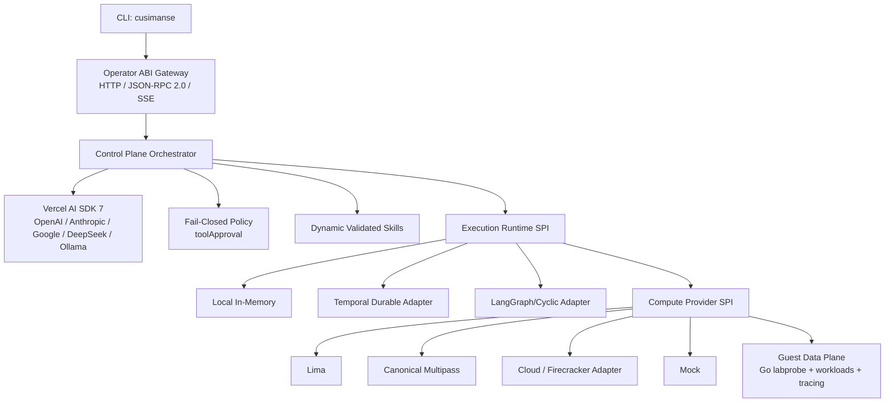

# Cusimanse

**Cusimanse Agent Runtime (CAR)** is a harness-neutral, declarative security-research runtime. An AI agent is the operator; Cusimanse governs intent, policy, approvals, isolation, execution, and evidence.

## Architecture



### Core boundaries

1. **Model layer:** provider-neutral Vercel AI SDK 7 model factories. Local DeepSeek/Ollama use OpenAI-compatible endpoints.
2. **Policy layer:** every model-proposed tool operation is evaluated fail-closed before execution. Unknown operations are denied.
3. **Skill layer:** only skills under `skills/validated/` become native AI SDK tools. `SKILL.md` provides instructions and `schema.json` provides the input contract.
4. **Runtime SPI:** local, Temporal-compatible, and cyclic/LangGraph-compatible drivers share one execution contract.
5. **Compute SPI:** Lima, Multipass, Firecracker/cloud, and Mock are replaceable providers. Provider commands use argument vectors rather than shell interpolation.
6. **Data plane:** workloads and Go `labprobe` telemetry remain inside the selected sandbox boundary.

## Quick start

```bash
git clone https://github.com/Opposum0112/Cusimanse.git
cd Cusimanse
npm install
npm run build
npm link
cusimanse compile recipes/examples/npm-install.yaml
cusimanse run recipes/examples/npm-install.yaml --provider mock --runtime local
cusimanse serve --port 8080
```

`mock` is hermetic and is the default for development and CI. Lima is intended for macOS/Linux environments with `limactl`; Multipass is intended for Linux/desktop environments with `multipass`. Cloud/Firecracker is an SPI boundary and requires a configured provider adapter.

## Configuration

Resolution precedence is **CLI > environment/.env > project `./.cusimanse/config.yaml` > user `~/.cusimanse/config.yaml` > defaults**. Supported secrets/settings include `ANTHROPIC_API_KEY`, `OPENAI_API_KEY`, `GEMINI_API_KEY`, `DEEPSEEK_API_KEY`, and `OLLAMA_BASE_URL`.

## Operator ABI

JSON-RPC endpoint: `POST /rpc` with methods `experiment.run`, `evidence.inspect`, `skills.promote`, and `providers.list`.

REST endpoints include `POST /v1/experiments/run`, `GET /v1/experiments/:runId/events`, `GET /v1/evidence/:runId`, `POST /v1/skills/promote`, and `GET /v1/providers`.

See `docs/operator-abi.md` and `docs/recipe-authoring.md` for contracts.

## Development

```bash
npm run check-types
npm run lint
npm test
npm run test:coverage
```

See `CONTRIBUTING.md` and `SECURITY.md` before contributing or running untrusted workloads.
