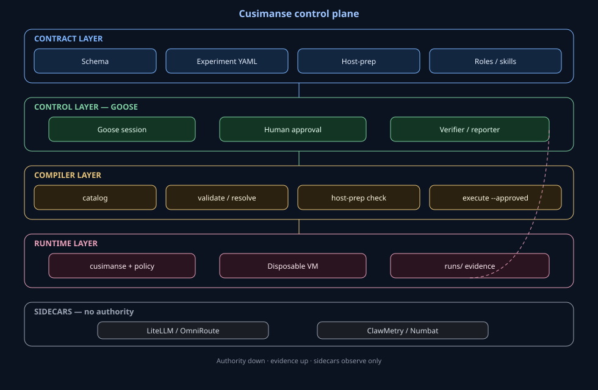
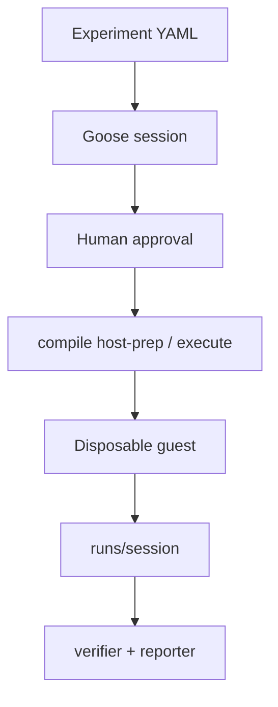

# Cusimanse (`agentic-native-goose`)

Goose-driven research lab. One typed YAML experiment. Goose plans, checks declared host tools, orchestrates roles, requests approval, runs the compiler, reads evidence, and writes the report.

Beta. Not a certified sandbox.

## Table of contents

1. [Layers](#layers)
2. [Architecture](#architecture)
3. [Components](#components)
4. [Research outputs (`runs/`)](#research-outputs-runs)
5. [Repository structure](#repository-structure)
6. [Which shell](#which-shell)
7. [Host bootstrap](#host-bootstrap)
8. [Install](#install)
9. [Researcher workflow (npm-install-001)](#researcher-workflow-npm-install-001)
10. [YAML configuration set](#yaml-configuration-set)
11. [Access and observability](#access-and-observability)
12. [Report generation](#report-generation)
13. [Compiler commands](#compiler-commands)
14. [Validation and integration tests](#validation-and-integration-tests)
15. [Safety](#safety)

## Layers

| Layer | Files | Who runs it |
|---|---|---|
| Contract schema | `schemas/cusimanse.yaml` | Maintainer |
| Experiment | `experiments/<id>.yaml` | Researcher |
| Host bootstrap catalog | `host-prep/default.yaml` | Goose *or* normal shell via compiler |
| Roles / skills | `roles/`, `skills/` | Goose Summon |
| Operator recipe | `recipes/goose/session.yaml` | Goose session |
| Compiler | `cmd/compile` | Goose session *or* normal shell |
| Provision | `cmd/cusimanse` after `--approved` | Compiler |
| Guest | Lima or Multipass | Engine |

## Architecture

Five planes: contract → Goose control → compiler → runtime → sidecars. Authority down. Evidence up.





## Components

Specialist work lives in `roles/*.yaml` plus `skills/*/SKILL.md`. Goose Summons those roles. There is no separate `.agents` tree.

| Role | Skills |
|---|---|
| operator | experiment-operate, host-prep-declared |
| verifier | evidence-read, evidence-analysis, verification |
| reporter | report |

## Research outputs (`runs/`)

```text
runs/<session-id>/
  session.yaml
  evidence/  provenance/  analysis/
  verification/result.md
  research-report/report.md
  preservation/  observability/
```

Chat is not evidence.

## Repository structure

```text
experiments/          researcher contracts
host-prep/default.yaml
roles/                operator, verifier, reporter
skills/               SKILL.md used by those roles
recipes/goose/session.yaml
cmd/compile  cmd/cusimanse
policies/host-policy.yaml
scripts/install.sh    first-time host tools (normal shell)
scripts/tests/
runs/                 generated
```

## Which shell

Two surfaces. Do not mix them by habit.

| Task | Surface | Command |
|---|---|---|
| Clone repo | **Normal shell** (bash/zsh/Windows terminal) | `git clone` … `git checkout` |
| First-time tool install (git, go, goose, lima…) | **Normal shell** | `./scripts/install.sh` |
| Unit / integration tests | **Normal shell** | `go test` / `bash scripts/tests/integration.sh` |
| Compile catalog / validate / resolve | **Either** | `go run ./cmd/compile …` |
| Check declared host-prep | **Either** | `go run ./cmd/compile host-prep npm-install-001` |
| Drive the session (plan, approve, Summon) | **Goose** | `goose run --recipe recipes/goose/session.yaml …` |
| Guest workload | **Guest VM only** | compiler after `--approved` |
| Read `runs/` | **Normal shell** | `ls runs/` |

**Goose session** means: you started Goose (`goose` / Goose desktop) and it is following `recipes/goose/session.yaml`. Commands Goose types are still `go run ./cmd/compile …` or `cusimanse compile …` — there is no separate Goose-only binary for compile.

**Normal shell** means: your laptop terminal, not inside Goose and not inside the guest.

## Host bootstrap

Host-prep is **declared** in `host-prep/default.yaml`. Two ways to apply it:

### A. First clone — normal shell (required once)

Goose is not installed yet, so it cannot bootstrap itself.

```bash
# normal shell
./scripts/install.sh
export PATH="$HOME/.local/bin:$HOME/go/bin:$PATH"
goose --version
limactl --version || multipass version
```

That script is what `host-prep/default.yaml` lists under `install:`.

### B. Before each experiment — Goose *or* normal shell (check only)

The compiler **does not invent packages**. It checks the allow-list. Missing optional tools are `NOT_DEPLOYED`.

```bash
# normal shell — same check Goose will run
go run ./cmd/compile host-prep npm-install-001
```

```text
# Goose session — agent command (inside goose run)
go run ./cmd/compile host-prep {{ experiment }}
```

Goose may **re-run** `scripts/install.sh` only when that path is the declared `install:` for a missing *required* tool (goose itself). It must not `apt install` random extras.

| Question | Answer |
|---|---|
| Can Goose provision the VM? | No. It calls `compile execute --approved`. |
| Can Goose install host git/go/lima? | Only by running the declared `scripts/install.sh`. Prefer doing that once in a normal shell. |
| Can I skip Goose and only use the compiler? | Yes. Catalog → validate → host-prep → execute `--approved` in bash. |

## Install

```bash
# normal shell
git clone https://github.com/Opposum0112/Cusimanse.git
cd Cusimanse
git checkout agentic-native-goose
./scripts/install.sh
export PATH="$HOME/.local/bin:$HOME/go/bin:$PATH"
```

## Researcher workflow (npm-install-001)

1. Author `experiments/npm-install-001.yaml` (repo already has it).
2. **Normal shell:** `go run ./cmd/compile validate npm-install-001` and `host-prep`.
3. **Goose:** `goose run --recipe recipes/goose/session.yaml --params experiment=npm-install-001`
4. Approve when Goose asks. Compiler starts the guest.
5. **Normal shell:** read `runs/<session>/research-report/report.md`.

## YAML configuration set

| File | Kind |
|---|---|
| `experiments/npm-install-001.yaml` | Study |
| `host-prep/default.yaml` | Host allow-list |
| `recipes/goose/session.yaml` | Goose operator |
| `roles/*.yaml` + `skills/*/SKILL.md` | Specialists |
| `policies/host-policy.yaml` | Execute-time policy |

## Access and observability

Missing collectors → `NOT_DEPLOYED` in `evidence/index.yaml`.

## Report generation

Acceptance lines in the experiment YAML. Cite hashed evidence.

## Compiler commands

Same binaries in Goose or bash:

```bash
go run ./cmd/compile catalog
go run ./cmd/compile validate <id>
go run ./cmd/compile host-prep <id>
go run ./cmd/compile resolve <id>
go run ./cmd/compile execute <id> --approved
```

## Validation and integration tests

```bash
# normal shell
go test ./internal/compiler ./cmd/compile ./cmd/cusimanse ./internal/validation
bash ./scripts/tests/validate.sh
bash ./scripts/tests/integration.sh
```

## Safety

Do not run the workload on the host. `--approved` is required.
