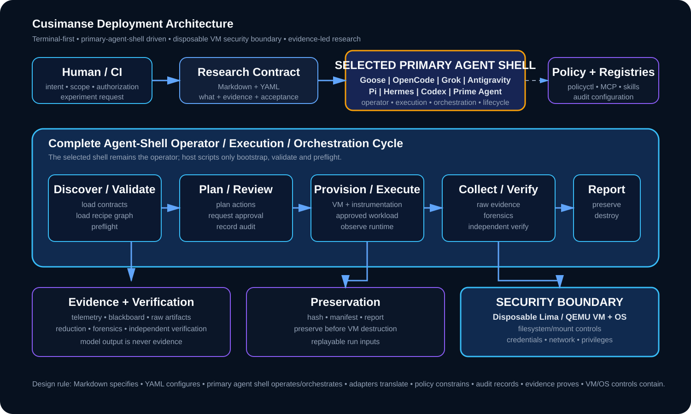

# 🦝 Cusimanse

<p align="center">
  
</p>

> **Autonomous, agentic security research platform for controlled workload detonation, runtime analysis, anomaly detection and evidence extraction inside disposable virtual machines.**

Cusimanse is an **agent-neutral, terminal-first security research platform**. Exactly one selected primary agent shell owns the runtime operator, execution and orchestration cycle after bootstrap. YAML contracts define semantics; the agent shell operates them; Lima/QEMU and VM/OS controls enforce the security boundary.

[](https://github.com/Opposum0112/Cusimanse/actions/workflows/validate.yml)

## 1. Primary-agent shell model

```text
Human / CI intent
      ↓
Markdown + YAML contracts
      ↓
SELECT ONE PRIMARY AGENT SHELL
      ↓
Discover → Validate → Preflight → Plan → Review → Approve
      ↓
Provision → Instrument → Execute → Collect → Reduce
      ↓
Forensics → Independent verification → Report
      ↓
Preserve evidence → Destroy disposable VM
```

**The whole operator and execution/orchestration cycle runs in the selected primary agent shell.** `scripts/*.sh` are limited to bootstrap, prerequisite installation, adapter selection, configuration, validation and preflight. They do not introduce a second orchestration controller.

## 2. Operator matrix

| Adapter | Interactive shell | Native prompt/run form | Role | Status |
|---|---|---|---|---|
| Goose | `goose` | `goose run ...` | reference operator | reference |
| OpenCode | `opencode` | `opencode run '<PROMPT>'` | programmable operator | candidate |
| Grok Build | `grok` | `grok -p '<PROMPT>'` | provider operator/orchestrator | candidate |
| Antigravity | `agy` | verify `agy --help` | provider operator | candidate |
| Pi | `pi` | `pi -p '<PROMPT>'` | thin custom operator | candidate |
| Hermes | `hermes` | TUI-first | self-improving operator | candidate |
| Codex | `codex` | verify `codex --help` | CLI/coding operator | candidate |
| Prime Agent | `prime-agent` | `prime-agent -p '<PROMPT>'` | self-improving operator | candidate |
| Claude Code | `claude` | provider/version-specific | enterprise operator | candidate |
| Devin | provider-managed | provider-managed | enterprise operator | candidate |

Do not copy Goose command syntax to another agent. Provider CLI versions are verified during preflight; recipe presence alone never means runtime deployment.

## 3. Five-minute repository validation

From a clean host/worktree:

```bash
git clone <REPOSITORY_URL> Cusimanse
cd Cusimanse
git checkout agent-and-adapter

./scripts/prerequisites.sh
./scripts/agent-preflight.sh
./policyctl validate
bash ./scripts/tests/validate-project.sh
```

The prerequisites script interactively selects exactly one primary agent. For repeatable testing, set it explicitly:

```bash
CUSIMANSE_PRIMARY_ADAPTER=grok-build ./scripts/prerequisites.sh
CUSIMANSE_PRIMARY_ADAPTER=antigravity ./scripts/prerequisites.sh
CUSIMANSE_PRIMARY_ADAPTER=pi ./scripts/prerequisites.sh
CUSIMANSE_PRIMARY_ADAPTER=hermes ./scripts/prerequisites.sh
CUSIMANSE_PRIMARY_ADAPTER=prime-intellect ./scripts/prerequisites.sh
CUSIMANSE_PRIMARY_ADAPTER=codex ./scripts/prerequisites.sh
CUSIMANSE_PRIMARY_ADAPTER=opencode ./scripts/prerequisites.sh
CUSIMANSE_PRIMARY_ADAPTER=goose ./scripts/prerequisites.sh
```

Selection is recorded in `.cusimanse/primary-agent.yaml`.

## 4. Verify the selected shell

```bash
cat .cusimanse/primary-agent.yaml
command -v <PRIMARY_COMMAND>
<PRIMARY_COMMAND> --help
```

The help check is important because CLI flags are provider-specific and can change between releases.

## 5. Non-destructive smoke test

Start the selected native shell and provide:

```text
Operate this Cusimanse repository from the primary-agent shell.
Load recipes/agents/primary-agent.yaml and recipes/agents/primary-shell.yaml.
Load the selected adapter recipe.
Report the selected adapter, contract paths, approval gates, security boundary,
and expected evidence outputs. Do not modify the host, VM, credentials or repository.
```

Expected: contract discovery and safety checks without privileged or destructive actions.

## 6. Runtime reference test

Use `experiments/go-install-001` as the common adapter-equivalence test. The primary shell loads:

```text
experiments/go-install-001/experiment.yaml
experiments/go-install-001/lima.yaml
experiments/go-install-001/run.sh
```

Then it drives the complete semantic lifecycle:

```text
Discover → Validate → Preflight → Plan → Review → Approve
→ Provision VM → Start instrumentation → Execute workload
→ Collect → Reduce → Forensics → Independent verification
→ Report → Hash/preserve evidence → Destroy VM
```

Check artifacts after the run:

```bash
find evidence blackboard experiments/go-install-001 -maxdepth 3 -type f -print
```

A runtime `PASS` requires runtime evidence, audit records, independent verification, a report and preservation before VM destruction. Configuration alone is never evidence.

## 7. Adapter-specific deployment and runtime commands

### Grok Build

Install/select:

```bash
CUSIMANSE_PRIMARY_ADAPTER=grok-build ./scripts/prerequisites.sh
./scripts/agent-preflight.sh
grok --help
grok inspect
```

Interactive:

```bash
grok
```

Headless smoke test:

```bash
grok -p 'Load recipes/agents/primary-agent.yaml and perform only the non-destructive Cusimanse contract check.'
```

Grok's current documentation supports `grok -p` for headless scripting and `grok inspect` for discovered configuration. citeturn1search0turn1search2

### Antigravity

Install/select:

```bash
CUSIMANSE_PRIMARY_ADAPTER=antigravity ./scripts/prerequisites.sh
./scripts/agent-preflight.sh
agy --help
```

Interactive:

```bash
agy
```

If the installed release supports the recorded prompt form, use:

```bash
agy -p 'Load the Cusimanse primary-agent contract and perform only the non-destructive contract check.'
```

Because Antigravity CLI behavior is installation/version dependent in this project, `agy --help` is a required runtime check before claiming support.

### Pi

Install/select:

```bash
CUSIMANSE_PRIMARY_ADAPTER=pi ./scripts/prerequisites.sh
./scripts/agent-preflight.sh
pi --help
```

Interactive:

```bash
pi
```

Print/smoke form:

```bash
pi -p 'Load the Cusimanse primary-agent contract and perform only the non-destructive contract check.'
```

The prerequisites path uses the current Pi package name configured by the branch; verify the installed version with `pi --help` before runtime acceptance.

### Hermes

Install/select:

```bash
CUSIMANSE_PRIMARY_ADAPTER=hermes ./scripts/prerequisites.sh
./scripts/agent-preflight.sh
hermes --help
```

Interactive:

```bash
hermes
```

Hermes is documented as a terminal UI/interactive CLI. Use its native interactive prompt flow to load the Cusimanse contract rather than depending on an undocumented one-shot flag. citeturn877file0L2-L2

### Prime Intellect / Prime Agent

Install/select:

```bash
CUSIMANSE_PRIMARY_ADAPTER=prime-intellect ./scripts/prerequisites.sh
./scripts/agent-preflight.sh
prime-agent --help
```

Interactive:

```bash
prime-agent
```

Print/smoke form:

```bash
prime-agent -p 'Load the Cusimanse primary-agent contract and perform only the non-destructive contract check.'
```

Prime Agent currently documents `-p/--print`, JSON/RPC modes, persistent sessions and evidence-bounded refinement. Its generated commands execute with user permissions, so Cusimanse still requires the external VM/OS security boundary. citeturn0search1turn0search2

### Codex

Install/select:

```bash
CUSIMANSE_PRIMARY_ADAPTER=codex ./scripts/prerequisites.sh
./scripts/agent-preflight.sh
codex --help
```

Interactive:

```bash
codex
```

Use the installed Codex release's documented non-interactive mode only after checking `codex --help`. Do not infer Codex syntax from Goose or another adapter.

### OpenCode

Install/select:

```bash
CUSIMANSE_PRIMARY_ADAPTER=opencode ./scripts/prerequisites.sh
./scripts/agent-preflight.sh
opencode --help
```

Interactive:

```bash
opencode
```

Non-interactive smoke test:

```bash
opencode run 'Load the Cusimanse primary-agent contract and perform only the non-destructive contract check.'
```

OpenCode documents `opencode` for the TUI and `opencode run` for scripted/non-interactive use. citeturn1search1

### Goose reference

```bash
CUSIMANSE_PRIMARY_ADAPTER=goose ./scripts/prerequisites.sh
./scripts/agent-preflight.sh
goose --help
goose
```

Goose remains the reference adapter for equivalence testing, not a permanent architectural dependency.

## 8. Adapter equivalence

For each candidate adapter, compare the same `go-install-001` semantic run:

```text
contract load
→ recipe load
→ policy check
→ shell smoke test
→ VM experiment
→ instrumentation
→ evidence preservation
→ independent verification
→ report
```

Keep Goose as the reference until the selected adapter demonstrates equivalent experiment semantics and acceptable audit/evidence output.

## 9. Evidence-bounded self-learning

```text
verified run → compare → propose → validate/replay
→ independent verification → human approve → promote
```

Learning may improve reviewed non-security recipe defaults, routing hints, adapter command templates and evidence-reduction heuristics. It cannot modify VM isolation, credentials, privileges, network allowlists, approval requirements or evidence-integrity rules at runtime.

## 10. Architecture



```text
Contracts / recipes
       ↓
Primary agent shell
       ↓
policy + approval
       ↓
Lima / QEMU VM boundary
       ↓
workload + instrumentation
       ↓
evidence → verification → report
       ↓
preserve → destroy
```

See `01-deployment-architecture.md` and `docs/agent-shell-runbook.md`.

## 11. CrewAI role-based analysis

CrewAI is a good fit as a **research-analysis layer**, not as the sole security controller. The selected primary agent retains lifecycle authority and may delegate specialist analysis to Planner, Static Analyst, Runtime Analyst, Network Analyst, Malware/RE Analyst, Detection Engineer, Forensics Analyst, Independent Verifier and Reporter roles. Privileged operations return through the primary shell and Cusimanse approval/policy controls.

## 12. Recipes and contracts

- `recipes/agents/primary-agent.yaml` — common operator contract
- `recipes/agents/primary-shell.yaml` — terminal-first shell contract
- `recipes/agents/learning-loop.yaml` — evidence-bounded learning
- `recipes/agents/adapter-matrix.yaml` — adapter matrix
- `recipes/adapters/` — provider-specific adapter contracts
- `recipes/agent-selection.yaml` — primary selection/preflight contract
- `recipes/orchestration/` — orchestration strategies
- `recipes/mcp/` — MCP registry/connectors
- `recipes/skills/` — skills registry
- `recipes/reference/` — tools/frameworks/research references
- `recipes/detection/` — detection validation
- `recipes/experiments/` — experiment contracts

## 13. Acceptance states

| State | Meaning |
|---|---|
| `PASS` | Runtime evidence and required verification demonstrate the capability |
| `PARTIAL` | Required coverage is incomplete |
| `FAIL` | Contract or safety requirement was violated |
| `NOT_DEPLOYED` | Provider/runtime/configuration is unavailable or unverified |

## 14. Security boundary

AI agents, prompts, skills, MCP servers, CrewAI and `policyctl` are **not** security boundaries. Enforcement comes from disposable VM/OS controls, filesystem/mount controls, credential separation, network controls and explicit approval gates.

Use only systems and workloads you are authorized to test. Preserve and hash evidence before destroying disposable VMs.

## Documentation

- `01-deployment-architecture.md` — deployment architecture
- `02-system-requirements.md` — host requirements
- `03-deployment-runbook.md` — deployment/runbook
- `04-security-model.md` — security model
- `05-multi-agent-operating-model.md` — multi-agent operation
- `06-observability-and-evidence.md` — observability/evidence
- `07-experiment-framework.md` — experiment framework
- `10-validation-and-acceptance.md` — validation and acceptance
- `11-current-antigravity-reference.md` — Antigravity reference
- `AGENTS.md` — agent operating instructions
- `SECURITY.md` — security boundaries/reporting

## License

**MIT License — Copyright (c) 2026 Opposum0112.** See `LICENSE`.
