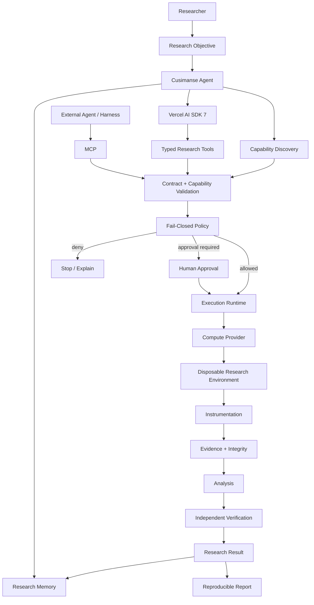

# Cusimanse

**A terminal-driven, provider-neutral security research agent for evidence-backed investigation.**

Cusimanse helps security researchers turn a research question into a controlled investigation. It can plan research with an LLM, remember previous findings, select governed capabilities, request human approval, operate disposable testbeds, collect telemetry, analyze evidence, verify findings, and produce reproducible results.

> **The agent decides what to investigate. Cusimanse policy decides what it is allowed to execute.**

**Status:** active development / technical preview. The architecture and core workflows are implemented, but provider integrations, observability, MCP, and production deployment paths should be validated on your target environment before being treated as production infrastructure.

---

## Why use Cusimanse?

Security research often involves the same difficult cycle:

1. Define a hypothesis.
2. Build an isolated environment.
3. Run a controlled workload.
4. Observe what happened.
5. Preserve the evidence.
6. Analyze the observations.
7. Decide what to investigate next.
8. Reproduce and verify the result.

Cusimanse automates that loop while keeping **policy, isolation, evidence, and human approval outside the authority of the model**.

It is designed for:

- Supply-chain and package-installation research
- Malware and suspicious-workload analysis in controlled environments
- Vulnerability reproduction and validation
- Detection engineering
- Threat hunting and threat research
- Process, filesystem, network, and kernel telemetry research
- Agentic security experiments
- Repeatable security experiments that need preserved evidence

---

## How it works

At a high level:

```text
Researcher
   │
   │ research objective / recipe
   ▼
Cusimanse Agent
   │
   ├── recall previous research
   ├── plan with selected LLM
   ├── discover available capabilities
   ├── compile intent into typed operations
   └── validate the proposed operation
   │
   ▼
Policy + Approval
   │
   ├── DENY ───────────────► stop safely
   │
   └── APPROVE
          │
          ▼
   Execution Runtime
          │
          ▼
   Disposable Testbed
          │
          ├── workload
          ├── process telemetry
          ├── network / PCAP
          └── filesystem / other probes
          │
          ▼
       Evidence
          │
          ├── hash
          ├── analyze
          ├── verify
          └── preserve
          │
          ▼
    Research Result
          │
          ▼
    Long-term Memory
```

The model is **not** the security boundary. A model response cannot authorize an operation, expand scope, bypass policy, or directly execute arbitrary host commands.

---

# Quick start

## 1. Requirements

You need:

- Node.js **22 or newer**
- npm
- Git
- A supported model provider if you want LLM-assisted planning
- Docker for the Docker execution path
- Lima for disposable VM execution with the Lima provider
- Proxmox only if you intend to use the Proxmox provider

The package currently targets Node.js >=22. fileciteturn44file0

> Start with the mock provider if you only want to understand the workflow or run deterministic development tests.

## 2. Install Cusimanse

```bash
git clone https://github.com/Opposum0112/Cusimanse.git
cd Cusimanse
npm install
npm run build
npm link
```

Check the CLI:

```bash
cusimanse --help
```

The package exposes the `cusimanse` command. fileciteturn44file0

## 3. Run the deterministic checks

Before running an experiment:

```bash
npm run check-types
npm run lint
npm test
npm run validate:recipes
```

For development, also run coverage:

```bash
npm run test:coverage
```

These are the repository's current type-checking, linting, test, recipe-validation, and coverage commands. fileciteturn44file0

## 4. Try a safe mock experiment

Start with the mock provider so no real testbed needs to be provisioned:

```bash
cusimanse compile recipes/examples/npm-install.yaml
cusimanse run recipes/examples/npm-install.yaml --provider mock --runtime local
```

The mock provider is intended for deterministic development and CI workflows.

## 5. Run against disposable compute

When you are ready to use a real isolated environment:

```bash
cusimanse run recipes/examples/npm-install.yaml --provider lima --runtime local
```

Or, where configured:

```bash
cusimanse run recipes/examples/npm-install.yaml --provider multipass --runtime local
```

Review the experiment recipe, network policy, mounts, workload, evidence requirements, and provider configuration before allowing a real execution.

---

# Your first research investigation

There are two ways to use Cusimanse.

### Option A — Use a research recipe

Use this when you want a **repeatable, version-controlled experiment**.

```bash
cusimanse compile recipes/examples/npm-install.yaml
cusimanse run recipes/examples/npm-install.yaml --provider mock --runtime local
```

### Option B — Use the agent to investigate a question

Use the agent workflow when you want the LLM to help formulate and iterate on the research plan.

Conceptually:

```text
research question
      ↓
agent planning
      ↓
capability discovery
      ↓
validation
      ↓
approval
      ↓
execution
      ↓
observation
      ↓
evidence analysis
      ↓
verification
      ↓
next research action / final result
```

The agent can use previous research context when deciding what to investigate next, but stored findings never become an authorization mechanism.

---

# Research recipes

A recipe describes **what you are trying to learn and what evidence you require**. It is not intended to be an unrestricted shell script.

A minimal research recipe can express:

```yaml
research_question:
  question: What happens when this package is installed?

scope:
  paths:
    - /workspace
  egress:
    mode: declared-only

allowed_capabilities:
  - vm.create
  - workload.npm.install
  - evidence.collect
  - network.observe

evidence_required:
  - type: process
  - type: network
  - type: log
```

The reference example is:

```text
recipes/examples/npm-install.yaml
```

For recipe authoring, see:

- `docs/getting-started.md`
- `docs/architecture.md`
- `docs/capabilities.md`
- `docs/policy.md`
- `docs/evidence.md`

A useful rule is:

> **Put research intent in the recipe; put enforcement in policy and the runtime.**

---

# What the agent can do

Cusimanse exposes research operations as typed capabilities rather than giving the model unrestricted shell access.

Core operations include:

```text
create_lab
execute_workload
observe_processes
observe_network
observe_filesystem
query_telemetry
inspect_artifact
analyze_evidence
verify_finding
seal_evidence
destroy_lab
```

The normal lifecycle is:

```text
create → instrument → execute → observe → collect
       → analyze → verify → seal → destroy
```

Execution remains subject to the active research contract, capability registry, policy, and approval requirements.

---

# Human approval and safety

By default, sensitive execution should cross an explicit approval boundary.

```text
LLM proposes operation
        ↓
Typed operation
        ↓
Scope / capability validation
        ↓
Policy evaluation
        ↓
Human approval when required
        ↓
Provider execution
```

Important principles:

- A model response is not authorization.
- Unknown capabilities are rejected.
- Policy failures are fail-closed.
- Disposable environments are preferred for untrusted workloads.
- Host credentials should never be placed in research recipes.
- Unrestricted host mounts should not be granted to workloads.
- Network access should be explicitly declared and constrained.
- Evidence should be preserved before destroying a disposable environment.
- Important findings should be independently verified.

For the detailed policy model, see `docs/policy.md`.

---

# Configure an LLM

Cusimanse uses **Vercel AI SDK 7** as its model/tool-calling substrate. The model layer is deliberately separate from the security policy and execution boundary.

The current package includes integrations for provider families such as:

| Provider | Typical use |
|---|---|
| OpenAI | Hosted reasoning and analysis |
| Anthropic | Hosted reasoning and analysis |
| Google | Gemini models |
| DeepSeek | API / compatible endpoints |
| Ollama | Local model execution |

The package dependencies include the AI SDK provider packages and AI SDK itself. fileciteturn44file0

## Configure credentials

Use environment variables or another supported configuration mechanism. Do **not** put credentials in YAML recipes or commit them to Git.

Examples:

```bash
export OPENAI_API_KEY='...'
export ANTHROPIC_API_KEY='...'
export GEMINI_API_KEY='...'
export DEEPSEEK_API_KEY='...'
export OLLAMA_BASE_URL='http://127.0.0.1:11434'
```

For provider-specific configuration, see:

```text
docs/llm.md
```

## Important security boundary

The LLM can:

- interpret the research question
- propose a research plan
- select from available capabilities
- analyze collected observations
- suggest the next research step

The LLM cannot independently:

- grant itself permissions
- change trusted policy
- expand experiment scope
- turn an unknown capability into an approved capability
- treat its own generated text as evidence

---

# Memory and durable execution

Cusimanse separates **execution state** from **research knowledge**.

```text
Current investigation
        │
        ├── plan
        ├── validation state
        ├── approvals
        ├── execution state
        └── telemetry references

Long-term research knowledge
        │
        ├── findings
        ├── observations
        ├── experiment outcomes
        └── reusable research context
```

This allows an investigation to evolve over multiple steps without treating a conversation transcript as the source of truth.

The branch also supports multiple execution-runtime choices:

```bash
cusimanse run recipe.yaml --runtime local --provider mock
cusimanse run recipe.yaml --runtime temporal --provider lima
cusimanse run recipe.yaml --runtime graph --provider lima
```

The runtime and compute provider are independent choices.

---

# Choose an execution provider

| Provider | Use it when | Isolation model |
|---|---|---|
| `mock` | Development, CI, deterministic tests | No real testbed |
| `lima` | Local Linux VM research | Disposable VM |
| `multipass` | Ubuntu-oriented VM research | Disposable VM |
| `cloud` / Firecracker | Isolated hosted execution | Provider-dependent |

The important design principle is that the **agent should not care which compute backend executes a governed operation**.

---

# Instrumentation and evidence

Security research is only useful when another researcher can understand what actually happened.

Cusimanse therefore separates:

```text
Model reasoning
      ≠
Observed telemetry
      ≠
Evidence
      ≠
Verified finding
```

The intended evidence path is:

```text
Workload
   ↓
Instrumentation
   ↓
Raw observations
   ↓
Evidence records
   ↓
SHA-256 integrity
   ↓
Analysis
   ↓
Independent verification
   ↓
Research result
```

Typical evidence can include:

- Process activity
- Network activity / PCAP
- Filesystem observations
- Logs
- Tool output
- Runtime metadata
- Evidence hashes
- Verification results

See `docs/instrumentation.md` and `docs/evidence.md` for the detailed model.

---

# Observability

Cusimanse is designed to correlate research activity across the agent and execution environment.

Conceptually:

```text
Research run
    │
    ├── agent activity
    ├── model activity
    ├── tool calls
    ├── policy decisions
    ├── runtime operations
    ├── compute operations
    ├── instrumentation
    └── evidence
```

A shared run/trace identity allows researchers to connect these events without treating model output as evidence.

Application telemetry should describe observable execution; it should not be used as a mechanism for exposing private model chain-of-thought.

---

# MCP interoperability

MCP is an **interoperability layer**, not Cusimanse's internal security boundary.

Cusimanse is designed to support both directions:

```text
External Agent / Harness
        │
        ▼
   Cusimanse MCP
        │
        ▼
   Governed Agent Core

Cusimanse Agent
        │
        ├── Native research tools
        └── MCP research capabilities
                    │
                    ▼
              Policy boundary
```

This lets researchers use Cusimanse as a dedicated research agent while still integrating it with other agent and tool ecosystems.

See the adapter and capability documentation before exposing MCP capabilities to another process.

---

# Operator API

Cusimanse can expose an operator interface for applications or external agents.

Start the local service with:

```bash
cusimanse serve --host 127.0.0.1 --port 8080
```

The intended operator interface includes:

- HTTP/REST
- JSON-RPC 2.0
- SSE telemetry

Primary operations include:

```text
experiment.run
evidence.inspect
skills.promote
providers.list
```

See `docs/operator-abi.md` before integrating an external client.

Keep operator services bound to localhost unless you have explicitly designed and validated the authentication, authorization, network exposure, and deployment model.

---

# Skills

Skills provide reusable research instructions without changing the core agent implementation.

A validated skill contains a human-reviewable instruction set and typed input contract, for example:

```text
skills/validated/<skill>/
├── SKILL.md
└── schema.json
```

Candidate skills should not become executable merely because an agent generated them.

Promotion is an explicit lifecycle:

```text
candidate
   ↓
review
   ↓
validation
   ↓
verification
   ↓
approval
   ↓
validated skill
```

For the current CLI and skill lifecycle, see `docs/capabilities.md` and the repository's skill tooling.

---

# Providers and adapters

Cusimanse separates several kinds of provider:

```text
Model Provider
      │
      ▼
AI SDK 7
      │
      ▼
Agent / Tool Layer
      │
      ▼
Execution Runtime
      │
      ▼
Compute Provider
      │
      ▼
Disposable Lab
```

This means you can change a model provider without redesigning the security execution path, and you can change the compute backend without changing the research methodology.

See `docs/adapters.md` for integration guidance.

---

# Common workflows

## Development / CI

Use the mock provider and deterministic checks:

```bash
npm install
npm run check-types
npm run lint
npm run validate:recipes
npm test
npm run test:coverage
```

Then run a mock experiment:

```bash
cusimanse run recipes/examples/npm-install.yaml --provider mock --runtime local
```

## Local VM research

```text
1. Review recipe
2. Review policy
3. Check Lima installation
4. Validate the workload and evidence plan
5. Start the governed run
6. Review approval request
7. Execute in disposable VM
8. Collect and preserve evidence
9. Verify important findings
10. Destroy the VM only after preservation
```

Example:

```bash
cusimanse run recipes/examples/npm-install.yaml --provider lima --runtime local
```

## Long-running research

For research that needs durable execution, recovery, or external orchestration, select an appropriate runtime such as Temporal and configure the required infrastructure before running real experiments.

Do not assume that selecting a runtime name means the complete production deployment has been validated on your environment.

---

# Troubleshooting

### `cusimanse: command not found`

Build and link the package again:

```bash
npm install
npm run build
npm link
```

Or run the compiled CLI directly:

```bash
node dist/bin/cli.js --help
```

### Type or dependency errors

Check the supported Node.js version:

```bash
node --version
npm --version
```

The package currently requires Node.js >=22. fileciteturn44file0

Then reinstall dependencies:

```bash
rm -rf node_modules
npm install
```

### Recipe validation fails

Run:

```bash
npm run validate:recipes
```

Then inspect the referenced recipe and its capability/provider requirements.

### A provider is unavailable

Do not silently substitute another provider. Check which provider is configured, verify its prerequisites, and use the mock provider for deterministic development if appropriate.

### A run is blocked by policy

Treat this as an intentional security control. Review:

- experiment scope
- requested capability
- network requirements
- filesystem requirements
- provider configuration
- approval requirements

Do not weaken the policy simply to make an experiment run.

---

# Repository layout

The main implementation is organized around the agent, execution, evidence, and provider boundaries:

```text
src/
├── agent/                 # research workflow and agent behavior
├── infra/                 # compute providers
├── instrumentation/       # probes and evidence collection
├── llm/                   # model/provider connectivity
├── runtime/               # execution runtimes and state
├── gateway/               # operator/API surface
├── registry/              # capabilities and provider registration
└── ...

recipes/                   # declarative research experiments
skills/                    # reusable research skills
docs/                      # user and developer documentation
tests/                     # automated validation
```

The package is published as `@cusimanse/agent-runtime` and exposes both the CLI and library entry points. fileciteturn44file0

---

# Architecture at a glance



### In one sentence

> **The researcher defines the question; the agent plans; the model assists; policy governs; the runtime orchestrates; the compute provider isolates; instrumentation observes; evidence proves; verification establishes the result.**

---

# Security model

Cusimanse is intended for authorized security research only.

Recommended operating rules:

1. Test only systems, software, and workloads you own or are explicitly authorized to test.
2. Use disposable environments for untrusted workloads.
3. Keep credentials outside recipes and source control.
4. Avoid unrestricted host mounts.
5. Keep external network access disabled unless the experiment explicitly requires it and policy allows it.
6. Require approval for privileged, destructive, or infrastructure-changing operations.
7. Start instrumentation before the target workload whenever possible.
8. Preserve and hash evidence before destroying disposable resources.
9. Independently verify important findings.
10. Treat AI-generated plans and explanations as fallible analysis, not proof.

The LLM, prompt, skill, MCP layer, and UI are **not** the security boundary. Enforcement belongs in policy, execution controls, host/VM isolation, provider restrictions, and evidence handling.

See `SECURITY.md` for vulnerability reporting and `docs/policy.md` for the detailed policy model.

---

# Current status and expectations

This branch is an **active technical-preview implementation**, not a claim that every documented integration is production-ready.

Implemented architecture includes the agent/tool substrate, provider abstractions, research recipes, policy boundaries, execution-runtime choices, evidence flow, and model/provider integration described above. The package also includes automated type checking, linting, recipe validation, tests, coverage tooling, and a Temporal worker entry point. fileciteturn44file0

Before using Cusimanse for a production deployment, validate the exact combination of:

- operating system and architecture
- Node.js/runtime version
- model provider
- execution runtime
- compute provider
- instrumentation stack
- persistence configuration
- MCP/operator exposure
- security controls
- recovery and replay behavior
- evidence preservation

A capability should be considered **validated only after it has actually been exercised and its behavior demonstrated with evidence**.

---

# Documentation map

Start here:

| Document | Purpose |
|---|---|
| `README.md` | End-user overview and quick start |
| `docs/getting-started.md` | Initial setup and first use |
| `docs/architecture.md` | Detailed architecture |
| `docs/llm.md` | Model/provider configuration |
| `docs/capabilities.md` | Capability and tool model |
| `docs/policy.md` | Security policy and authorization |
| `docs/evidence.md` | Evidence lifecycle and integrity |
| `docs/instrumentation.md` | Telemetry and probes |
| `docs/lima.md` | Lima execution environment |
| `docs/planner.md` | Planning behavior |
| `docs/adapters.md` | Adapter integration |
| `docs/operator-abi.md` | External operator API |
| `docs/operations.md` | Operational guidance |
| `SECURITY.md` | Security reporting |
| `CONTRIBUTING.md` | Contribution workflow |

---

# Contributing

Contributions are welcome.

Before opening a pull request:

```bash
npm run check-types
npm run lint
npm run validate:recipes
npm test
```

When changing security-sensitive behavior, include:

- the security boundary affected
- the policy decision being changed
- tests demonstrating the behavior
- evidence/reproduction steps where appropriate
- any new provider/runtime assumptions

Read `CONTRIBUTING.md` and `SECURITY.md` before contributing.

---

# Responsible use

Cusimanse is a security-research tool. Use it only for authorized testing and research.

AI-generated output can be incorrect, incomplete, stale, or unsafe. Human researchers remain responsible for authorization, scope, approvals, safety, interpretation, and final conclusions.

Do not provide an agent with unrestricted host access or credentials merely because a prompt requests them.

---

# License

See `LICENSE` for the project license and applicable third-party notices.
