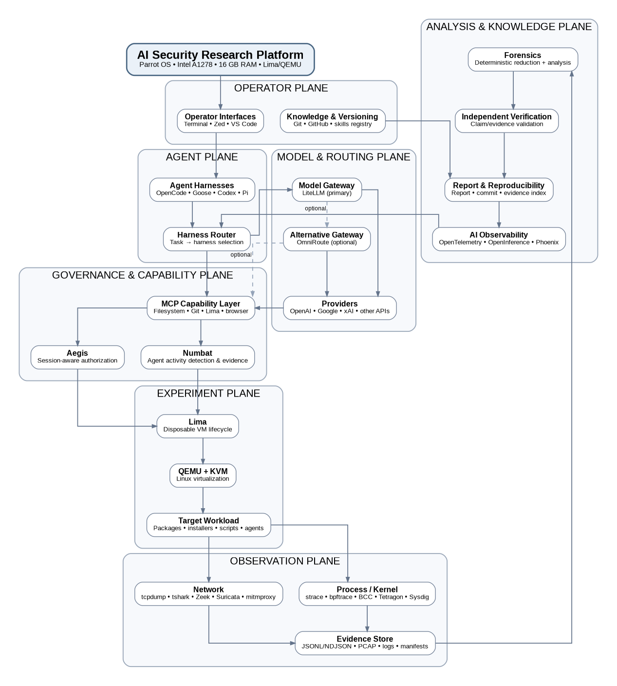

# 🦝 Cusimanse

<p align="center">
  
</p>

> **Declarative, fully multiagentic security-research platform for controlled experiments, observable execution, evidence preservation and independent verification.**

Cusimanse turns a Markdown research contract plus composable YAML recipes into a repeatable agent-operated research run. The selected primary agent coordinates the lifecycle; Lima/QEMU and VM/OS controls provide the actual workload isolation boundary.

**Status:** beta research platform. A green static check is not proof of runtime isolation or production security.

## Architecture



The canonical vector architecture is [`docs/architecture/cusimanse-architecture.svg`](docs/architecture/cusimanse-architecture.svg), with Mermaid source in [`docs/architecture/cusimanse-architecture.mmd`](docs/architecture/cusimanse-architecture.mmd).

### Operating model

```text
Researcher / normal host shell
        ↓
Markdown contract + YAML recipe graph
        ↓
Session YAML + selected profiles + audit
        ↓
Start exactly one primary agent
        ↓
PRIMARY AGENT PROMPT
        ↓
plan → review → approval
        ↓
Lima/QEMU disposable compute
        ↓
VM instrumentation → workload execution
        ↓
evidence + telemetry → blackboard
        ↓
multiagent analysis → verification
        ↓
report → preserve/hash → dashboard finalize → destroy
```

**Where commands run matters:** host setup commands run in the normal research-host shell; the lifecycle prompt runs inside the selected primary agent; the actual experiment workload runs inside disposable compute. Agents, prompts, skills, MCP, CrewAI, LangGraph, Taskflow and `policyctl` are coordination/governance layers, not containment boundaries.

## End-to-end research workflow

The canonical detailed workflow is [`docs/research-workflow.md`](docs/research-workflow.md). The durable session contract is [`recipes/session/session-state.yaml`](recipes/session/session-state.yaml). The evidence-bounded learning contract is [`recipes/session/learning-workflow.yaml`](recipes/session/learning-workflow.yaml). Explicit experiment prompts are [`docs/prompts/go-install-001.md`](docs/prompts/go-install-001.md) and [`docs/prompts/npm-install-001.md`](docs/prompts/npm-install-001.md).

### Layer 1 — Researcher: create the experiment

**Normal host shell, from the Cusimanse repository root:**

1. Create the Markdown contract under `contracts/`.
2. Create the YAML recipe under `recipes/experiments/`.
3. Select host, compute, tools, instrumentation, adapter, roles, skills, MCP, orchestration, policy, routing, reporting and observability profiles.
4. Create `runs/<session-id>/session.yaml` and snapshot the selected profiles and input digests.

### Layer 2 — Researcher: install and validate the host

**Normal host shell:**

```bash
cd <CUSIMANSE_REPO_ROOT>
git checkout architecture-refactor
./scripts/cusimanse-host.sh
./scripts/prerequisites.sh
./scripts/agent-preflight.sh
./policyctl validate
./scripts/tests/validate-project.sh
```

The host profile declares its tools through `recipes/host/research-host.yaml` → `recipes/tools/security-research.yaml`. These scripts prepare and validate the host; they do not run the target workload.

### Layer 3 — Researcher: select and start one primary agent

**Still the normal host shell:**

```bash
goose --help
# or: opencode --help / grok --help / agy --help / pi --help /
#     hermes --help / prime-agent --help / codex --help / claude --help
```

Then start the selected native shell, for example:

```bash
goose
```

or a provider-supported headless form, after checking its current help:

```bash
opencode run '<PROMPT>'
grok -p '<PROMPT>'
pi -p '<PROMPT>'
prime-agent -p '<PROMPT>'
```

Exactly one primary agent is the operator. Do not start CrewAI/LangGraph/Taskflow as a second lifecycle controller.

### Layer 4 — Researcher: provide the experiment prompt

**The prompt is entered inside the primary agent, not in the normal shell.** It names the session, experiment and configuration to load. Use the complete experiment-specific prompts:

- `docs/prompts/go-install-001.md`
- `docs/prompts/npm-install-001.md`

The prompt tells the primary agent to discover/validate the session, plan, request approval, provision compute, start instrumentation, execute the declared workload, collect evidence, delegate specialist roles, verify findings, report, preserve evidence, finalize the dashboard and close the session.

### Layer 5 — Primary agent + multiagentic control plane

The primary agent loads `recipes/agents/primary-agent.yaml` and `recipes/agents/primary-shell.yaml`, then coordinates:

```text
Primary agent
 ├─ Planner
 ├─ Researcher
 ├─ Runtime analyst
 ├─ Forensics analyst
 ├─ Detection analyst
 ├─ Analysis agent
 ├─ Independent verifier
 └─ Report generator
```

CrewAI can coordinate specialist roles; LangGraph can provide stateful graph/checkpoint execution; Taskflow can decompose and track replayable tasks. The primary agent remains lifecycle authority.

### Layer 6 — Compute execution plane

The primary agent provisions the declared Lima/QEMU compute profile. VM/OS controls enforce the actual workload boundary. Instrumentation starts **inside the disposable compute before the target workload**.

The researcher should not run `go install`, `npm install` or the target workload directly on the host as part of an experiment run.

### Layer 7 — Evidence, report and session closure

All artifacts are keyed by `runs/<session-id>/`. Raw evidence is hashed before compute destruction. The report cites preserved evidence and distinguishes observed facts from inference. Every session finalizes token accounting and the dashboard snapshot and records its terminal state in `session.yaml`.

## Reference experiments

### Go: `go-install-001`

**Normal host shell:** prepare and start the primary agent:

```bash
cd <CUSIMANSE_REPO_ROOT>
./scripts/cusimanse-host.sh
./scripts/prerequisites.sh
./scripts/agent-preflight.sh
./policyctl validate
goose
```

**Inside Goose (agent prompt):** paste the prompt in `docs/prompts/go-install-001.md`, replacing `<SESSION_ID>` and repository path.

**Inside disposable compute:** the agent executes the declared workload:

```bash
go install github.com/Opposum0112/ai-security-lab/packages/labprobe@v0.1.0
```

Evidence, telemetry, audit and verification are written to the session artifact tree before compute destruction.

### npm: `npm-install-001`

**Normal host shell:** prepare and start the primary agent:

```bash
cd <CUSIMANSE_REPO_ROOT>
./scripts/cusimanse-host.sh
./scripts/prerequisites.sh
./scripts/agent-preflight.sh
./policyctl validate
goose
```

**Inside Goose (agent prompt):** paste the prompt in `docs/prompts/npm-install-001.md`, replacing `<SESSION_ID>` and repository path.

**Inside disposable compute:** the agent executes the workload declared by `recipes/workloads/npm-install-001.yaml`. Do not run the npm workload directly on the host.

## Session artifact store

```text
runs/<session-id>/
├── session.yaml
├── audit/
├── evidence/raw/ + index.yaml
├── telemetry/
├── provenance/manifest.sha256
├── blackboard/
├── analysis/summary.md
├── verification/result.md
├── research-report/report.md
├── preservation/manifest.yaml
├── observability/token-usage.yaml + dashboard.yaml
└── learning/{candidates,evaluations,replays,verification,promotions}/
```

## Learning / skill improvement

```text
retrieve prior cases/skills
        ↓
Taskflow decomposition
        ↓
primary-agent execution
        ↓
specialist analysis
        ↓
evaluate against contract
        ↓
refine candidate
        ↓
LangGraph checkpoint/replay
        ↓
independent verification
        ↓
human approval
        ↓
promote validated skill/recipe improvement
        ↓
rollback on regression
```

Learned skills cannot grant privilege, alter security policy, expose credentials, bypass approval or change the compute/VM security boundary.

## Security boundary

1. Human authorization defines scope.
2. Contracts and recipes define the experiment.
3. The primary agent owns the approved lifecycle.
4. `policyctl` supplies policy decisions and token accounting; it is not the sandbox.
5. Lima/QEMU plus VM/OS controls enforce disposable workload isolation.
6. Instrumentation precedes target execution.
7. Evidence is preserved and hashed before destruction.
8. Important findings require independent verification.

## Runtime acceptance

```bash
./scripts/tests/production-validation.sh
export CUSIMANSE_LIMA_PROFILE=recipes/lima/profiles/security-research.yaml
./scripts/tests/runtime-integration.sh
./scripts/verify-run.sh reports/runtime/<run-id>
```

A real Lima/QEMU runtime PASS requires execution on a suitable research host. Hosted static CI is not evidence of VM runtime execution.
