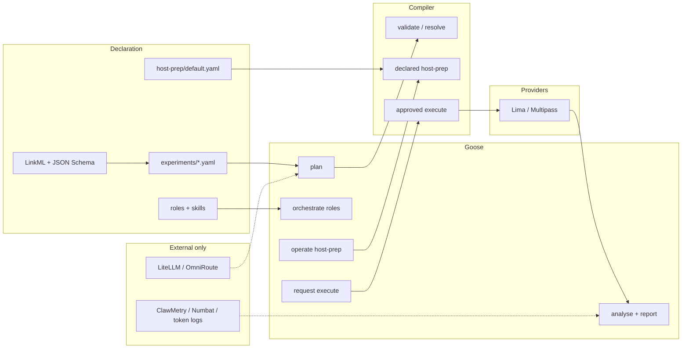

# Cusimanse (`agentic-native-goose`)

Goose-driven research lab. The researcher writes a typed experiment YAML. Goose plans, orchestrates roles, operates host-prep, requests approval, runs the compiler, analyses evidence, and writes the report.

LinkML is the contract language. The small compiler is the only interpreter of those YAML fields. Gateway and observability stay external.

This is a **beta research lab**, not a certified sandbox.

## Architecture



Goose is the operator. The compiler maps YAML ids to handlers. Goose does not invent `limactl` or host `npm`.

## Repository layout

| Path | Role |
|---|---|
| `schemas/` | LinkML + JSON Schema |
| `experiments/` | Experiment contracts (source of truth) |
| `recipes/goose/session.yaml` | Only Goose operator recipe |
| `host-prep/` | Declared host bootstrap |
| `roles/`, `skills/` | Specialist roles and skills |
| `cmd/compile` | YAML compiler Goose calls |
| `cmd/cusimanse` | Existing provision engine used by `compile execute` |
| `profiles/`, `policies/` | Trusted meanings of workload/host ids |
| `docs/architecture/` | Diagrams |

Markdown files under `contracts/` are **not** the contract. Use `experiments/*.yaml`.

## Researcher install

```bash
git clone https://github.com/Opposum0112/Cusimanse.git
cd Cusimanse
git checkout agentic-native-goose
./scripts/install.sh
export PATH="$HOME/.local/bin:$HOME/go/bin:$PATH"
```

Needs: Git, Go 1.22+, Node/npm for npm experiments, Goose, and Lima or Multipass for a live VM run.

## Run an experiment (Goose)

```bash
go run ./cmd/compile validate npm-install-001
goose recipe validate recipes/goose/session.yaml
goose run --recipe recipes/goose/session.yaml --params experiment=npm-install-001
```

Goose will validate, run declared host-prep checks, resolve, wait for approval, then `compile execute --approved`.

## Run without Goose (CI / compiler only)

```bash
go test ./internal/compiler ./cmd/compile
go run ./cmd/compile validate npm-install-001
go run ./cmd/compile host-prep npm-install-001
go run ./cmd/compile resolve npm-install-001
go run ./cmd/compile execute npm-install-001 --approved
```

`execute --approved` delegates provision to `cusimanse --approved run <id>` when that binary is on `PATH`. Otherwise it prints a fail-closed plan.

## Observability and gateway

Declared in `host-prep/default.yaml` and `spec.observability`:

- Host: ClawMetry, Goose logs, token usage
- Experiment: session id, evidence hash, Numbat when deployed
- Gateway: LiteLLM (`127.0.0.1:4000`), OmniRoute (`127.0.0.1:20128`)

Missing optional tools are `NOT_DEPLOYED`, not a cue to invent another stack.

## Tests and CI

- `.github/workflows/agentic-native.yml` — compiler + experiment YAML
- `.github/workflows/validate.yml` — existing scripts plus compiler checks on this branch

```bash
bash ./scripts/tests/validate.sh
bash ./scripts/tests/integration.sh
go test ./internal/compiler ./cmd/compile ./cmd/cusimanse
```

## Safety

Do not treat this as production isolation. Workloads run in disposable guests when provision is deployed. Host execution of experiment workloads is out of scope.
