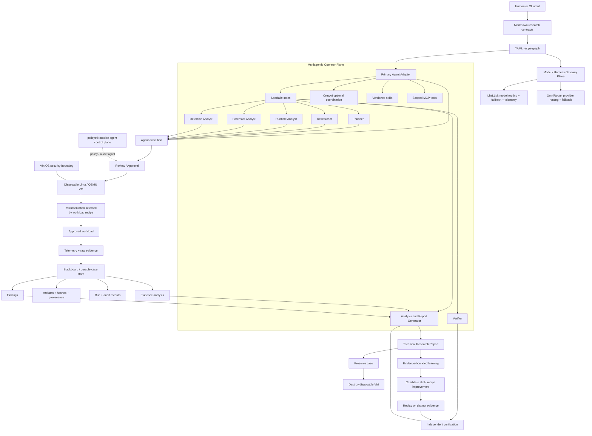

# 🦝 Cusimanse


> **Cusimanse is a declarative, multiagentic research-platform framework for controlled security experiments — with safeguards, disposable execution, evidence preservation and independent verification built into the workflow.**

Cusimanse is a **framework, not a security guarantee**. Its safeguards reduce risk, but it does **not guarantee protection from sandbox escape, host compromise, vulnerable hypervisors, kernel flaws, malicious workloads, misconfiguration, or failures in the surrounding environment**. The disposable VM is a risk-reduction boundary that must itself be tested and independently assessed.

**Markdown specifies. YAML configures. Multiple specialist agents collaborate. Gateways route model traffic. The blackboard preserves evidence and analysis. The final research report is the key human-reviewable output. Lima/QEMU + VM/OS controls enforce the actual execution boundary.**

## Architecture


The architecture is intentionally **multiagentic**: a primary agent adapter owns the case lifecycle while specialist agents perform planning, research, runtime analysis, forensics, detection analysis, verification and report generation. CrewAI may coordinate specialist roles, but it is optional and is not a security boundary.

### Architecture flow



### How to read the architecture

1. **Contract plane:** Markdown states what the research means: intent, scope, hypotheses, safety constraints, evidence requirements, acceptance and promotion gates.
2. **Recipe plane:** YAML makes the design executable and reviewable: campaign, workload, VM, tools, instrumentation, agent adapters, specialist roles, skills, MCP, gateways, audit and reporting.
3. **Multiagentic operator plane:** the selected primary adapter owns the case lifecycle. Specialist agents return structured work products to that operator. No specialist role can grant itself authority.
4. **Gateway plane:** LiteLLM and OmniRoute sit between agents/harnesses and model providers. They provide routing/fallback and observability; they are not the sandbox or policy authority.
5. **Execution plane:** approval is followed by disposable VM provisioning. The workload and its instrumentation run inside the VM. The VM/OS controls mounts, credentials, privilege and networking.
6. **Evidence plane:** every meaningful execution produces durable run/audit records, raw artifacts, telemetry, hashes, provenance, analysis and findings in the blackboard.
7. **Report plane:** a dedicated analysis/report-generator role turns preserved evidence into the technical research report. This is the platform's **key research output**, not an unverified model narrative.
8. **Learning plane:** evidence may produce candidate skill/recipe improvements. Candidates are replayed on distinct evidence, independently verified and human-approved before becoming validated capabilities.

## Evidence, artifacts, analysis and the research report

Evidence is a first-class product of a Cusimanse run. The platform must preserve the **raw source material before the disposable VM is destroyed** and maintain provenance from the artifact to the finding and report section that uses it.

### Evidence and artifact model

| Output | Meaning | Mutability | Example |
|---|---|---|---|
| Run record | What was executed, when, with which recipe/adapter/VM | Append/update by lifecycle checkpoints | run ID, timestamps, recipe digest |
| Audit record | Governance and approval trail | Append-only | approval, action, policy decision |
| Raw artifact | Original captured material | Immutable after capture | logs, pcaps, files, command output |
| Telemetry | Instrumentation observations | Immutable after collection | process, filesystem, network, syscall events |
| Provenance | How evidence was produced and identified | Append-only | source, collector, timestamps, SHA-256 |
| Evidence analysis | Correlation and interpretation of evidence | Versioned | timeline, correlations, hypotheses tested |
| Finding | A claim tied to evidence | Versioned | finding + confidence + supporting artifacts |
| Verification | Independent check of a finding | Append-only/versioned | verifier result and evidence references |
| Research report | Human-reviewable synthesis of the complete case | Versioned | technical report with evidence links |

The report generator **does not rewrite raw evidence**. Analysis can create derived datasets and interpretations, but those remain linked to the original artifacts. A model response by itself is never accepted as evidence.

### Research report structure

A production research report should contain:

```text
research-report/
├── executive-summary.md
├── scope-and-research-question.md
├── environment-and-recipe.yaml
├── workload-and-instrumentation.md
├── execution-timeline.md
├── evidence-inventory.yaml
├── evidence-analysis.md
├── findings.md
├── verification.md
├── limitations.md
├── reproducibility.md
├── provenance-and-hashes.sha256
└── conclusion.md
```

The report should answer **what was tested, how it was tested, what was observed, what evidence supports each conclusion, what was independently verified, what remains uncertain, and how another researcher can reproduce the case**.

## Multiagent roles

Cusimanse is specifically designed as a **multiagentic system**, not merely a single LLM wrapped around scripts.

| Role | Responsibility | Produces |
|---|---|---|
| Planner | Convert contract + recipe into an executable research plan | plan, gates, hypotheses |
| Researcher | Investigate the security question and retrieve relevant context | research notes, candidate hypotheses |
| Runtime Analyst | Interpret runtime behavior and telemetry | timelines, behavioral observations |
| Forensics Analyst | Examine captured artifacts | forensic observations, artifact relationships |
| Detection Analyst | Evaluate detection signals and telemetry | detection findings |
| Verifier | Independently challenge important claims | verification results |
| Analysis Agent | Correlate preserved evidence and findings | evidence analysis |
| Report Generator | Produce the technical research report | final report + provenance links |

CrewAI can coordinate these roles, while the primary agent adapter remains the case operator. Skills and MCP integrations provide capabilities; they do not become authorities.

## YAML recipes by architecture plane

Recipes are deliberately small and composable. A contract describes **why and under what constraints**; recipes describe **which components and configuration** implement it.

### 1. Contract / experiment plane

```yaml
schema: cusimanse.recipe/experiment/v1
name: npm-security-experiment
contract: contracts/research/npm-security.md
workload: npm
vm_profile: recipes/lima/profiles/research.yaml
instrumentation: recipes/instrumentation/npm-workload.yaml
agent: recipes/agents/primary-agent.yaml
roles: recipes/roles/analysis-report-generator.yaml
routing: recipes/routing/default.yaml
reporting: recipes/reporting/default.yaml
```

### 2. Multiagent operator plane

```yaml
schema: cusimanse.recipe/role/v1
name: specialist-research-team
plane: multiagent_operator
roles:
  - planner
  - researcher
  - runtime_analyst
  - forensics_analyst
  - detection_analyst
  - verifier
  - analysis_report_generator
orchestration:
  provider: crewai
  optional: true
security_boundary: vm_os_controls
```

### 3. Gateway plane

```yaml
schema: cusimanse.recipe/model-gateways/v1
name: model-gateway-stack
plane: agent_execution
gateways:
  - id: litellm
    role: model-routing-and-observability
    config_path: ~/.config/cusimanse/litellm.yaml
  - id: omniroute
    role: provider-routing-and-fallback
    config_path: ~/.config/cusimanse/omniroute.yaml
policy:
  secrets_from_environment_only: true
  localhost_by_default: true
  gateway_is_security_boundary: false
```

### 4. Execution / instrumentation plane

```yaml
schema: cusimanse.recipe/instrumentation/v1
name: npm-workload-instrumentation
plane: execution_instrumentation
selection:
  stage: recipe_graph
  selected_by: experiment_recipe
  executed_by: primary_agent_adapter
workload:
  type: npm
  command: npm test
instrumentation:
  tools: [opentelemetry, strace, lsof, tcpdump]
  start_before_workload: true
  stop_after_workload: true
  vm_only: true
collection:
  raw_artifacts: evidence/runs/${run_id}/npm/
  telemetry: blackboard/runs/${run_id}/telemetry/
  hashes: blackboard/runs/${run_id}/provenance/hashes.sha256
```

### 5. Evidence / analysis / report plane

```yaml
schema: cusimanse.recipe/role/v1
name: analysis-report-generator
plane: blackboard_analysis
inputs:
  - blackboard/raw-artifacts
  - blackboard/telemetry
  - blackboard/audit-records
  - blackboard/verification-results
outputs:
  - blackboard/evidence-analysis
  - blackboard/research-report
report:
  evidence_links_required: true
  raw_artifacts_immutable: true
  independent_verification_required: true
```

### 6. Governance / observability plane

```yaml
schema: cusimanse.recipe/token-usage/v1
name: session-token-usage
plane: observability_governance
contract:
  command: cusimanse-token-dashboard
  policy_interface: policyctl token-dashboard
ledger:
  path: reports/token-usage/usage.json
validation:
  security: localhost-only
  authorization: false
```

See `recipes/README.md` for the complete recipe family map.

## Where instrumentation is selected

Instrumentation is **selected during recipe composition, before execution**, not improvised by a model after entering the workload.

The experiment/campaign recipe identifies the workload and references an instrumentation recipe. The instrumentation recipe declares the tools, telemetry types, start/stop lifecycle, VM-only requirement and collection destinations. The primary agent adapter executes that declared instrumentation after approval and VM provisioning.

This separation makes instrumentation:

- declarative and reviewable;
- reproducible across runs;
- workload-specific without changing the platform core;
- auditable through the blackboard;
- enforceable as VM-only execution.

For an npm workload, for example, the recipe can select OpenTelemetry for application-level traces, `strace` for syscall behavior, `lsof` for process/file/network state and `tcpdump` for network evidence. The exact tool set is a recipe decision; tools unavailable on the host/VM are explicitly reported as `NOT_DEPLOYED` rather than silently replaced.

## Example: instrumenting an npm workload

A representative case can look like:

```text
1. Research contract defines the npm security question and safety limits.
2. Experiment recipe selects the npm workload and disposable VM profile.
3. Instrumentation recipe selects telemetry and collection tools.
4. Agent plans and requests approval.
5. Lima/QEMU creates the disposable VM.
6. Instrumentation starts inside the VM.
7. npm install/test/workload executes inside the VM.
8. Logs, package metadata, syscall/network/process telemetry and other raw artifacts are collected.
9. Artifacts are hashed and linked to the run in the blackboard.
10. VM is destroyed only after evidence preservation succeeds.
11. Analysis agent correlates telemetry with raw artifacts and findings.
12. Verifier independently checks important conclusions.
13. Report Generator creates the technical research report.
```

Example evidence layout:

```text
evidence/runs/<run-id>/npm/
├── stdout.log
├── stderr.log
├── package.json
├── package-lock.json
├── npm-debug.log
├── syscalls.strace
├── processes.txt
├── open-files.txt
└── network.pcap

blackboard/runs/<run-id>/
├── run.yaml
├── audit/
├── telemetry/
├── evidence-analysis/
├── findings/
├── verification/
├── provenance/
└── research-report/
```

## Installation and control-plane components

The single installation front door is:

```bash
./scripts/cusimanse-host.sh
```

The interactive installation stages are:

```text
Foundation
  → Primary Agent
  → Control / Learning
  → Observability / Governance
  → Validation
```

The complete researcher profile also installs/checks the model gateway layer:

- **LiteLLM** for model routing, fallback and telemetry integration.
- **OmniRoute** for provider routing and fallback.
- **OpenTelemetry / Phoenix** for agent/application observability.
- **Ponytail / Numbat / Miller** when their executables are available, with declarative fallback when unavailable.
- Security research tools such as `strace`, `lsof`, `tcpdump`, `tshark`, `yara`, `jq`, `yq` and related dependencies where supported by the host package manager.

Installation generates local configuration under `~/.config/cusimanse/`; provider/API secrets remain environment-only and are never stored in recipes or Git.

Gateway recipes are under `recipes/gateways/` and `recipes/routing/`. Installation creates:

```text
~/.config/cusimanse/litellm.yaml
~/.config/cusimanse/omniroute.yaml
~/.config/cusimanse/token-optimization.env
```

These are installation-time host configuration artifacts. They do not grant model gateways authority over VM/OS isolation.

## Token usage and optimization

Every agent/model/tool session should emit token accounting when the provider exposes it. The local dashboard is observability only:

```bash
cusimanse-token-dashboard
```

It validates/initializes the usage ledger and starts a localhost-only dashboard through `policyctl token-dashboard`. Token accounting cannot approve actions, bypass policy or weaken the VM boundary.

The token-optimization skill encourages focused reads, efficient tool calls, caching and reduction of redundant context while explicitly forbidding optimization that removes policy checks, approvals, audit, evidence hashes, provenance or independent verification.

## Operator surfaces: normal shell vs agent shell vs prompt

| Surface | Actor | What it does | What it cannot do |
|---|---|---|---|
| **Normal shell** | Human/operator | Install, validate, inspect host/Lima, inspect evidence, launch the platform | Does not turn a prompt into authorization |
| **Agent/operator shell** | Selected primary adapter | Performs approved case actions and workload operations | Is not the VM/OS security boundary |
| **Agent prompt** | Human → agent | Expresses intent, scope, constraints and requested work | Is never a security control |
| **Specialist agent** | Planner/research/analysis/etc. | Performs a bounded role and returns structured results | Cannot self-authorize or bypass policy |
| **Gateway** | LiteLLM/OmniRoute | Routes model/provider traffic | Cannot enforce sandbox isolation |
| **policyctl** | Host governance | Validates policy and provides governance signals | Is not the sandbox |

**Simple rule:** the prompt requests work; specialist agents reason about bounded tasks; the primary adapter operates the case; the normal shell manages the host; Lima/QEMU + VM/OS controls enforce isolation.

## Runtime execution and production-readiness validation

Static validation is necessary but not sufficient. Production readiness requires a real disposable-VM integration test with evidence preservation and independent verification.

### Static gate

```bash
./policyctl validate
bash ./scripts/agent-preflight.sh
bash ./scripts/tests/validate-project.sh
bash ./scripts/tests/architecture-refactor.sh
go test ./...
```

The integration contract is `recipes/integration/production-readiness.yaml`.

### Runtime acceptance test

Run a controlled, non-destructive workload using a dedicated test VM:

```bash
limactl list
# provision the project test VM using the selected Lima profile
# run the npm workload only inside that VM
# collect evidence and telemetry
# verify hashes and blackboard records
# generate the research report
# independently verify the key finding
# destroy the disposable VM
```

A runtime pass should demonstrate all of the following:

```text
contract loaded
  ✓ recipe graph loaded
  ✓ gateway configuration resolved
  ✓ primary + specialist roles selected
  ✓ approval/audit gate recorded
  ✓ disposable VM created
  ✓ instrumentation started in VM
  ✓ workload executed in VM, not host
  ✓ raw evidence collected
  ✓ telemetry preserved
  ✓ hashes/provenance recorded
  ✓ evidence analysis completed
  ✓ independent verification completed
  ✓ research report generated
  ✓ evidence preserved before VM destruction
  ✓ VM destroyed
```

A static CI pass must **not** be described as proof of sandbox resistance. Production readiness should remain `PENDING` until the real runtime path has passed on the intended host/VM environment.

## Security boundary and limitations

`policyctl` is deliberately outside the agent control plane. It provides host-side policy/configuration and observability signals; it is **not** the sandbox.

The enforcement boundary is **Lima/QEMU + VM/OS controls** for filesystem/mounts, credentials, privilege and networking. No prompt, model, agent, role, skill, MCP server, gateway or orchestrator is a substitute for that boundary.

Cusimanse cannot guarantee escape resistance or host safety. Use dedicated hosts, least privilege, controlled credentials/networking, current hypervisor/OS patches and independent validation appropriate to the workload.

## Key files

| Surface | Location |
|---|---|
| Host preparation front door | `scripts/cusimanse-host.sh` |
| Host preparation state | `recipes/host-state.yaml` |
| Primary agent contract | `recipes/agents/primary-agent.yaml` |
| Agent selection | `recipes/agent-selection.yaml` |
| CrewAI orchestration | `recipes/orchestration/crewai.yaml` |
| Role/skill plugin contract | `recipes/orchestration/role-skill-plugin.yaml` |
| Gateway stack | `recipes/gateways/model-gateways.yaml` |
| Routing | `recipes/routing/default.yaml` |
| npm instrumentation | `recipes/instrumentation/npm-workload.yaml` |
| Analysis/report role | `recipes/roles/analysis-report-generator.yaml` |
| Token usage | `recipes/agent-monitoring/token-usage.yaml` |
| Production readiness | `recipes/integration/production-readiness.yaml` |
| Skills registry | `recipes/skills/registry.yaml` |
| MCP registry | `recipes/mcp/registry.yaml` |
| Campaigns / experiments | `recipes/campaigns/`, `recipes/experiments/` |
| Evidence / audit | `recipes/audit/`, `blackboard/` |
| Canonical architecture | `docs/architecture/cusimanse-architecture.svg` |
| Mermaid source | `docs/architecture/cusimanse-architecture.mmd` |
| Runtime guidance | `docs/runtime-architecture.md` |
