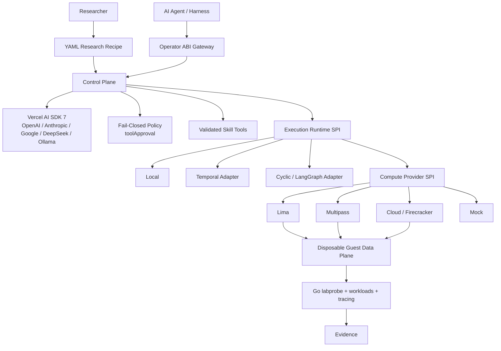

# Cusimanse

**Run security research experiments with an AI agent without giving the agent direct control of your machine.**

Cusimanse is a declarative, agent-operated security research platform. You describe **what you want to investigate** in a YAML recipe; Cusimanse validates the research contract, applies policy and approval gates, runs the workload on disposable compute, and collects evidence.

The important distinction is simple:

> **Your AI agent is the researcher. Cusimanse is the governed execution boundary.**

## What can I use it for?

Cusimanse is designed for repeatable, isolated research such as:

- **Software supply-chain research** — observe package installation and build behavior.
- **Malware analysis** — execute suspicious workloads inside disposable compute and collect telemetry.
- **Vulnerability validation** — reproduce a declared behavior while keeping execution inside the research boundary.
- **Detection engineering** — generate process, filesystem, network, and kernel evidence for detection development.
- **Threat research** — let an agent investigate a research question while Cusimanse enforces the declared scope.
- **Agentic security experiments** — give different AI agents or harnesses the same research contract and execution boundary.

## How it works

You provide three things:

1. **A research recipe** — the question, scope, workload, capabilities, evidence requirements, and cleanup rules.
2. **An AI model or agent** — OpenAI, Anthropic, Google, DeepSeek, Ollama, or another compatible operator.
3. **A compute provider** — Mock for CI, or disposable Lima/Multipass/Firecracker-based infrastructure for real experiments.

Cusimanse then follows this path:

```text
Research recipe
      │
      ▼
 Validate + compile
      │
      ▼
 Policy + approval gate ──► DENY unknown/unsafe operation
      │
      ▼
 AI agent proposes research actions
      │
      ▼
 Execution runtime
      │
      ▼
 Disposable compute
      │
      ▼
 Workload + labprobe telemetry
      │
      ▼
 Evidence + experiment result
```

## Try it in minutes

### 1. Install

```bash
git clone https://github.com/Opposum0112/Cusimanse.git
cd Cusimanse
npm install
npm run build
npm link
```

### 2. Validate a recipe

```bash
cusimanse compile recipes/examples/npm-install.yaml
```

Compilation turns the YAML research contract into validated intermediate representation (IR) before execution.

### 3. Run safely with the Mock provider

```bash
cusimanse run recipes/examples/npm-install.yaml --provider mock --runtime local
```

The **Mock provider is hermetic** and is the recommended way to try Cusimanse, develop recipes, and run tests without a hypervisor.

### 4. Run with disposable compute

For a real sandbox, select an available provider:

```bash
cusimanse run recipes/examples/npm-install.yaml --provider lima --runtime local
```

or:

```bash
cusimanse run recipes/examples/npm-install.yaml --provider multipass --runtime local
```

Lima requires `limactl`; Multipass requires `multipass`. Cloud/Firecracker is exposed through the compute-provider SPI and requires a configured provider adapter.

## Write a research recipe

A recipe is the main user-facing contract. It declares **intent rather than arbitrary shell commands**.

For example, a recipe can say:

```yaml
research_question:
  question: What happens when this package is installed?

scope:
  paths:
    - /workspace
  egress:
    mode: declared-only

allowed_capabilities:
  - vm.create
  - workload.npm.install
  - evidence.collect
  - network.observe

evidence_required:
  - type: process
  - type: network
  - type: log
```

The full example is in `recipes/examples/npm-install.yaml`. See `docs/recipe-authoring.md` for the complete contract.

## Choose how you want to run it

### AI models

Cusimanse uses **Vercel AI SDK 7** so the research runtime is not tied to one model vendor.

Supported provider families include:

| Provider | Typical use |
|---|---|
| OpenAI | Hosted frontier models |
| Anthropic | Hosted reasoning/coding models |
| Google | Gemini models |
| DeepSeek | API or OpenAI-compatible endpoint |
| Ollama | Local models through an OpenAI-compatible endpoint |

Credentials can be supplied without putting secrets in recipes:

- CLI: `--model`, `--api-key`, `--base-url`
- Environment: `ANTHROPIC_API_KEY`, `OPENAI_API_KEY`, `GEMINI_API_KEY`, `DEEPSEEK_API_KEY`, `OLLAMA_BASE_URL`
- Project configuration: `./.cusimanse/config.yaml` / `.env`
- User configuration: `~/.cusimanse/config.yaml`

Configuration is resolved from the most specific user-provided source first.

### Execution runtimes

Choose the execution model independently from the compute provider:

```bash
# Simple local execution
cusimanse run recipe.yaml --runtime local --provider mock

# Durable workflow adapter
cusimanse run recipe.yaml --runtime temporal --provider lima

# Cyclic/adversarial research adapter
cusimanse run recipe.yaml --runtime graph --provider lima
```

This separation means you can change orchestration without rewriting your research recipes or compute integration.

### Compute providers

| Provider | Purpose |
|---|---|
| `mock` | Hermetic development and CI |
| `lima` | Disposable VM research on supported desktop/server environments |
| `multipass` | Disposable Ubuntu VM research |
| `cloud` / Firecracker | Provider boundary for stronger isolated/cloud execution |

All provider integrations use typed argument vectors rather than interpolating untrusted commands into a shell.

## AI-agent skills

Validated skills let an agent use reusable research capabilities without embedding provider-specific logic in the agent.

A validated skill contains:

```text
skills/validated/<skill>/
├── SKILL.md       # instructions and research guidance
└── schema.json    # typed input contract
```

At startup Cusimanse scans `skills/validated/`, validates the skill contract, converts its schema into a Zod-backed AI SDK tool, and routes execution through the active compute provider and approval policy.

Candidate skills are **not automatically executable**. Promote them only after validation:

```bash
cusimanse skills promote skills/candidate/my-skill
```

## Security boundary

Cusimanse is deliberately fail-closed:

- A model proposal is **not** an execution authorization.
- Unknown operations are denied.
- Tool execution passes through the policy/approval boundary before reaching compute.
- Recipes constrain capabilities, paths, networks, evidence, and lifecycle.
- Real workloads are intended to run on disposable compute rather than directly on the operator host.
- Evidence collection and teardown are part of the research lifecycle.
- Validated skills are declarative and schema-checked; candidate content is not treated as trusted executable code.

For threat assumptions, supported versions, reporting, and hypervisor-breakout considerations, see `SECURITY.md`.

## Use Cusimanse from another agent or application

You do not have to use the CLI directly. Start the Operator ABI Gateway:

```bash
cusimanse serve --host 127.0.0.1 --port 8080
```

The gateway provides:

- **JSON-RPC 2.0** at `POST /rpc`
- **REST** endpoints for experiments, evidence, skills, and providers
- **SSE** event streams for experiment progress

The primary operations are:

```text
experiment.run
 evidence.inspect
 skills.promote
 providers.list
```

This makes Cusimanse usable beneath different AI agents, IDEs, automation systems, and research interfaces without coupling the research contract to a particular harness.

See `docs/operator-abi.md` for the typed interface.

## Architecture



### The design in one sentence

**Recipes define the research, agents reason about it, policy controls what may happen, runtimes orchestrate it, compute providers isolate it, and evidence makes the result inspectable.**

## Development

```bash
npm run check-types
npm run lint
npm test
npm run test:coverage
```

Before contributing, read `CONTRIBUTING.md` and `SECURITY.md`.

## Project status

Cusimanse is under active development. The Mock provider and local runtime are the easiest entry points for development and CI; hypervisor and cloud integrations depend on the host environment and provider configuration.
