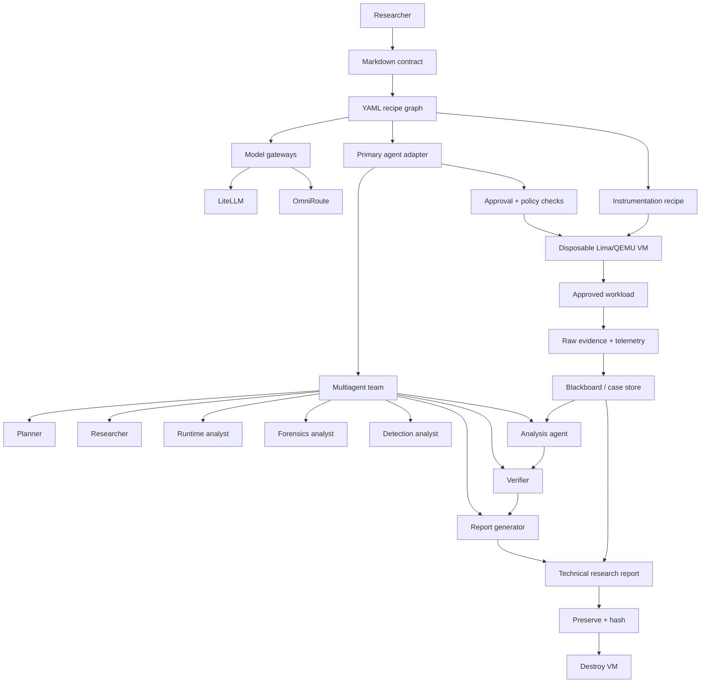

# 🦝 Cusimanse

**Cusimanse is a declarative, multiagentic security-research platform for controlled experiments.** It combines Markdown research contracts, YAML recipes, specialist agents, model gateways, disposable Lima/QEMU VMs, instrumentation, durable evidence, independent verification and a technical research report.

> **Important:** Cusimanse reduces research risk; it is not a security guarantee. VM/OS isolation must be tested and independently assessed.

## Architecture




The key idea is simple: **contracts say why, recipes say what, agents coordinate the research, the VM contains execution, instrumentation captures what happened, the blackboard preserves it, independent verification challenges conclusions, and the report is the final research output.** Gateways route model traffic but are not security boundaries.

## Quick start: host → experiment → report

### 1. Normal host shell: install and prepare

Run these commands on the **researcher's normal host shell**:

```bash
git clone https://github.com/Opposum0112/Cusimanse.git
cd Cusimanse
git checkout architecture-refactor
./scripts/cusimanse-host.sh
```

The installer prepares the host, Lima/QEMU prerequisites, selected agent adapters, research tools, observability/governance tools and model gateways. It also creates local configuration under `~/.config/cusimanse/`.

Start a fresh shell after installation so the installed PATH/configuration is visible:

```bash
exec "$SHELL" -l
```

Then validate the installation:

```bash
./policyctl validate
./scripts/agent-preflight.sh
./scripts/tests/production-validation.sh
```

Check that the expected control-plane commands are available:

```bash
command -v lima
command -v policyctl
command -v cusimanse-token-dashboard
```

### 2. Choose a research case

Two ready examples are provided:

```text
experiments/go-install-001/
recipes/experiments/go-install-001.yaml
recipes/experiments/npm-install-001.yaml
```

The Go case is the simplest first runtime test. The npm case is useful for software-supply-chain research.

### 3. Agent/operator shell: run the research lifecycle

The **agent/operator shell** is the selected primary agent CLI. It is different from the normal host shell.

The normal shell prepares the environment. The agent shell conducts the approved case.

Example with Goose:

```bash
goose
```

Then give the agent the research request below. For another adapter, use the adapter named by `recipes/agents/primary-shell.yaml`.

### 4. Agent prompt: Go installation experiment

Paste this into the selected agent:

```text
Run the Cusimanse go-install-001 security research case.

Use the contract and YAML recipes in this repository. First discover the case,
validate the recipe graph and preflight the host. Explain the plan and required
approval gates before execution.

After approval, create the declared disposable Lima/QEMU VM. Start the declared
instrumentation before the workload. Execute the pinned Go installation workload
inside the VM. Collect raw stdout/stderr, process, filesystem, DNS/network and
security telemetry. Preserve and SHA-256 hash evidence before destroying the VM.

Then have the analysis agent correlate the evidence, have the verifier independently
challenge the important findings, and have the report generator produce the technical
research report with evidence references, provenance, hashes, verification results,
limitations and reproducibility information.

Do not treat model output as evidence. Do not mount host credentials. Do not bypass
policy or approval gates. Destroy the disposable VM only after evidence preservation
succeeds. Finish by showing the run ID and the paths of the evidence, verification
result and research report.
```

The lifecycle is:

```text
discover → validate → preflight → plan → review/approval
→ provision VM → start instrumentation → run workload
→ collect evidence → hash/preserve → analysis
→ independent verification → research report → destroy VM
```

## npm supply-chain research example

The npm example uses the same lifecycle but studies package installation behavior.

Recipe:

```bash
recipes/experiments/npm-install-001.yaml
```

The recipe connects the workload to the security-research VM profile, syscall/network/filesystem instrumentation, optional eBPF, agent monitoring, orchestration, routing, reporting and token accounting.

Use this agent prompt:

```text
Run the Cusimanse npm-install-001 supply-chain research case.

Investigate the approved npm installation workload only inside the disposable VM.
Before execution, discover and validate the experiment, identify the workload,
instrumentation and evidence requirements, and present the execution plan for
approval.

After approval, provision the VM and start instrumentation before npm executes.
Capture npm/package metadata, package-lock information, stdout/stderr, process and
filesystem activity, DNS/network activity and all other telemetry declared by the
recipe. Preserve raw artifacts first and calculate SHA-256 hashes.

Analyze the evidence for unexpected package lifecycle behavior, network access,
process creation, filesystem changes and other supply-chain-relevant observations.
Do not claim malicious behavior without supporting evidence.
Have the independent verifier challenge each material finding. Generate the final
technical research report with an evidence inventory, timeline, analysis, findings,
verification, provenance/hashes, limitations and reproduction steps.

Do not mount host credentials, do not weaken policy, and destroy the VM only after
evidence preservation succeeds. Return the run ID and final artifact locations.
```

The important research question is not simply “did npm install succeed?” It is **what happened during installation and what evidence proves it?**

## Evidence, artifacts and the research report

The **technical research report is the key output** of a Cusimanse experiment. It is generated from preserved evidence and verified findings, not from an unaudited model conversation.

A successful case should contain:

```text
<case>/<run-id>/
├── run.yaml                 # execution metadata and recipe references
├── audit/                   # approvals and governance events
├── evidence/                # immutable raw artifacts
├── telemetry/               # instrumentation output
├── provenance/              # collectors, timestamps and SHA-256 hashes
├── analysis/                # evidence correlation and interpretation
├── findings/                # claims tied to evidence
├── verification/            # independent verification
└── research-report/         # final human-reviewable report
```

The report should answer:

1. What question and hypothesis were tested?
2. Which workload, VM, recipe and instrumentation were used?
3. What actually happened?
4. Which raw artifacts support each important finding?
5. What did the independent verifier confirm or reject?
6. What remains uncertain or could not be observed?
7. Can another researcher reproduce the case?

## Verify that a run really succeeded

A successful command exit is **not sufficient**. Verify the run in this order:

```bash
# 1. Locate the run
find evidence blackboard reports -maxdepth 4 -type f | sort

# 2. Verify hashes when a manifest exists
sha256sum -c <run-directory>/provenance/hashes.sha256

# 3. Confirm verification exists
test -s <run-directory>/verification/*

# 4. Confirm the report exists
test -s <run-directory>/research-report/*
```

Or use the repository verifier:

```bash
./scripts/verify-run.sh <run-directory>
```

The verifier checks that the run metadata, raw evidence, provenance/hash manifest, analysis, independent verification and research report exist, and that the recorded hashes match the preserved artifacts.

**Success means:** workload completed as declared, evidence was preserved, hashes verify, independent verification exists, the research report was generated, and the disposable VM was destroyed only after preservation.

## Where instrumentation is configured

Instrumentation is selected **before execution in the experiment recipe graph**:

```text
experiment recipe
      ↓
instrumentation recipe
      ↓
primary agent adapter
      ↓
disposable VM
      ↓
workload + instrumentation
      ↓
evidence / telemetry
```

For npm, `recipes/instrumentation/npm-workload.yaml` declares the workload-specific capture set. Tools execute inside the VM; they are not chosen ad hoc by the model after execution begins.

## Control surfaces

| Surface | Purpose |
|---|---|
| **Normal host shell** | Install, validate, inspect host, select/run cases and inspect artifacts |
| **Agent/operator shell** | Primary agent lifecycle and approved case operations |
| **Agent prompt** | Research intent, scope, hypotheses and requested work |
| **Specialist agents** | Planning, research, runtime analysis, forensics, detection, analysis and verification |
| **LiteLLM / OmniRoute** | Model/provider routing and fallback; not security boundaries |
| **policyctl** | Governance/policy signal outside the agent control plane |
| **Lima/QEMU + VM/OS** | Actual disposable execution and isolation boundary |

**Prompt requests. Agent reasons. Operator executes approved work. VM/OS controls isolation. Evidence proves what happened. Report communicates the result.**

## Useful files

```text
contracts/                         Research intent and safety constraints
recipes/                           Declarative experiment configuration
recipes/experiments/go-install-001.yaml
recipes/experiments/npm-install-001.yaml
recipes/instrumentation/           Workload instrumentation
recipes/agents/                    Agent adapters and operator contract
recipes/roles/                     Specialist roles
recipes/gateways/                  LiteLLM / OmniRoute configuration
recipes/lima/                      Disposable VM profiles
experiments/                       Ready-to-run research cases
blackboard/                        Durable case/evidence model
scripts/cusimanse-host.sh          Host bootstrap front door
scripts/verify-run.sh              Runtime artifact verification
policyctl                          Governance and validation CLI
```

## Safety boundary

Cusimanse is intended for controlled research. Keep credentials out of disposable workloads, avoid unsafe host mounts, use isolated networking appropriate to the case, review recipes before approval, preserve evidence before VM destruction, and independently verify important findings.
