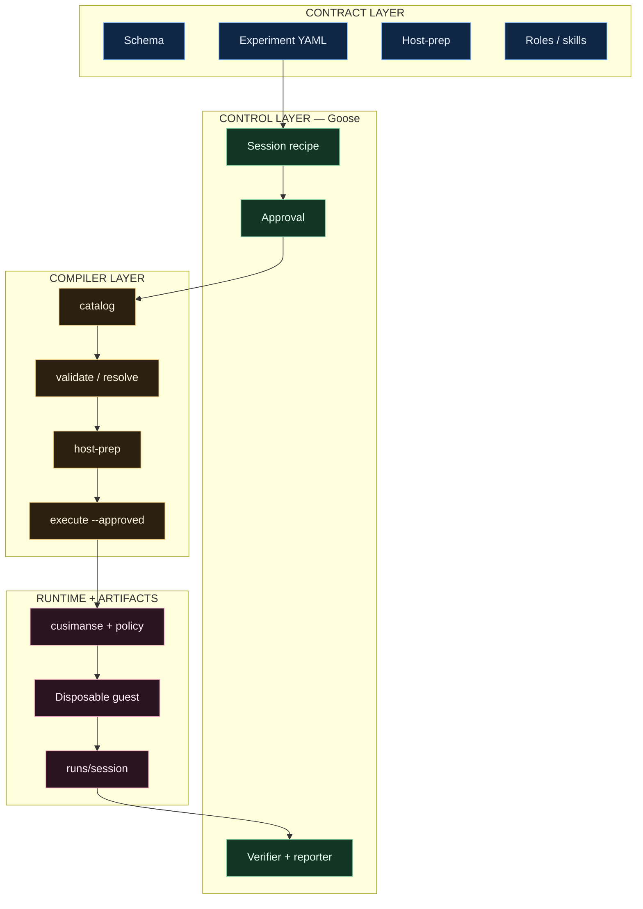

# Cusimanse (`agentic-native-goose`)

Goose-driven research lab. One typed YAML experiment. Goose plans, installs from a declared host-prep list, orchestrates roles, requests approval, runs the compiler, reads evidence, and writes the report.

Beta. Not a certified sandbox.

## Table of contents

1. [Layers](#layers)
2. [Architecture](#architecture)
3. [Components](#components)
4. [Research outputs (`runs/`)](#research-outputs-runs)
5. [Repository structure](#repository-structure)
6. [Which shell](#which-shell)
7. [Install](#install)
8. [Example: npm-install-001 end to end](#example-npm-install-001-end-to-end)
9. [Access and observability](#access-and-observability)
10. [Report generation](#report-generation)
11. [Compiler commands](#compiler-commands)
12. [Tests and CI](#tests-and-ci)
13. [Safety](#safety)

## Layers

| Layer | Files | Who runs it |
|---|---|---|
| Contract schema | `schemas/cusimanse.yaml`, `schemas/experiment.schema.json` | Maintainer |
| Experiment | `experiments/<id>.yaml` | Researcher |
| Host bootstrap catalog | `host-prep/default.yaml` | Goose via compiler |
| Roles / skills | `roles/`, `skills/` | Goose Summon |
| Operator recipe | `recipes/goose/session.yaml` | Goose |
| Compiler | `cmd/compile` | Goose or bash |
| Provision | `cmd/cusimanse` after `--approved` | Compiler |
| Guest | Lima or Multipass | Compiler/engine |
| Gateway / observability | LiteLLM, OmniRoute, ClawMetry, Numbat | External |

## Architecture

See `docs/architecture/agentic-native-goose.mmd`. Authority flows down. Evidence flows up into `runs/<session>/`.



## Components

| Layer | Component | Responsibility |
|---|---|---|
| Contract | Schema / experiment YAML | Legal fields and one study |
| Control | Goose | Plan, approve, Summon |
| Compiler | `cmd/compile` | Interpret YAML only |
| Runtime | guest + `runs/` | Workload + research outputs |

## Research outputs (`runs/`)

Every approved execute creates **one session directory**. That tree is the citable research record. Chat text is not evidence.

```text
runs/<session-id>/
  session.yaml                 session id, experiment id, state, agent
  evidence/
    index.yaml                 what was collected (or NOT_DEPLOYED)
    audit/
      events.jsonl             lifecycle events
      manifest.sha256          hashes of evidence files
    process/                   process snapshots when instrumented
    syscall/                   syscall traces when instrumented
    filesystem/                guest fs diffs when instrumented
    network/                   localhost-only captures when instrumented
  provenance/
    manifest.sha256            hash of the whole session tree
  analysis/
    summary.md                 operator / analyst notes (not authority)
  verification/
    result.md                  VERIFIED | NOT_VERIFIED | PARTIAL + cited paths
  research-report/
    report.md                  requirements-traceable write-up
    report.yaml                machine-readable report metadata
  preservation/
    manifest.yaml              preserve-before-destroy status
  observability/
    token-usage.yaml           Goose token accounting when available
    dashboard.yaml             ClawMetry / Numbat pointers when deployed
```

`<session-id>` is typically `YYYYMMDDTHHMMSSZ-<experiment-id>`.

### What each artifact is for

| Artifact | Key research output |
|---|---|
| `session.yaml` | Which experiment ran, which operator, lifecycle state |
| `evidence/index.yaml` | Inventory of collectors and gaps |
| `evidence/*` | Raw guest observations (process, syscall, fs, net) |
| `evidence/audit/manifest.sha256` | Integrity of evidence files |
| `provenance/manifest.sha256` | Integrity of the whole session |
| `verification/result.md` | Independent check against acceptance lines |
| `research-report/report.md` | Publishable findings and limitations |
| `preservation/manifest.yaml` | Proof evidence was kept before VM destroy |
| `observability/*` | Token use and dashboards; optional |

### How they get written

1. Compiler / engine create the session and collect guest evidence.
2. Hashes are written **before** destroy.
3. Goose **verifier** fills `verification/result.md` from hashes + index.
4. Goose **reporter** fills `research-report/report.md` from verified evidence and `spec.acceptance` in the experiment YAML.

A report that cites only the chat is incomplete. Cite `evidence/` paths and SHA-256 lines.

## Repository structure

```text
experiments/          contracts
recipes/goose/        operator recipe
cmd/compile           YAML interpreter
runs/                 session artifacts (generated, not committed)
```

## Which shell

| Task | Where |
|---|---|
| Install / go test | bash/zsh |
| Drive experiment | Goose |
| Read artifacts | `ls runs/<session>/` in a normal shell |

## Install

```bash
git checkout agentic-native-goose
./scripts/install.sh
```

## Example: npm-install-001 end to end

```bash
go run ./cmd/compile validate npm-install-001
goose run --recipe recipes/goose/session.yaml --params experiment=npm-install-001
ls runs/
```

Then open `runs/<session>/research-report/report.md`.

## Access and observability

Declared on the experiment and in `host-prep/default.yaml`. Missing collectors are `NOT_DEPLOYED` in `evidence/index.yaml`.

## Report generation

Acceptance lines in the experiment YAML are the checklist. Use `PARTIAL` when a collector is missing.

## Compiler commands

```bash
go run ./cmd/compile catalog
go run ./cmd/compile validate <id>
go run ./cmd/compile execute <id> --approved
```

## Tests and CI

```bash
go test ./internal/compiler ./cmd/compile ./cmd/cusimanse
bash ./scripts/tests/integration.sh
```

## Safety

Do not run the workload on the host. `--approved` is required. Hash evidence before destroy.
