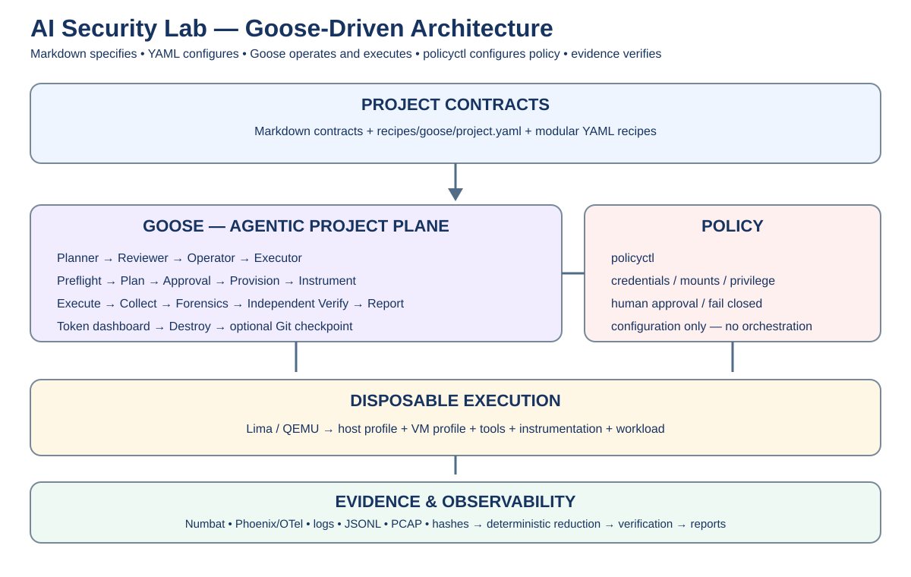

# AI Security Research Lab

> **A modular, recipe-driven security research lab operated by Goose.**

Markdown specifies the research contract. YAML composes the project. Goose plans, reviews and executes. `policyctl` configures host/security policy and owns the local token-usage web dashboard. Evidence and independent verification establish what actually happened.



## 1. Quick start

Install and configure the current Goose CLI, then from the repository root:

```bash
goose run --recipe recipes/goose/project.yaml --params experiment=go-install-001 --params section=project
```

The recipe performs host preflight and prerequisite resolution before attempting the project workflow. A missing capability becomes `NOT_DEPLOYED`; it is not silently substituted.

### Run one section

```bash
goose run --recipe recipes/goose/project.yaml --params experiment=go-install-001 --params section=07
```

The same prerequisite, approval and audit flow is used for section-only execution.

### Token dashboard

`policyctl` is the **only** command surface for the token web dashboard:

```bash
go build ./cmd/policyctl
./policyctl token-dashboard
```

Open the printed localhost URL. The dashboard reads `reports/token-usage/usage.json`; it does not expose a public listener by default.

## 2. Architecture

```text
Human / CI
   ↓
Markdown contracts
   ↓
Goose project recipe
   ↓
MCP registry + Skill registry + Audit layer
   ↓
Prerequisite / installation recipes
   ↓
Experiment composition
   ├── workload
   ├── host profile
   ├── VM profile
   ├── tools
   ├── instrumentation
   ├── agent monitoring
   ├── routing
   └── reporting
   ↓
Disposable Lima / QEMU VM
   ↓
Evidence → deterministic reduction → forensics → independent verification
   ↓
Reports / token telemetry / Git
```

## 3. Recipe families

```text
recipes/
├── goose/              # Goose entry workflow
├── experiments/        # experiment compositions
├── workloads/          # workload definitions
├── install/            # prerequisites and installation
├── host/               # host profiles
├── lima/profiles/      # VM profiles
├── tools/              # tool inventory
├── instrumentation/    # instrumentation profiles
├── agent-monitoring/   # Numbat/Phoenix/OTel
├── mcp/                # MCP registry
├── skills/             # skill registry
├── audit/              # audit layer
├── agents/             # agent roles
├── orchestration/      # workflow stages
├── routing/            # model/harness routing
├── stages/             # Markdown stage map
├── reporting/          # report recipes
├── token/              # token telemetry recipe
└── tests/              # validation
```

An experiment selects reusable profiles; it should not duplicate VM or instrumentation configuration without a genuine capability difference.

## 4. Execution model

| Layer | Responsibility |
|---|---|
| Markdown | requirements, threat model, research intent |
| Goose | reasoning, planning, approval workflow, execution, evidence workflow |
| Recipes | configuration and composition |
| MCP registry | declared agent capabilities |
| Skill registry | reviewed reusable agent instructions |
| Audit layer | append-only action/decision record |
| `policyctl` | host/security policy + token dashboard only |
| Lima/QEMU | disposable isolation |
| Numbat/Phoenix/OTel | observation |
| Git | durable state |

Goose is **not** the security boundary. Policy, approval, VM isolation, credential separation, evidence preservation and independent verification are.

## 5. Installation and prerequisites

The installation path is deliberately one-go:

```text
Goose
  → read install recipe
  → host preflight
  → install declared prerequisites
  → re-run preflight
  → resolve experiment profiles
  → plan
  → approval
  → execute
```

Optional tools are installed only when the selected experiment requires them. Unknown installers are denied.

## 6. MCP, skills and audit

The project now has three explicit agent-capability layers:

- `recipes/mcp/registry.yaml` — what MCP servers/capabilities may exist.
- `recipes/skills/registry.yaml` — which repository skills may be loaded.
- `recipes/audit/default.yaml` — how material agent actions and decisions are recorded.

MCP remains localhost/approval-first. Skills are instructions, not security boundaries. Audit records never contain secrets.

## 7. Security contract

Use only on systems and workloads you own or are explicitly authorized to test.

- untrusted workloads run only in disposable VMs;
- host credentials are denied;
- unrestricted host mounts are denied;
- privileged/destructive actions require approval;
- instrumentation starts before the workload;
- evidence is preserved and hashed before VM deletion;
- deterministic reduction happens before LLM analysis where practical;
- important findings receive independent verification;
- unavailable components are `NOT_DEPLOYED`.

See `AI-DISCLAIMER.md`, `AGENTS.md` and `SECURITY.md`.

## 8. Documentation map

| Section | Contract | Focus |
|---|---|---|
| 01 | Deployment Architecture | system boundaries |
| 02 | System Requirements | prerequisites |
| 03 | Deployment Runbook | installation and first run |
| 04 | Security Model | threats and controls |
| 05 | Multi-Agent Operating Model | roles and handoffs |
| 06 | Observability & Evidence | telemetry and evidence |
| 07 | Experiment Framework | reusable experiment design |
| 08 | go-install-001 | end-to-end acceptance experiment |
| 09 | Operations & Maintenance | upgrades and recovery |
| 10 | Validation & Acceptance | PASS/PARTIAL/FAIL/NOT_DEPLOYED |
| 11 | Harness Reference | current external-harness notes |


## 9. Acceptance

Configuration alone never means PASS. A component is PASS only when its runtime behavior is evidenced. Otherwise use `PARTIAL`, `FAIL`, or `NOT_DEPLOYED` honestly.

## 10. License

MIT. See `LICENSE` and `NOTICE`.
