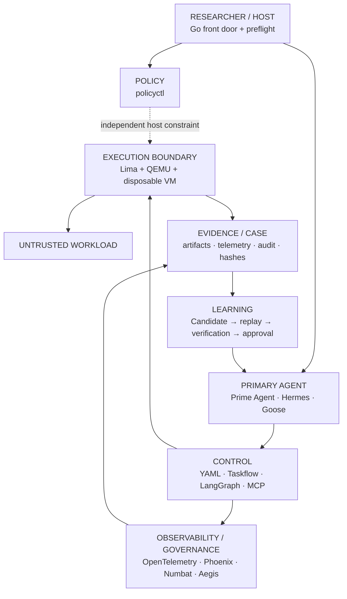

# 🦝 Cusimanse

> Autonomous, agentic security research platform for controlled workload detonation, runtime analysis, anomaly detection and evidence extraction inside disposable virtual machines.

Cusimanse prepares a researcher host, selects one primary terminal agent, runs workloads inside disposable Lima/QEMU VMs, collects evidence, independently verifies findings, and preserves artifacts before VM destruction.

## Architecture




## One frontdoor deployment

The supported researcher interface is a single Go front door. It installs and verifies the host/VM, primary-agent, control/learning, and observability/governance planes interactively and then runs the comprehensive preflight. Installation is performed plane by plane so the researcher can accept or skip each capability group.

From the repository root:

```bash
./scripts/cusimanse-host.sh
```

The front door presents:

1. **Host + VM plane** — Git, Bash, Python, Ruby, Go, QEMU and Lima.
2. **Primary Agent plane** — choose Prime Agent, Hermes, Goose, or no primary adapter; supported adapters are installed and the selected adapter is recorded in the recipe.
3. **Control + Learning plane** — research utilities, YAML tooling, LangGraph-related tooling and the skill-learning stack.
4. **Observability + Governance plane** — OpenTelemetry, Phoenix, **Numbat** and **Aegis**, with OS-aware installation fallbacks.
5. **Comprehensive preflight** — validates the resulting host and selected capabilities.
6. **Policy validation** — optionally runs the independent host-side `policyctl validate` check.

Installation and preflight may update local YAML recipes when a value is not defined. Deployment state is recorded only from locally verifiable capability checks; otherwise the recipe remains `NOT_DEPLOYED`.

### Manual installation options

The Go front door is the supported interface. The underlying commands remain available for operators who need individual plane control:

```bash
bash ./scripts/prerequisites.sh
bash ./scripts/install-observability.sh
bash ./scripts/agent-preflight.sh
./policyctl validate
```

The manual commands do not replace the front-door workflow; they provide explicit per-plane operation and automation hooks.

## OS support and fallback strategy

| Host | Preparation | Fallback |
|---|---|---|
| Ubuntu/Debian | `apt` | supported package fallback where available |
| Fedora/RHEL-family | `dnf` | supported package fallback where available |
| Arch-family | `pacman` | supported package fallback where available |
| openSUSE/SUSE | `zypper` | supported package fallback where available |
| Alpine | `apk` | supported package fallback where available |
| macOS | Homebrew | official release/source fallback where supported |
| Windows | WSL2 | Linux installation path inside WSL2 |

Lima always attempts the native package path first and uses its official release archive when the native package is unavailable. Numbat uses Go installation first and an official release asset fallback. Aegis uses its upstream installer first and a source/Docker fallback on supported Linux/macOS hosts. Unsupported combinations are reported as `NOT_DEPLOYED`, never silently treated as installed.

Third-party installers are not security boundaries. Verify release provenance according to the research environment's supply-chain requirements before enabling them on sensitive hosts.

## Primary agent

Cusimanse uses exactly one selected primary operator shell per case. The agent operates the research workflow; it is not the VM security boundary.

Supported adapters:

```text
prime-agent
hermes
goose
```

Example after installation:

```bash
export CUSIMANSE_PRIMARY_ADAPTER=prime-agent
prime-agent
```

The selected adapter is written to `recipes/agents/self-learning-primary.yaml` by the configuration step when the adapter is locally available.

## Observability and governance

Numbat provides local agent observability, detection and forensic records. Its CLI includes agent discovery, scanning, timeline reconstruction, OTLP/HTTP collection, live hooks, rules and case verification. Cusimanse keeps Numbat on the observability plane; it does not replace the VM execution boundary. citeturn0search10

Aegis is an independent runtime policy/audit integration for AI agents. Cusimanse treats it as governance/observability, not as the workload isolation boundary. The selected integration must be independently verified before being considered deployed. citeturn0search12

The observability installer is:

```bash
bash ./scripts/install-observability.sh
```

The integration recipes are:

```text
recipes/observability/numbat.yaml
recipes/observability/aegis.yaml
```

Numbat's default OTLP/HTTP receiver is loopback-oriented; keep observability endpoints private unless an authenticated and explicitly controlled network path is required. citeturn0search10

## Policy control

`policyctl` is **outside the agent control plane**. It is the independent host-side policy and validation layer.

| Command | Use |
|---|---|
| `./policyctl validate` | Validate the active host policy and required policy invariants before research execution. |
| `./policyctl --help` | Show all available policy-control commands and options. |

The primary agent cannot redefine `policyctl` as part of its own control flow. VM/OS isolation, mounts, privileges, credentials, network controls and approval gates remain the security boundary controls.

## Control, workflow and learning

Recipes describe experiment and campaign semantics; the selected agent operates them. LangGraph provides stateful execution, while the durable evidence/case layer remains independent.

```bash
find recipes -name '*.yaml' -print
yq '.' recipes/agents/self-learning-primary.yaml
bash ./scripts/tests/validate-project.sh
bash ./scripts/tests/architecture-refactor.sh
go test ./...
```

Lifecycle:

```text
Discover → Validate → Retrieve → Plan → Review → Approve
→ Provision VM → Instrument → Execute → Collect → Analyze
→ Verify → Learn → Promote → Preserve → Destroy
```

A learned procedure remains **CANDIDATE** until replay on distinct evidence, independent verification, provenance and human approval gates pass.

## Execution boundary

Untrusted workload commands execute inside disposable Lima/QEMU VMs through the selected agent workflow. The normal researcher shell and primary-agent shell are distinct contexts.

```bash
limactl list
limactl shell <vm>
limactl stop <vm>
limactl delete <vm>
```

Preserve evidence before VM destruction.

## Evidence and integrity

```bash
find evidence blackboard runs -type f -print 2>/dev/null
sha256sum <file>
find .agents/skills -name SKILL.md -print
git diff -- .agents/skills/
```

Evidence, telemetry, audit records and hashes provide the basis for independent verification and later skill promotion.

## Validation

The standard engineering validation set is:

```bash
./policyctl validate
bash ./scripts/agent-preflight.sh
bash ./scripts/tests/validate-project.sh
bash ./scripts/tests/architecture-refactor.sh
go test ./...
```

A `PASS` is a result of the corresponding engineering/capability check. It is not a certification of sandbox resistance. Runtime security claims require actual experiment evidence and independent verification.

## System requirements

- Linux or macOS directly; Windows through WSL2.
- 4+ CPU cores recommended.
- 16 GB RAM recommended for VM and observability workloads.
- 40+ GB free disk recommended for VM images and evidence.
- Hardware virtualization enabled where applicable.
- Network access for permitted installation and research enrichment.
- One supported primary terminal agent for agent-driven cases.

See `docs/system-requirements.md` for detailed requirements and deployment constraints.

## Security invariants

- Lima/QEMU disposable VM is the workload execution boundary.
- `policyctl` remains outside the agent control plane.
- Host credentials are not exposed to workloads or learned skills.
- Public MCP exposure is denied by default.
- Observability and governance are not isolation boundaries.
- Retrieval does not grant execution authority.
- Evidence is preserved before VM destruction.
- Learned capabilities require replay and independent verification before promotion.
