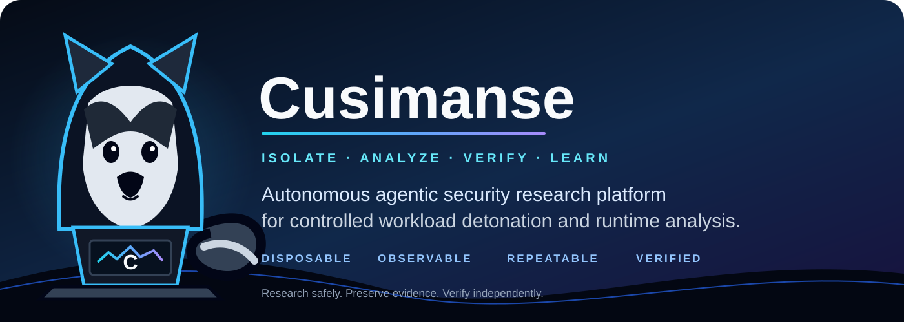
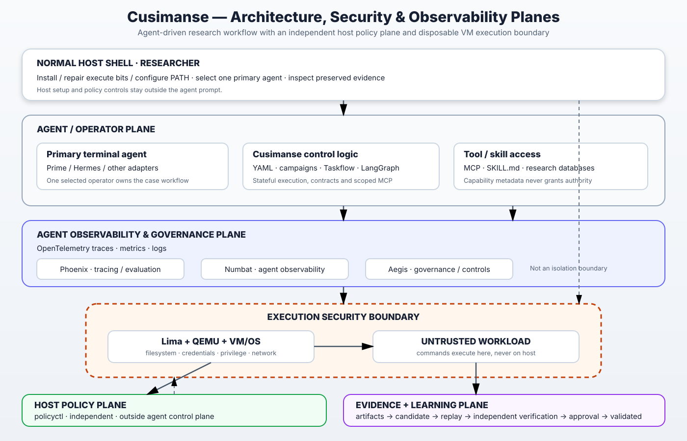

# 🦝 Cusimanse

> **Declarative, fully multiagentic security-research platform for controlled experiments, observable execution, evidence preservation and independent verification.**

Cusimanse turns Markdown research contracts and composable YAML recipes into repeatable, agent-operated research sessions. The selected primary agent owns the lifecycle; Lima/QEMU plus VM/OS controls provide the actual workload isolation boundary.

**Status:** beta research platform. Static validation is not proof of runtime isolation or production security.



## AI use and usage disclaimer

Cusimanse is an **AI-assisted security research framework**. AI agents and models may be used to plan experiments, delegate specialist analysis, operate declared workflows, interpret telemetry/evidence, generate reports, and propose reusable skills. Model outputs can be incomplete, incorrect, nondeterministic or unsafe if used outside the declared controls.

AI is a capability layer, **not a security boundary or an authority to expand scope**. Human researchers remain responsible for authorization, scope, approvals, credentials, safety decisions and final interpretation. Cusimanse does not guarantee that an AI agent, model, skill, MCP tool, orchestration framework or generated output is correct or secure.

Use AI providers and agent tools according to their own terms and privacy policies. Do not place secrets, credentials or sensitive research data into model prompts or telemetry unless the deployment explicitly authorizes and protects them. Review generated commands and findings before execution or publication, and use disposable compute for untrusted workloads.

## System requirements

| Area | Requirement |
|---|---|
| Host OS | Linux or macOS; Windows through WSL2 |
| CPU | Hardware virtualization recommended; 4+ cores recommended |
| RAM | 8 GB minimum; 16 GB+ recommended |
| Disk | 20 GB minimum; 40–50 GB+ recommended for VM images/evidence |
| Runtime | Lima + QEMU |
| Languages | Go, Python 3, Ruby |
| Utilities | Git, Bash, curl |
| Agent | At least one supported primary terminal agent |
| Network | Outbound access only where installation/experiment policy permits |

Detailed requirements, package-manager support and preflight behavior: [`docs/system-requirements.md`](docs/system-requirements.md).

## Architecture



- **Canonical rendering:** [`docs/architecture/cusimanse-architecture.svg`](docs/architecture/cusimanse-architecture.svg)
- **Canonical editable Mermaid source:** [`docs/architecture/cusimanse-architecture.mmd`](docs/architecture/cusimanse-architecture.mmd)

The Mermaid diagram explains the numbered research flow and the control/data planes from contract creation through session closure.

## Repository structure

```text
Cusimanse/
├── contracts/       # research contracts and reference semantics
├── recipes/         # executable declarative composition and profiles
├── experiments/     # reference experiment material/output
├── .agents/         # agent roles, skills and MCP metadata
├── skills/          # reviewed/promoted skills
├── packages/        # research packages
├── policies/        # host/action policy
├── blackboard/      # durable case metadata
├── reports/         # generated reports/token history
├── manifest/        # package/source-of-truth manifest
├── docs/            # architecture + focused guides
├── scripts/         # bootstrap/preflight/validation helpers
├── cmd/             # policyctl and host tooling
└── tools/           # research-tool documentation
```

**Documentation rule:** contracts define research semantics, recipes define execution composition, README defines the researcher workflow, and `docs/` contains focused guides plus the canonical architecture. Do not duplicate the end-to-end workflow in another document.

**Configuration rule:** `recipes/` is the source of truth for host tools, VM profiles, agents, orchestration, instrumentation, gateways, observability, policy references and experiments. There is no parallel `infra/` configuration tree.

## Researcher workflow

### Step 1 — Define the experiment

**Normal host shell, from the Cusimanse repository root.** Use `go-install-001` as the reference pattern:

```text
contracts/08-go-install-001.md
        │ what / why / scope / safety / evidence / acceptance
        ▼
recipes/experiments/go-install-001.yaml
        │ composition
        ├─ workload: recipes/workloads/go-install-001.yaml
        ├─ host: recipes/host/research-host.yaml
        ├─ compute: recipes/lima/profiles/security-research.yaml
        ├─ tools: recipes/tools/security-research.yaml
        ├─ instrumentation: recipes/instrumentation/*
        ├─ agent/orchestration: recipes/agents/* + recipes/orchestration/*
        └─ audit/reporting/observability: recipes/{audit,reporting,observability}/*
```

For a new experiment:

1. Create `contracts/<id>.md` with purpose, scope, safety, evidence and acceptance.
2. Create `recipes/experiments/<id>.yaml` to compose the required profiles.
3. Create `recipes/workloads/<id>.yaml` with the exact approved commands and **where they execute**.
4. Select the host/compute/tool/instrumentation/agent/orchestration/policy/routing/reporting/observability recipes.
5. Create `runs/<session-id>/session.yaml` from `recipes/session/session-state.yaml` and snapshot the selected profiles.
6. Validate before execution.

Use the supplied `npm-install-001` as the second test/reference experiment.

### Step 2 — Install and validate the host

**Normal host shell:**

```bash
cd <CUSIMANSE_REPO_ROOT>
./scripts/install.sh
./scripts/cusimanse-host.sh
./scripts/agent-preflight.sh
./policyctl validate
./scripts/tests/validate-project.sh
```

The all-inclusive installer prepares the selected host/control-plane capabilities declared by the recipes, including prerequisites, selected agent adapters, control/learning tooling, agent observability, token tooling and model gateways. `recipes/tools/security-research.yaml` declares host/VM tool inventories; VM workload tools are installed or selected inside disposable compute according to the workload recipe. `./scripts/agent-preflight.sh` verifies what is actually deployed. These commands prepare the host; they do not run the experiment workload.

### Step 3 — Select one primary agent

**Normal host shell:**

```bash
command -v goose && goose --help
```

Choose exactly one adapter from `recipes/agents/adapter-matrix.yaml` and record it in `session.yaml`. Other supported adapters include OpenCode, Grok Build, Antigravity, Pi, Hermes, Prime Agent, Codex and Claude Code. Verify provider-specific command syntax with the installed adapter's help.

### Step 4 — Start the primary agent

Starting the agent remains a **normal host-shell** operation:

```bash
goose
```

The selected primary agent then becomes the lifecycle operator. Do not start another tool as a competing lifecycle controller.

### Step 5 — Provide the experiment prompt

**Inside the primary agent**, provide the experiment-specific prompt:

- Go: `docs/prompts/go-install-001.md`
- npm: `docs/prompts/npm-install-001.md`

The prompt loads the contract, experiment recipe, session YAML and profiles and instructs the primary agent to validate → plan → request approval → provision → instrument → execute → collect → analyze → verify → report → preserve → finalize → destroy.

### Step 6 — Multiagentic operation

The primary agent is the single lifecycle authority and delegates declared specialist work:

```text
Primary agent
├─ Planner
├─ Researcher
├─ Runtime analyst
├─ Forensics analyst
├─ Detection analyst
├─ Analysis agent
├─ Independent verifier
└─ Report generator
```

Optional tools are selected through recipes: **Taskflow** decomposes replayable tasks, **LangGraph** provides state/checkpoints, and **CrewAI** delegates specialist roles. They are coordination layers, not security boundaries.

### Agent observability

Agent observability is configured by `recipes/agent-monitoring/observability.yaml` and attached to the adapter registry. The all-inclusive `./scripts/install.sh` installs/checks the observability foundation; `./scripts/agent-preflight.sh` verifies deployed capabilities and reports unavailable optional backends as `PARTIAL` rather than silently claiming coverage.

The stack covers:

- **Numbat** — process tree, shell commands, network connections, file activity and agent-tool activity.
- **Phoenix + OpenTelemetry** — traces, spans, model/tool calls, errors and approvals.
- **Aegis** — security/governance observability where deployed.
- **Token dashboard** — per-session model/token accounting and session-end finalization.

Useful host commands:

```bash
./scripts/install.sh
./scripts/agent-preflight.sh
cusimanse-token-dashboard
```

Configuration is recipe-driven; provider credentials remain outside Git. Observability is not the security boundary. If an optional backend is unavailable, the session/project may be `PARTIAL`; required workload isolation still depends on Lima/QEMU and VM/OS controls.

### Step 7 — Execute the workload in disposable compute

The primary agent provisions the declared Lima/QEMU profile. VM/OS controls enforce the execution boundary. Instrumentation starts before the target workload.

**Go reference — inside the disposable VM:**

```bash
go version
go install ./packages/labprobe
```

**npm reference — inside the disposable VM:**

```bash
node --version
npm --version
mkdir -p /tmp/npm-test
cd /tmp/npm-test && npm init -y
cd /tmp/npm-test && npm install lodash@4.17.21 --ignore-scripts
```

These workload commands are declared by their workload recipes and must not be run directly on the research host during an experiment.

### Step 8 — Store evidence and report

Every session writes to `runs/<session-id>/`:

```text
session.yaml
  audit/          evidence/        telemetry/       provenance/
  blackboard/     analysis/        verification/   research-report/
  preservation/   observability/   learning/
```

Raw evidence is ground truth. Hash and preserve it before VM destruction. The report references artifacts and distinguishes observation from inference.

### Step 9 — Optional learning and skill promotion

Learning is a **post-research improvement loop**, not part of the normal workload. It starts only after the research report and independent verification, when the primary agent identifies a reusable improvement candidate.

**Where configuration lives:** `recipes/session/learning-workflow.yaml` declares the lifecycle, gates, artifacts and promotion rules. `recipes/skills/registry.yaml` is the skill registry; `skills/` is the reviewed/promoted library. The base research contracts remain immutable.

**When tools are installed:** Taskflow, LangGraph and CrewAI are optional host/control-plane capabilities. They are installed when selected by the host/control-plane profile and prepared by the all-inclusive `./scripts/install.sh`; they are not installed inside the workload VM unless an experiment explicitly declares such a need. `./scripts/agent-preflight.sh` reports whether the selected capability is actually available.

**How a learning run works:**

```text
research report + verification
          ↓
identify reusable improvement
          ↓
retrieve prior evidence / reviewed skills
          ↓
Taskflow → small replayable tasks
          ↓
primary-agent execution
          ↓
evaluate → refine candidate
          ↓
optional LangGraph state/checkpoints
          ↓
replay on preserved/distinct evidence
          ↓
independent verification
          ↓
HUMAN APPROVAL
          ↓
promote validated skill → skills/ + registry
          ↓
rollback if regression/safety issue is found
```

Candidate artifacts are kept under `runs/<session-id>/learning/` (`candidates/`, `evaluations/`, `replays/`, `verification/`, `promotions/`). A skill is **not** added to the library merely because an AI agent generated it: promotion requires evidence, replay, independent verification, provenance and explicit human approval. Automatic privilege grants, security-policy changes and base-contract mutation are prohibited.

### Step 10 — Close the session

The primary agent finalizes evidence/hashes, audit, provenance, verification, report, token accounting, dashboard state and `session.yaml`; only then is disposable compute destroyed. Terminal state is `COMPLETE`, `PARTIAL` or `FAILED`.

## Project validation status

Project validation has three outcomes; the same status is used throughout the validation contract rather than duplicated across multiple documents:

- **PASS** — all required project/static checks pass.
- **PARTIAL** — required project structure is valid, but optional/declarative capabilities are unavailable or unverified.
- **FAIL** — a required contract, safety check or validation step fails.

`NOT_DEPLOYED` describes an unavailable provider/capability and can contribute to `PARTIAL`; it is not itself a fourth project result state.

```bash
./scripts/tests/validate-project.sh
```

### Policyctl commands

`policyctl` is host-side governance. It is outside the agent control plane and is **not** the sandbox.

```bash
./policyctl validate
./policyctl check --action credentials --audit-file /tmp/cusimanse-policy-audit.jsonl
./policyctl check --action host-root --audit-file /tmp/cusimanse-policy-audit.jsonl
./policyctl check --action crew-orchestration --audit-file /tmp/cusimanse-policy-audit.jsonl
./policyctl token-dashboard
```

Retain policy/audit references in the session state. Never use `policyctl` as a substitute for VM isolation.

## Runtime validation commands

### Project/static integration

From the repository root:

```bash
./scripts/tests/production-validation.sh
```

This validates project structure, recipes, Go code, policy and integration contracts. It does not prove VM runtime execution.

### Lima/QEMU runtime smoke test

Run on a suitable research host with Lima/QEMU available:

```bash
export CUSIMANSE_LIMA_PROFILE=recipes/lima/profiles/security-research.yaml
./scripts/tests/runtime-integration.sh
```

Verify the generated run:

```bash
./scripts/verify-run.sh reports/runtime/<run-id>
```

Runtime `PASS` requires actual disposable-compute execution, instrumentation/evidence, independent verification and a passing verifier. Hosted static CI cannot establish runtime PASS.

## Security boundary

1. Human authorization defines scope.
2. Contracts and recipes define the permitted experiment.
3. The selected primary agent operates the approved lifecycle.
4. `policyctl` provides governance decisions; it is not the sandbox.
5. Lima/QEMU + VM/OS controls enforce workload isolation.
6. Instrumentation precedes execution.
7. Evidence is preserved and hashed before destruction.
8. Important findings require independent verification.

Agents, skills, MCP, Taskflow, LangGraph, CrewAI and model/harness gateways are coordination/capability layers, not containment boundaries.

## Documentation

- [`manifest/PACKAGE-MANIFEST.json`](manifest/PACKAGE-MANIFEST.json) — architecture and source-of-truth inventory
- [`docs/architecture/cusimanse-architecture.svg`](docs/architecture/cusimanse-architecture.svg) — canonical architecture
- [`docs/architecture/cusimanse-architecture.mmd`](docs/architecture/cusimanse-architecture.mmd) — canonical Mermaid workflow/source
- [`contracts/`](contracts/) — canonical contracts
- [`recipes/`](recipes/) — declarative configuration and source of truth
- [`docs/system-requirements.md`](docs/system-requirements.md) — requirements
- [`docs/agent-shell-runbook.md`](docs/agent-shell-runbook.md) — adapter details
- [`docs/production-architecture.md`](docs/production-architecture.md) — deployment/security model
- [`docs/runtime-architecture.md`](docs/runtime-architecture.md) — runtime model
- [`docs/integration-status.md`](docs/integration-status.md) — validation status
- [`docs/prompts/`](docs/prompts/) — experiment-specific prompts
- [`docs/images/cusimanse-mascot.svg`](docs/images/cusimanse-mascot.svg) — project mascot
- [`docs/images/cusimanse-logo.svg`](docs/images/cusimanse-logo.svg) — project logo

## Responsible use

Use Cusimanse only against systems and software you own or are explicitly authorized to test. Untrusted workloads belong in disposable compute. Human researchers remain responsible for authorization, scope, approvals, safety and final interpretation.

## License

MIT — see [`LICENSE`](LICENSE) and [`NOTICE`](NOTICE).
