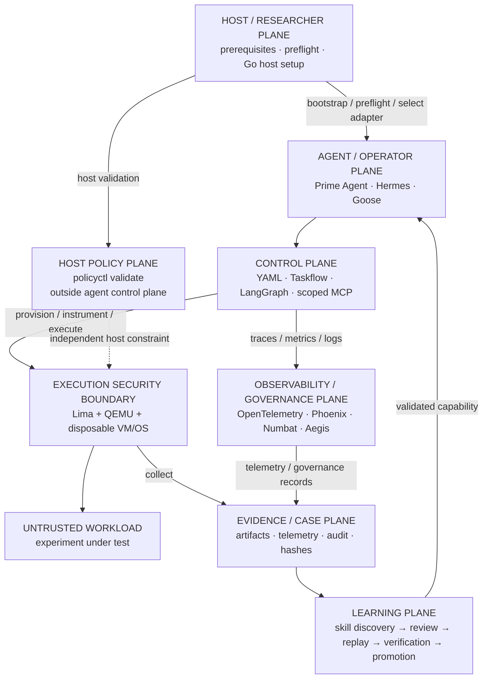

# 🦝 Cusimanse

> **Autonomous, agentic security research platform for controlled workload detonation, runtime analysis, anomaly detection and evidence extraction inside disposable virtual machines.**

Cusimanse lets a researcher define a security experiment, select one primary terminal agent, execute the workload in a disposable Lima/QEMU VM, collect evidence, verify findings, and preserve artifacts before destroying the VM.

> **Markdown specifies. YAML configures. Agent adapters operate. Policy constrains. Audit records. Evidence proves. Learning reuses only what has been verified.**

Cusimanse is a security research platform, not a production malware sandbox or a claim of sandbox-escape resistance.

## Architecture

Cusimanse separates the **host policy plane**, **agent/operator plane**, **control plane**, **agent observability & governance plane**, **execution boundary**, **evidence plane**, and **learning plane**.




## Plane responsibilities, commands and interfaces

The following table is the operational map for the architecture. **Commands in the Host and Policy planes are researcher/host-side commands; workload execution belongs inside the disposable VM and is driven by the selected agent.**

| Plane | Responsibility | Primary commands / interfaces | Execution context |
|---|---|---|---|
| **Host / Researcher** | Bootstrap dependencies, repair execute bits, configure environment, run preflight and select the agent | `./scripts/prerequisites.sh`, `./scripts/agent-preflight.sh`, `go run ./cmd/cusimanse-host`, `git status` | Normal host shell |
| **Policy** | Independent policy and configuration validation; remains outside agent control | `./policyctl validate`, `./policyctl --help` | Normal host shell; never delegated to agent |
| **Agent / Operator** | Operate one research case and direct the experiment lifecycle | `prime-agent`, `hermes`, `goose`, `export CUSIMANSE_PRIMARY_ADAPTER=...` | Selected primary agent shell |
| **Control** | Define campaign semantics, sequence taskflow stages, maintain state and use scoped tools/data transforms | YAML recipes, Taskflow workflow, LangGraph orchestration, `yq`, `jq`, scoped MCP | Agent-driven control workflow |
| **Observability / Governance** | Capture agent/tool/runtime traces, metrics and logs and provide visibility/governance | OpenTelemetry SDK/exporters, `phoenix`, `numbat`, `aegis` | Host/observability services; not an isolation boundary |
| **Execution** | Create, inspect, operate, stop and destroy disposable VM execution environments | `limactl list`, `limactl shell <vm>`, `limactl stop <vm>`, `limactl delete <vm>`; Lima/QEMU | Disposable VM/OS; workload stays here |
| **Evidence / Case** | Preserve artifacts, telemetry, audit records, provenance and integrity hashes | `find evidence blackboard runs -type f -print`, `sha256sum <file>` | Host evidence store after collection |
| **Learning** | Discover reusable skills, review candidates, replay, independently verify and promote validated procedures | `find skills -name SKILL.md`, `git diff -- skills/`, review `recipes/learning/skill-promotion.yaml` | Agent workflow + human approval gate |

### Command/interface quick reference

#### 1. Host / Researcher plane

```bash
# If the checkout has executable bits intact, run directly.
./scripts/prerequisites.sh

# Safe first-run fallback: bash can run the bootstrap even if checkout permissions were lost.
bash ./scripts/prerequisites.sh

# Check the host and selected adapter prerequisites
./scripts/agent-preflight.sh

# Interactive Go host setup
go run ./cmd/cusimanse-host

git status --short --branch
```

The repository tracks host `.sh` controls as executable. The bootstrap and preflight also run `chmod +x` over `scripts/*.sh` and `scripts/tests/*.sh`, then verify the execute bits. Project validation fails if a repository script is not executable.

The prerequisite installer identifies the runtime OS, architecture and available package manager (`apt`, `dnf`, `pacman`, `zypper` or `apk`) instead of assuming a particular Linux distribution. For Lima it first tries the native package manager and, when Lima is unavailable there, falls back to the **official Lima release archive** for the detected OS/CPU architecture. This is important for distributions such as openSUSE where a usable Lima package may not be available from the configured repositories. Lima's official documentation also provides this binary-archive installation path. citeturn0search0

For the extended research and observability profile:

```bash
CUSIMANSE_INSTALL_PRODUCTION_PROFILE=1 ./scripts/prerequisites.sh
CUSIMANSE_INSTALL_OBSERVABILITY=1 ./scripts/prerequisites.sh
```

#### 2. Policy plane

```bash
./policyctl validate
./policyctl --help
```

`policyctl` is intentionally **outside the agent control plane**. The primary agent must not invoke it, modify it, or use an agent prompt to bypass it.

#### 3. Agent / Operator plane

Choose exactly one primary terminal agent for a case:

```bash
export CUSIMANSE_PRIMARY_ADAPTER=prime-agent
prime-agent --help
prime-agent

export CUSIMANSE_PRIMARY_ADAPTER=hermes
hermes --help
hermes

export CUSIMANSE_PRIMARY_ADAPTER=goose
goose --help
goose
```

#### 4. Control plane

```bash
find recipes -name '*.yaml' -print
yq '.' recipes/agents/self-learning-primary.yaml
jq '.' < <(printf '%s\n' '{}')
bash ./scripts/tests/validate-project.sh
bash ./scripts/tests/architecture-refactor.sh
```

The principal interfaces are **YAML** contracts, **Taskflow** stages/gates, **LangGraph** stateful orchestration and **scoped MCP** tool/data access.

#### 5. Observability / Governance plane

OpenTelemetry is the tracing foundation. Phoenix, Numbat and Aegis are integrations for agent/runtime observability and governance when their adapters/installers are verified and deployed.

```bash
python3 -c 'import importlib.util; print("opentelemetry:", bool(importlib.util.find_spec("opentelemetry"))); print("phoenix:", bool(importlib.util.find_spec("phoenix")))'
phoenix --help
numbat --help
aegis --help
```

If an optional adapter or binary is unavailable, Cusimanse records that capability as **NOT_DEPLOYED** rather than treating its presence in a recipe as proof of installation.

#### 6. Execution plane

Lima/QEMU provides the disposable VM/OS execution boundary:

```bash
limactl list
limactl shell <vm>
limactl stop <vm>
limactl delete <vm>
```

**Untrusted workload commands execute inside the VM**, through the agent-driven workflow. They are not run directly from the normal researcher host shell.

#### 7. Evidence / Case plane

```bash
find evidence blackboard runs -type f -print 2>/dev/null
find experiments/go-install-001 -maxdepth 4 -type f -print 2>/dev/null
sha256sum <file>
```

Evidence includes raw artifacts, telemetry, audit records, reductions, findings, verification results and provenance. Evidence must be preserved before VM destruction.

#### 8. Learning plane

```bash
find skills -name SKILL.md -print
git diff -- skills/
cat recipes/learning/skill-promotion.yaml
```

Lifecycle: **Evidence → CANDIDATE → replay on distinct artifact → independent verification → human approval → VALIDATED → indexed retrieval**.

## System requirements

- Linux or macOS research host
- 4+ CPU cores recommended; 8 GB RAM minimum, 16 GB+ recommended
- 20 GB free disk minimum; 50 GB+ recommended for VM images/evidence
- Lima + QEMU with hardware virtualization where available
- Git, Bash, curl, Go, Python 3 and Ruby
- One supported primary terminal agent
- Network access for installation and permitted research enrichment

See [`docs/system-requirements.md`](docs/system-requirements.md) for host configuration, environment and observability details.

## Researcher testing

### Prepare the host

```bash
git clone https://github.com/Opposum0112/Cusimanse.git
cd Cusimanse
git checkout architecture-refactor

# bash fallback is intentionally valid on a fresh checkout
bash ./scripts/prerequisites.sh
./scripts/agent-preflight.sh
./policyctl validate
bash ./scripts/tests/validate-project.sh
```

### Run a reference case from the agent shell

Start exactly one primary agent and use the following prompt:

```text
Run experiments/go-install-001 using the Cusimanse research workflow.

Maintain case state according to the orchestration contract. Provision the
Lima/QEMU disposable VM, execute the workload inside that VM, collect telemetry
and evidence, independently verify the result, preserve artifacts, then destroy
the disposable VM.

Do not modify policyctl or bypass approval controls.

Return PASS, PARTIAL, FAIL or NOT_DEPLOYED according to preserved evidence.
PASS requires actual runtime evidence.
```

### Inspect the result from the host shell

```bash
find evidence blackboard experiments/go-install-001 -maxdepth 4 -type f -print 2>/dev/null
find runs -maxdepth 4 -type f -print 2>/dev/null
./policyctl validate
bash ./scripts/tests/validate-project.sh
bash ./scripts/tests/architecture-refactor.sh
```

`PASS` requires actual runtime evidence. Static validation is not runtime PASS.

## Validation

```bash
bash ./scripts/tests/validate-project.sh
bash ./scripts/tests/production-validation.sh
```

Validation checks script execute bits, preflight presence, shell/YAML structure, Go validation, host environment configuration, observability requirements, reference-experiment compatibility, policyctl separation, VM-boundary documentation and skill-promotion requirements.

## Security invariants

- Untrusted workloads execute in disposable VMs.
- Workload execution is separated from the normal host shell.
- `policyctl` remains outside the agent control plane.
- Host credentials are not exposed to learned skills.
- Unrestricted host-root mounts are denied.
- Destructive/privileged actions require approval.
- Public MCP exposure is denied by default.
- Observability is for tracing, governance and audit—not isolation.
- Retrieval does not grant execution authority.
- Evidence is preserved before VM destruction.
- Learned capabilities require replay and independent verification before promotion.
