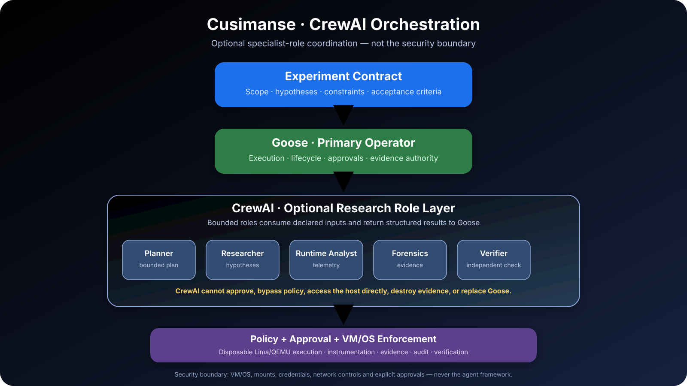

# 🦝 Cusimanse

<p align="center">
  
</p>

> **Autonomous, agentic security research platform for controlled workload detonation, runtime analysis, anomaly detection and evidence extraction inside disposable virtual machines.**

[](https://github.com/Opposum0112/Cusimanse/actions/workflows/validate.yml) [](https://go.dev/) [](https://www.gnu.org/software/bash/) [](LICENSE) [](https://github.com/Opposum0112/Cusimanse/releases)

Cusimanse applies the curiosity of its namesake to software workloads: provision an isolated environment, observe execution, collect evidence, analyze behavior and preserve artifacts for independent verification.

## About

Cusimanse is a **research and experimentation platform**, not a production malware sandbox. It combines disposable Lima/QEMU virtual machines with agent adapters, composable recipes, instrumentation, policy checks, evidence handling and optional orchestration/observability integrations.

**Status:** `v1.0.0-beta.1` — early beta for controlled security research and engineering experimentation. APIs, recipes and integrations may change between beta releases.

## What Cusimanse does


Cusimanse separates the **agent/operator plane** from the **VM/OS enforcement boundary**. Experiment contracts define what is being researched; adapters and optional orchestration coordinate approved work; disposable VMs contain the workload; instrumentation, evidence and verification support defensible results.

**Lifecycle:** `Intent → Contract → Plan → Review → Approval → Provision → Instrument → Execute → Collect → Analyse → Verify → Preserve → Destroy`

## CrewAI orchestration

**CrewAI is optional role orchestration. It does not replace Goose, `policyctl`, approval gates or VM/OS enforcement.**

On this `crew-orchestration` branch, CrewAI provides bounded specialist roles around the existing Cusimanse lifecycle:



| Layer | Responsibility |
|---|---|
| **Cusimanse contract** | Scope, hypotheses, constraints and acceptance criteria |
| **Goose** | Primary operator, executor and lifecycle authority |
| **CrewAI** | Optional specialist-role coordination and structured research results |
| **Specialist roles** | Planner, Researcher, Runtime Analyst, Forensics, Detection Analyst, Verifier, Reporter |
| **Policy + approval** | Constrain sensitive operations and require explicit approval where defined |
| **Lima/QEMU + OS** | Enforce the actual workload isolation and host/VM controls |
| **Evidence + audit** | Preserve artifacts, record material decisions and support independent verification |

### CrewAI rules

1. **Goose remains authoritative** for the Cusimanse run lifecycle and execution.
2. CrewAI roles may plan, research, analyze, verify and report; they must return structured results to Goose.
3. CrewAI must not bypass `policyctl`, approvals, audit, MCP/skills controls or VM/cloud enforcement.
4. CrewAI roles must not receive host credentials or unrestricted host filesystem access.
5. CrewAI must not directly destroy VMs or evidence.
6. A missing CrewAI capability is reported as `NOT_DEPLOYED`; it is never silently substituted.
7. A crew result, plan or AI assertion is **not evidence**. Runtime artifacts remain the source of truth.

Configuration lives in [`recipes/orchestration/crewai.yaml`](recipes/orchestration/crewai.yaml), with adapter guidance in [`crewai/README.md`](crewai/README.md). CrewAI is an integration, not a required security dependency.

## Security boundary

AI agents, prompts, skills, MCP servers, CrewAI and `policyctl` are **not** security boundaries. Enforcement comes from VM/OS controls, filesystem and mount restrictions, credential separation, network controls and explicit approval gates.

Key invariants:

- Untrusted workloads run in disposable VMs.
- Host credentials and unrestricted host mounts are denied.
- Privileged and destructive operations require approval.
- Public MCP/gateway exposure is denied by default.
- Instrumentation starts before the target workload.
- Evidence is preserved and hashed before VM destruction.
- Important findings require independent verification.
- Missing integrations are reported as `NOT_DEPLOYED`.
- AI assertions are never treated as evidence.

See [`04-security-model.md`](04-security-model.md) and [`SECURITY.md`](SECURITY.md).

## Quick start

### 1. Install prerequisites

```bash
./scripts/prerequisites.sh
```

The prerequisite script checks/installs the required host tooling and the optional CrewAI tooling used by the orchestration recipe. Review the script and environment before allowing installations on a research host.

### 2. Load the environment

```bash
source ./scripts/goose-env.sh
```

This configures project paths only. **Never place API keys, cloud credentials or secrets in the repository.**

### 3. Validate the repository

```bash
./policyctl validate
bash ./scripts/tests/validate-project.sh
```

### 4. Bootstrap the project

```bash
goose run --recipe recipes/install/project-bootstrap.yaml
```

### 5. Run the reference experiment

```bash
goose run \
  --recipe recipes/goose/project.yaml \
  --params experiment=go-install-001 \
  --params section=project
```

### 6. Enable the optional CrewAI orchestration recipe

```bash
crewai --version
goose run --recipe recipes/orchestration/crewai.yaml
```

Use the CrewAI recipe only when the environment has been reviewed and the declared policy/approval controls are in place. CrewAI participation does **not** grant additional privileges.

The expected research lifecycle is:

```text
Discover → Validate → Preflight → Install → Plan → Review → Approve
→ Provision → Instrument → Execute → Collect → Reduce → Forensics
→ Independent verification → Report → Preserve → Destroy
```

Do not describe an experiment or integration as `PASS` unless it was actually exercised and evidence was preserved.

## Recipes and composition

Recipes are intentionally small and composable. Do not turn the project recipe into a monolith.

| Concern | Recipe family |
|---|---|
| Experiments | `recipes/experiments/` |
| Workloads | `recipes/workloads/` |
| Routing | `recipes/routing/` |
| Installation | `recipes/install/` |
| Host profile | `recipes/host/` |
| VM profile | `recipes/lima/` |
| Tools | `recipes/tools/` |
| Instrumentation | `recipes/instrumentation/` |
| Agent monitoring | `recipes/agent-monitoring/` |
| Agent roles | `recipes/agents/` |
| Orchestration/stages | `recipes/orchestration/`, `recipes/stages/` |
| Reporting | `recipes/reporting/` |
| MCP | `recipes/mcp/` |
| Skills | `recipes/skills/` |
| Audit | `recipes/audit/` |

`recipes/goose/project.yaml` is the reference Goose adapter composition. Other adapters must consume the same project contracts.

## Agent adapters

**Goose** — current reference operator/executor and lifecycle authority.

**OpenCode** — documented adapter target using `AGENTS.md`, shared recipes, registry-approved tools and the same evidence/audit lifecycle.

**Grok Build** — documented adapter target; Grok-specific wiring remains outside shared experiment semantics.

**Antigravity** — documented adapter target using the canonical `.agents/` roles/skills and MCP registry.

**CrewAI** — optional orchestration integration for bounded specialist roles. It is not an independent Cusimanse controller and must return structured results to Goose.

An adapter must not bypass policy, suppress audit, expose credentials, alter experiment semantics or claim `PASS` without evidence.

## Observation and evidence

Cusimanse treats runtime artifacts as the source of truth. Typical run output is:

```text
runs/<run-id>/
├── blackboard/
├── evidence/
├── telemetry/
├── audit/
├── reductions/
├── forensics/
├── verification/
├── reports/
└── manifest.json
```

The blackboard is coordination metadata, not evidence. Large raw evidence should be deterministically reduced before LLM analysis where practical while retaining the original artifacts.

Optional monitoring integrations include OpenTelemetry, Phoenix, Numbat and ADR. These provide observability/detection capabilities, not isolation boundaries.

## `policyctl`

`policyctl` is deliberately narrow: host/security policy configuration and the local token-usage dashboard. It is **not** the experiment controller, sandbox, CrewAI controller or general agent harness.

```bash
./policyctl show
./policyctl validate
./policyctl check --action credentials
./policyctl check --action mounts
./policyctl check --action host-root
./policyctl check --action sudo
./policyctl check --action vm
./policyctl check --action network
./policyctl check --action git-write
./policyctl check --action push
./policyctl token-dashboard
```

A policy decision is not enforcement by itself; the adapter must honor it and host/VM controls enforce it.

## Validation and CI

Local validation includes recipe YAML parsing, shell syntax, architecture checks, Go formatting, `go vet`, unit tests, build checks and policy checks. Optional Python tests run when test modules are present.

GitHub Actions validates pushes and pull requests with least-privilege read permissions, concurrency cancellation, pinned action revisions, shell checks and Go checks. Dependency update automation covers Go modules and GitHub Actions.

The release workflow packages the repository from an immutable version tag and publishes checksums with the GitHub release. Release artifacts are generated from Git history rather than from a developer working tree.

## Contributing

Bug reports, documentation fixes, tests, recipes and adapter improvements are welcome. Please read [`CONTRIBUTING.md`](CONTRIBUTING.md) before opening a pull request.

- **Bug:** use the bug-report issue template and include reproducible steps, environment details and relevant logs with secrets removed.
- **Security vulnerability:** do **not** open a public issue; follow [`SECURITY.md`](SECURITY.md).
- **Feature/change:** explain the experiment or operator contract being improved and include tests or validation evidence where practical.
- **Pull requests:** keep changes focused, preserve security invariants and wait for required CI checks.

## Beta release policy

`v1.0.0-beta.*` releases are pre-production research releases. They are intended for authorized, controlled environments and may contain incomplete integrations or breaking changes. A beta release is not a claim of production security certification, sandbox escape resistance or operational completeness.

## Acceptance states

| State | Meaning |
|---|---|
| `PASS` | Runtime behavior demonstrated with evidence |
| `PARTIAL` | Capability worked but coverage/evidence is incomplete |
| `FAIL` | Tested behavior did not meet the contract |
| `NOT_DEPLOYED` | Capability unavailable or intentionally disabled |

Configuration is not evidence. AI output is not evidence.

## Responsible use

Use Cusimanse only against systems, software and workloads you own or are explicitly authorized to test. Untrusted workloads should run in disposable Lima/QEMU VMs. Never give an agent unrestricted host access or credentials merely because a prompt requests them.

AI-generated plans, commands, code and findings can be wrong, incomplete, stale or unsafe. Human researchers remain responsible for authorization, scope, approvals, safety and final interpretation.

## Documentation

- `01-deployment-architecture.md` — deployment architecture
- `02-system-requirements.md` — requirements
- `03-deployment-runbook.md` — deployment/runbook
- `04-security-model.md` — security model
- `05-multi-agent-operating-model.md` — multi-agent operation
- `06-observability-and-evidence.md` — observability and evidence
- `07-experiment-framework.md` — experiment framework
- `08-go-install-001.md` — reference experiment
- `09-operations-and-maintenance.md` — operations
- `10-validation-and-acceptance.md` — validation and acceptance
- `11-current-antigravity-reference.md` — Antigravity reference
- `crewai/README.md` — CrewAI adapter and responsibility boundary
- `AGENTS.md` — agent/adapter operating instructions
- `AI-DISCLAIMER.md` — AI limitations and responsible use
- `CONTRIBUTING.md` — contribution workflow
- `SECURITY.md` — security reporting and boundaries
- `RELEASE.md` — release process

## License

**MIT License — Copyright (c) 2026 Opposum0112.** See [`LICENSE`](LICENSE) for the authoritative license and [`NOTICE`](NOTICE) for the responsible-use and third-party software notice.
