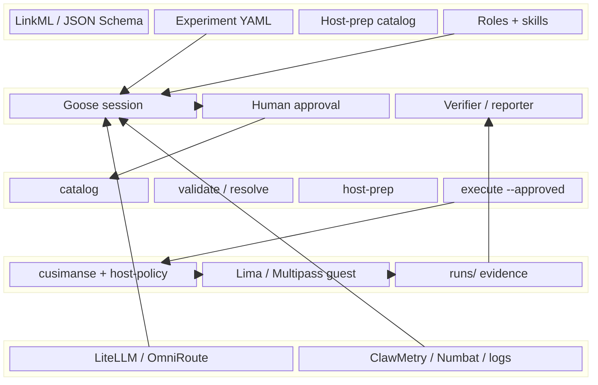
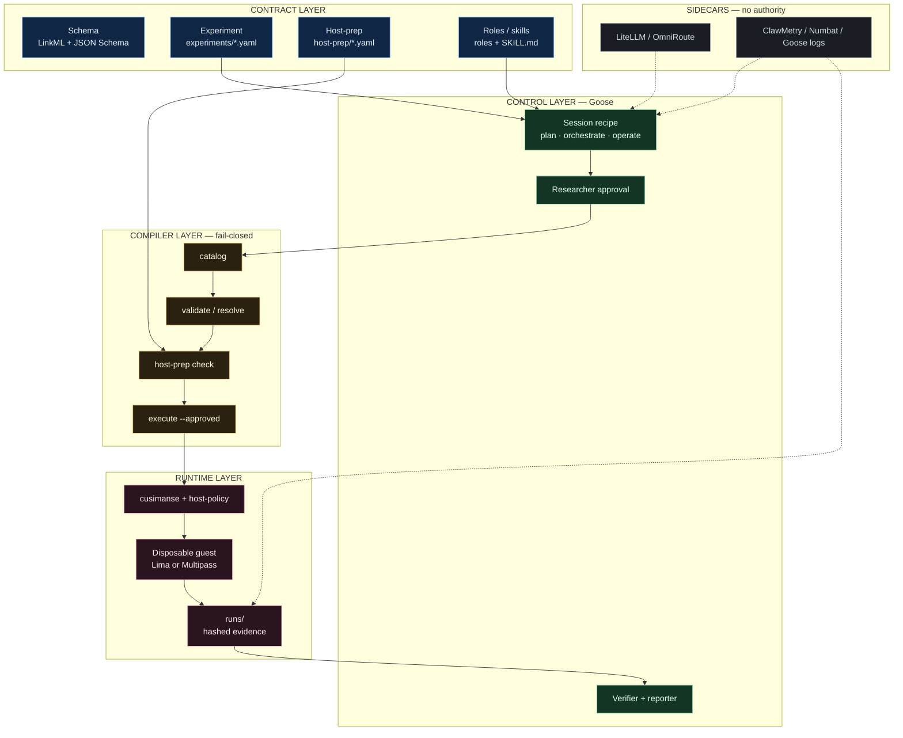

# Cusimanse (`agentic-native-goose`)

Goose-driven research lab. One typed YAML experiment. Goose plans, installs from a declared host-prep list, orchestrates roles, requests approval, runs the compiler, reads evidence, and writes the report.

Beta. Not a certified sandbox.

## Table of contents

1. [Layers](#layers)
2. [Architecture](#architecture)
3. [Components](#components)
4. [Repository structure](#repository-structure)
5. [Which shell](#which-shell)
6. [Install](#install)
7. [Example: npm-install-001 end to end](#example-npm-install-001-end-to-end)
8. [Access and observability](#access-and-observability)
9. [Report generation](#report-generation)
10. [Compiler commands](#compiler-commands)
11. [Tests and CI](#tests-and-ci)
12. [Safety](#safety)

## Layers

| Layer | Files | Who runs it |
|---|---|---|
| Contract schema | `schemas/cusimanse.yaml`, `schemas/experiment.schema.json` | Maintainer |
| Experiment | `experiments/<id>.yaml` | Researcher |
| Host bootstrap catalog | `host-prep/default.yaml` | Goose via compiler |
| Roles / skills | `roles/`, `skills/` | Goose Summon |
| Operator recipe | `recipes/goose/session.yaml` | Goose |
| Compiler | `cmd/compile` | Goose or bash |
| Provision | `cmd/cusimanse` after `--approved` | Compiler |
| Guest | Lima or Multipass | Compiler/engine |
| Gateway / observability | LiteLLM, OmniRoute, ClawMetry, Numbat | External |

## Architecture

Control plane is stacked. Authority flows **down**. Evidence flows **up**. Sidecars never authorize a run.



If `block-beta` does not render in your viewer, the equivalent layered flowchart is in `docs/architecture/agentic-native-goose.mmd`.



## Components

| Layer | Component | Responsibility |
|---|---|---|
| Contract | Schema | Legal fields and enums |
| Contract | Experiment YAML | One study: question, scope, workload id, acceptance |
| Contract | Host-prep YAML | Allow-listed host tools |
| Contract | Roles + skills | Who may compile vs who may only read `runs/` |
| Control | Goose session | Plan, approve, Summon specialists |
| Compiler | `cmd/compile` | Only interpreter of declarative YAML |
| Runtime | cusimanse + policy | Approved provision and guest lifecycle |
| Runtime | Disposable VM | Where the pinned workload runs |
| Runtime | `runs/` | Evidence, verification, report |
| Sidecar | LiteLLM / OmniRoute | Model transport |
| Sidecar | ClawMetry / Numbat | Optional observability |

## Repository structure

```text
schemas/              LinkML + JSON Schema
experiments/          researcher contracts
host-prep/            declared install catalog
roles/ skills/        specialist roles
recipes/goose/        one Goose recipe
cmd/compile           YAML interpreter
cmd/cusimanse         VM/policy engine (called by execute)
internal/compiler     compiler library
internal/policy       used at execute time
policies/host-policy.yaml
scripts/install.sh    optional installer referenced by host-prep
scripts/tests/        compiler + integration
```

## Which shell

| Task | Where |
|---|---|
| git clone, install.sh, go test | Normal bash/zsh |
| Drive the experiment | Goose |
| Debug YAML | Normal shell + `go run ./cmd/compile` |
| npm install under test | Guest only, after execute |

## Install

```bash
git clone https://github.com/Opposum0112/Cusimanse.git
cd Cusimanse
git checkout agentic-native-goose
./scripts/install.sh
export PATH="$HOME/.local/bin:$HOME/go/bin:$PATH"
```

## Example: npm-install-001 end to end

See `experiments/npm-install-001.yaml`.

```bash
go run ./cmd/compile catalog
go run ./cmd/compile validate npm-install-001
goose run --recipe recipes/goose/session.yaml --params experiment=npm-install-001
```

Verifier writes `runs/<session>/verification/result.md`. Reporter writes `runs/<session>/research-report/report.md`.

## Access and observability

Declared on the experiment and in `host-prep/default.yaml`. They do not authorize `execute`.

## Report generation

Acceptance lines in the experiment YAML are the checklist. `PARTIAL` if a collector was `NOT_DEPLOYED`.

## Compiler commands

```bash
go run ./cmd/compile catalog
go run ./cmd/compile validate <id>
go run ./cmd/compile host-prep <id>
go run ./cmd/compile resolve <id>
go run ./cmd/compile execute <id> --approved
```

## Tests and CI

```bash
go test ./internal/compiler ./cmd/compile ./cmd/cusimanse ./internal/validation
bash ./scripts/tests/integration.sh
```

## Safety

Do not run the workload on the host. `--approved` is required. Unknown workload ids fail closed.
