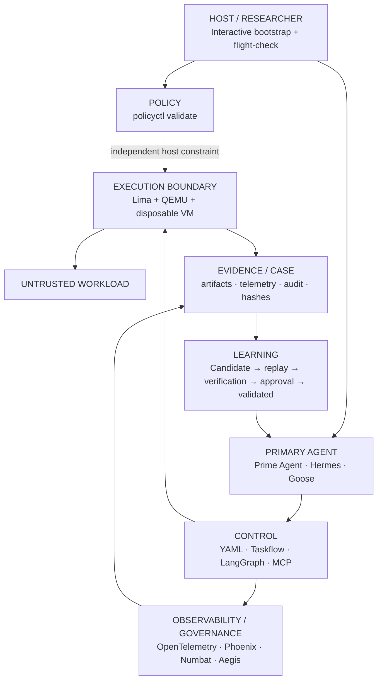

# 🦝 Cusimanse

> Autonomous, agentic security research platform for controlled workload detonation, runtime analysis, anomaly detection and evidence extraction inside disposable virtual machines.

Cusimanse prepares a researcher host, selects one primary terminal agent, runs workloads inside disposable Lima/QEMU VMs, collects evidence, independently verifies findings, and preserves artifacts before VM destruction.

## Architecture




## Researcher deployment — one front door

The supported researcher flow is intentionally **interactive**. It detects the host OS/architecture, installs or verifies the requested components, repairs repository shell execute bits, runs a comprehensive flight-check, and validates the independent host policy.

### Linux / macOS

From the repository root:

```bash
git clone https://github.com/Opposum0112/Cusimanse.git
cd Cusimanse
git checkout architecture-refactor
./scripts/cusimanse-host.sh
```

The Go entrypoint is **`cmd/cusimanse-host`**, not `scripts/cmd/cusimanse-host`. The wrapper changes to the repository root before running it, so the following are equivalent when the checkout is intact:

```bash
./scripts/cusimanse-host.sh
go run ./cmd/cusimanse-host
```

If a checkout lost execute bits, invoke Bash explicitly:

```bash
bash ./scripts/cusimanse-host.sh
```

You may run the Go front door from a repository subdirectory as well; it searches upward for `go.mod` and `cmd/cusimanse-host/main.go`. `CUSIMANSE_ROOT=/path/to/Cusimanse` can be used to override root discovery.

### Windows

Native Windows is not currently treated as a supported Lima/QEMU host path. Use **WSL2**, clone the repository inside WSL2, and run the Linux commands above. The Go front door detects a native Windows process and directs the researcher to WSL2 rather than claiming unsupported native execution.

## Interactive host bootstrap

The complete workstation profile is the recommended researcher deployment option:

```bash
bash ./scripts/prerequisites.sh
```

Interactive choices:

| Profile | Installs / verifies |
|---|---|
| **1** | Baseline host + Go/Python/Ruby + QEMU + Lima |
| **2** | Profile 1 + research/control/learning utilities and LangGraph-related Python tooling |
| **3** | OpenTelemetry + Phoenix observability foundation; reports Numbat/Aegis state |
| **4** | **Complete workstation**: all above + supported primary-agent installation attempts for Goose, Prime Agent and Hermes |
| **5** | Check/repair mode |

The installer is runtime/distro-aware. Linux detection supports `apt`, `dnf`, `pacman`, `zypper` and `apk`; macOS uses Homebrew; Windows uses WSL2. For Lima it attempts the native package manager first and falls back to the official Lima release archive when a native package is unavailable. Optional products without a verified installer are reported `NOT_DEPLOYED` instead of being guessed or silently treated as installed.

For CI or scripted testing, use explicit environment selection:

```bash
CUSIMANSE_NONINTERACTIVE=1 CUSIMANSE_PROFILE=4 bash ./scripts/prerequisites.sh
```

## Interactive flight-check

Run it independently whenever you want to verify a prepared researcher host:

```bash
bash ./scripts/agent-preflight.sh
```

Modes:

1. Baseline host check
2. Baseline + selected primary-agent check
3. Full capability audit across host, agent, control, observability, policy and learning planes

The flight-check repairs/checks shell execute bits, verifies Git/Bash/curl/Python/Ruby/Go/QEMU/Lima, checks `/dev/kvm` when available on Linux, validates the selected agent, checks plane directories/tools, and reports unsupported integrations as `NOT_DEPLOYED`.

## OS and distribution matrix

| Host | Supported preparation path | Lima strategy |
|---|---|---|
| Ubuntu/Debian | `apt` | native package → official archive fallback |
| Fedora/RHEL-family | `dnf` | native package → official archive fallback |
| Arch-family | `pacman` | native package → official archive fallback |
| openSUSE/SUSE | `zypper` | native package → official archive fallback |
| Alpine | `apk` | native package → official archive fallback |
| macOS | Homebrew | Homebrew package |
| Windows | WSL2 | Linux path inside WSL2 |

This is **OS-neutral at the deployment interface**, not a claim that every third-party security product has a native installer on every OS. Agent/provider credentials remain researcher-managed.

## Plane commands and interfaces

| Plane | Components | Primary commands / interfaces |
|---|---|---|
| **Host / Researcher** | bootstrap, environment, flight-check, Go front door | `./scripts/cusimanse-host.sh`, `go run ./cmd/cusimanse-host`, `bash ./scripts/prerequisites.sh`, `bash ./scripts/agent-preflight.sh` |
| **Policy** | independent host-side policy | `./policyctl validate`, `./policyctl --help` |
| **Agent / Operator** | primary terminal agent | `prime-agent`, `hermes`, `goose`, `CUSIMANSE_PRIMARY_ADAPTER` |
| **Control** | recipes, taskflow, state, transformations | `find recipes -name '*.yaml'`, `yq`, `jq`, LangGraph, Taskflow, scoped MCP |
| **Observability / Governance** | telemetry/tracing/integration targets | OpenTelemetry, Phoenix, Numbat, Aegis |
| **Execution** | disposable VM/OS boundary | `limactl list`, `limactl shell <vm>`, `limactl stop <vm>`, `limactl delete <vm>` |
| **Evidence / Case** | artifacts, telemetry, audit, integrity | `find evidence blackboard runs -type f -print`, `sha256sum <file>` |
| **Learning** | skills, replay, verification, promotion | `find .agents/skills -name SKILL.md`, `git diff -- .agents/skills/`, `cat recipes/learning/skill-promotion.yaml` |

## Primary agents

Profile 4 attempts to install the supported primary-agent adapters. Installation success is still checked by the flight-check; provider/model credentials are never put in Git.

```bash
export CUSIMANSE_PRIMARY_ADAPTER=prime-agent
prime-agent --help
prime-agent

export CUSIMANSE_PRIMARY_ADAPTER=hermes
hermes --help
hermes

export CUSIMANSE_PRIMARY_ADAPTER=goose
goose --help
goose
```

Use exactly **one primary operator shell per case**. The agent is an operator, not the VM security boundary.

## Control and workflow

```bash
find recipes -name '*.yaml' -print
yq '.' recipes/agents/self-learning-primary.yaml
bash ./scripts/tests/validate-project.sh
bash ./scripts/tests/architecture-refactor.sh
```

Lifecycle:

```text
Discover → Validate → Retrieve → Plan → Review → Approve
→ Provision VM → Instrument → Execute → Collect → Analyze
→ Verify → Learn → Promote → Preserve → Destroy
```

## Observability / governance

OpenTelemetry is the tracing foundation. Phoenix is the research observability integration. Numbat and Aegis remain integration targets until verified adapters/installers are available.

```bash
python3 -c 'import importlib.util; print("opentelemetry:", bool(importlib.util.find_spec("opentelemetry"))); print("phoenix:", bool(importlib.util.find_spec("phoenix")))'
phoenix --help
numbat --help
aegis --help
```

A missing optional command is not a security failure; it is `NOT_DEPLOYED` until its adapter/install path is verified.

## Execution boundary

Untrusted workload commands execute inside the disposable VM through the selected agent workflow, not directly from the normal researcher host shell.

```bash
limactl list
limactl shell <vm>
limactl stop <vm>
limactl delete <vm>
```

Preserve evidence before destroying the VM.

## Evidence and learning

```bash
find evidence blackboard runs -type f -print 2>/dev/null
find experiments/go-install-001 -maxdepth 4 -type f -print 2>/dev/null
sha256sum <file>
find .agents/skills -name SKILL.md -print
git diff -- .agents/skills/
cat recipes/learning/skill-promotion.yaml
```

A learned procedure remains **CANDIDATE** until replay on a distinct artifact, independent verification, provenance and human approval gates pass.

## Validation

```bash
bash ./scripts/agent-preflight.sh
./policyctl validate
bash ./scripts/tests/validate-project.sh
bash ./scripts/tests/architecture-refactor.sh
go test ./...
```

Validation `PASS` means that the corresponding engineering/capability check passed; it is not a claim of runtime sandbox resistance or production security certification. Runtime PASS requires actual experiment evidence and independent verification.

## System requirements

- Linux or macOS directly; Windows through WSL2.
- 4+ CPU cores recommended; 16 GB RAM recommended for VM + observability workloads.
- 40+ GB free disk recommended for VM images/evidence.
- Hardware virtualization enabled where applicable.
- Git, Bash, curl, Python 3, Ruby, Go, QEMU and Lima.
- One supported primary terminal agent for agent-driven cases.
- Network access for installation and permitted research enrichment.

See `docs/system-requirements.md` for the detailed requirements and deployment boundary.

## Security invariants

- Lima/QEMU disposable VM is the workload execution boundary.
- Normal host shell and primary-agent shell are distinct contexts.
- `policyctl` is host-side and outside the agent control plane.
- Host credentials are not exposed to workloads or learned skills.
- Public MCP exposure is denied by default.
- Observability/governance is not an isolation boundary.
- Retrieval does not grant execution authority.
- Evidence is preserved before VM destruction.
- Learned capabilities require replay and independent verification before promotion.
