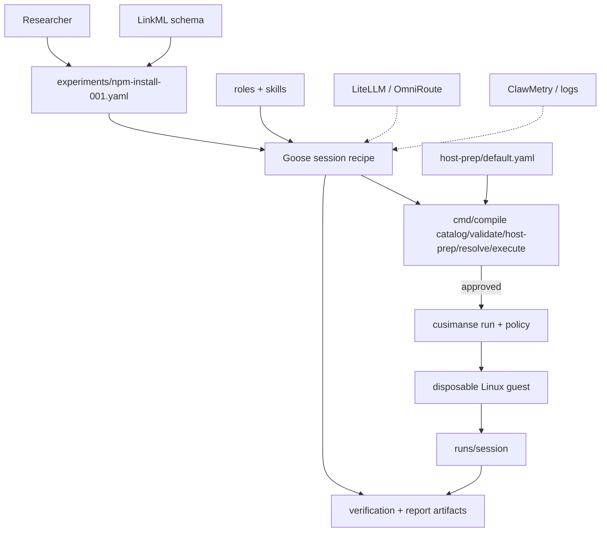

# Cusimanse (`agentic-native-goose`)

Goose-driven research lab. One typed YAML experiment. Goose plans, installs from a declared host-prep list, orchestrates roles, requests approval, runs the compiler, reads evidence, and writes the report.

Beta. Not a certified sandbox.

## Table of contents

1. [Layers](#layers)
2. [Architecture](#architecture)
3. [Repository structure](#repository-structure)
4. [Which shell](#which-shell)
5. [Install](#install)
6. [Example: npm-install-001 end to end](#example-npm-install-001-end-to-end)
7. [Access and observability](#access-and-observability)
8. [Report generation](#report-generation)
9. [Compiler commands](#compiler-commands)
10. [Tests and CI](#tests-and-ci)
11. [Safety](#safety)

## Layers

| Layer | Files | Who runs it |
|---|---|---|
| Contract schema | `schemas/cusimanse.yaml`, `schemas/experiment.schema.json` | Maintainer |
| Experiment | `experiments/<id>.yaml` | Researcher |
| Host bootstrap catalog | `host-prep/default.yaml` | Goose via compiler |
| Roles / skills | `roles/`, `skills/` | Goose Summon |
| Operator recipe | `recipes/goose/session.yaml` | Goose |
| Compiler | `cmd/compile` | Goose or bash |
| Provision | `cmd/cusimanse` after `--approved` | Compiler |
| Guest | Lima or Multipass | Compiler/engine |
| Gateway / observability | LiteLLM, OmniRoute, ClawMetry, Numbat | External |

Policy YAML under `policies/` is still used when `cusimanse run` executes. It is not a second researcher contract.

## Architecture



Diagram source: `docs/architecture/agentic-native-goose.mmd`.

## Repository structure

```text
schemas/              LinkML + JSON Schema
experiments/          researcher contracts
host-prep/            declared install catalog
roles/ skills/        specialist roles
recipes/goose/        one Goose recipe
cmd/compile           YAML interpreter
cmd/cusimanse         VM/policy engine (called by execute)
internal/compiler     compiler library
internal/policy       used at execute time, not authored per experiment
policies/             host policy YAML for the engine
scripts/install.sh    optional installer referenced by host-prep
scripts/tests/        compiler + integration
```

## Which shell

| Task | Where |
|---|---|
| git clone, install.sh, go test | Normal bash/zsh |
| Drive the experiment | Goose |
| Debug YAML | Normal shell + `go run ./cmd/compile` |
| npm install under test | Guest only, after execute |

## Install

Normal shell:

```bash
git clone https://github.com/Opposum0112/Cusimanse.git
cd Cusimanse
git checkout agentic-native-goose
./scripts/install.sh
export PATH="$HOME/.local/bin:$HOME/go/bin:$PATH"
go version
goose --version
```

Goose later runs `compile host-prep`, which only checks tools listed in `host-prep/default.yaml` (git, go, node, npm, yq, goose, lima/qemu or multipass, optional ClawMetry/LiteLLM).

## Example: npm-install-001 end to end

### 1. Contract (already in repo)

`experiments/npm-install-001.yaml`:

```yaml
apiVersion: cusimanse.dev/v1
kind: Experiment
metadata:
  id: npm-install-001
  title: Pinned npm install baseline
spec:
  question: Observe a pinned lodash install in a disposable Linux VM with lifecycle scripts disabled.
  hostPrep: default
  roles: [operator, verifier, reporter]
  scope:
    exclude: [host-execution, credentials, extra-mounts, postinstall-payloads, agent-escape]
  requirements:
    execution: disposable
    os: linux
    workload: npm-install
    network: localhost-only
    instrumentation: [process, syscall, filesystem, network]
  policyChecks: [vm, network, mounts]
  acceptance:
    - resolve binds npm-install handler
    - lodash installed with ignore-scripts in the guest
    - evidence hashed before destroy
  operator: goose
  observability:
    host: [clawmetry, goose-logs, token-usage]
    experiment: [session, evidence-hash, numbat]
```

That file is the whole researcher configuration. Workload **id** `npm-install` maps to a trusted handler. Do not put `npm install` flags in this file.

### 2. Validate the catalog (normal shell)

```bash
go run ./cmd/compile catalog
go run ./cmd/compile validate npm-install-001
go run ./cmd/compile host-prep npm-install-001
go run ./cmd/compile resolve npm-install-001
```

`resolve` should print `handler: npm-install` and `hostPrep: default`.

### 3. Operate in Goose

```bash
goose recipe validate recipes/goose/session.yaml
goose run --recipe recipes/goose/session.yaml --params experiment=npm-install-001
```

Goose (operator role):

1. Reads the experiment YAML.
2. Calls `compile validate` / `host-prep` / `resolve`.
3. Asks you to approve.
4. Calls `compile execute npm-install-001 --approved`.

Compiler then invokes `cusimanse --approved run npm-install-001` if that binary is on `PATH`. The guest runs the fixed npm-install handler. Evidence lands under `runs/<session>/`.

### 4. Access

| Thing | How |
|---|---|
| Experiment files | repo paths above |
| Session artifacts | `runs/<session>/` |
| Goose UI / logs | local Goose session |
| ClawMetry | host observability if declared and deployed |
| LiteLLM | `http://127.0.0.1:4000` if gateway installed |
| Guest shell | only via the engine; not a researcher step |

If ClawMetry or LiteLLM is missing, host-prep reports `NOT_DEPLOYED` or `DECLARED`. The experiment can still validate.

### 5. Analysis and report

After execute, Goose Summons:

- **verifier** (`skills/verification/SKILL.md`) → `runs/<session>/verification/result.md`
- **reporter** (`skills/report/SKILL.md`) → `runs/<session>/research-report/report.md`

Reports must cite hashed evidence. Model text is not evidence.

### 6. Same experiment without Goose

```bash
go run ./cmd/compile execute npm-install-001 --approved
ls runs/
```

## Access and observability

Declared on the experiment (`spec.observability`) and in `host-prep/default.yaml` categories `observability` and `gateway`. They do not authorize `execute`.

## Report generation

Goose reporter skill writes the report after verifier. Acceptance lines in the experiment YAML are the checklist. `PARTIAL` if a collector was `NOT_DEPLOYED`.

## Compiler commands

```bash
go run ./cmd/compile catalog
go run ./cmd/compile validate <id>
go run ./cmd/compile host-prep <id>
go run ./cmd/compile resolve <id>
go run ./cmd/compile execute <id> --approved
```

`catalog` parses experiments, host-prep, roles, bindings, and skill files.

## Tests and CI

```bash
go test ./internal/compiler ./cmd/compile ./cmd/cusimanse ./internal/validation
bash ./scripts/tests/integration.sh
```

CI: `.github/workflows/validate.yml` and `.github/workflows/agentic-native.yml`.

## Safety

Do not run the workload on the host. `--approved` is required. Unknown workload ids fail closed.
