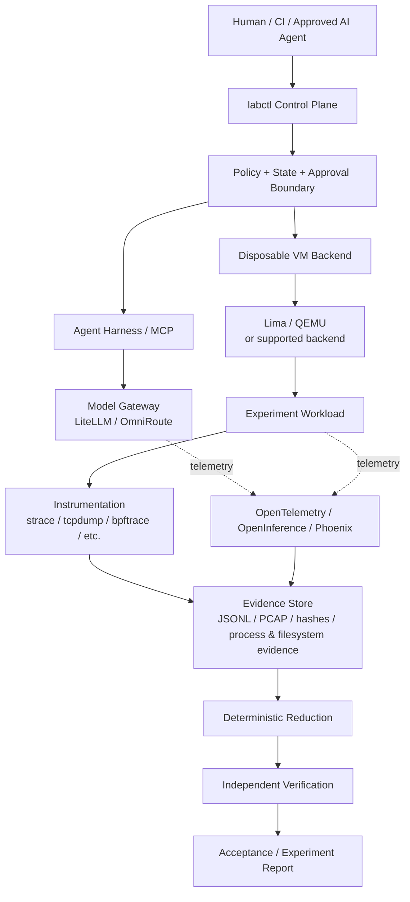

# AI Security Research Lab

Isolated, reproducible laboratory for studying AI agents, model routing, host/VM instrumentation, and controlled software installation.

> **Status:** deployment baseline under hardening. The repository contains a working Python controller today and a Go control-plane migration in progress. A release is not considered fully deployed until the acceptance matrix has been exercised on the target platform.

## Safety first

This is a security-research framework for systems you own or are explicitly authorized to test. Run untrusted workloads in disposable VMs, keep host credentials out of experiments, preserve evidence before VM deletion, and review commands before applying them.

See `AI-DISCLAIMER.md`, `AGENTS.md`, and `SECURITY.md`.

## What runs where?

**Normal shell:** `labctl` is a normal command-line program. Human operators, CI, and approved automation invoke it from a regular shell. There is no special “agent shell”.

**AI agent:** an agent may *request* an operation through its harness/MCP integration, but the same repository policy and explicit apply boundary remain in force. Do not give an agent unrestricted host access merely because it can execute shell commands.

**Disposable VM:** untrusted installation/workload commands belong inside the experiment VM. Host-side commands should be limited to setup, orchestration, observation, evidence export, and cleanup.

## Quick start

### 1. Clone

```bash
git clone https://github.com/Opposum0112/ai-security-lab.git
cd ai-security-lab
```

### 2. Inspect before changing anything

```bash
./scripts/bin/labctl --version
./scripts/bin/labctl --help
./scripts/bin/labctl stages
./scripts/bin/labctl experiment list
```

If the executable bit is missing:

```bash
chmod +x scripts/bin/labctl
```

### 3. Run read-only validation

```bash
./scripts/bin/labctl self-test
./scripts/bin/labctl init --dry-run
./scripts/bin/labctl preflight
```

`self-test` validates the controller/catalog/policy logic without installing software. `init --dry-run` previews generated files. `preflight` measures the host and does not update `state.yaml` unless `--apply` is supplied.

### 4. Materialize the deployment

After reviewing the generated plan:

```bash
./scripts/bin/labctl init --apply
```

Then inspect:

```bash
./scripts/bin/labctl status
./scripts/bin/labctl doctor
```

### 5. Validate the VM path

Install a supported Lima/QEMU combination using the host's normal package mechanism. Review the generated `lima.yaml` before starting a VM. The repository's profiles intentionally use `mounts: []` by default.

For the first integration experiment:

```bash
./scripts/bin/labctl experiment run go-install-001
```

The command is a dry-run until `--apply` is explicitly supplied. Do not use `--apply` until the VM profile, network policy, instrumentation, and evidence destination have been reviewed.

## Core command model

| Command | Default behavior | Mutating? |
|---|---|---:|
| `labctl status` | inspect state/host | No |
| `labctl stages` | list stages | No |
| `labctl experiment list` | list experiments | No |
| `labctl self-test` | deterministic tests | No |
| `labctl preflight` | inspect host | No |
| `labctl init --dry-run` | preview deployment | No |
| `labctl init --apply` | materialize files/state | Yes |
| `labctl stack up NAME --apply` | start localhost stack | Yes |
| `labctl experiment run ID --apply` | execute experiment | Yes |
| `labctl accept` | produce acceptance report | Report write |

If documentation shows a command that does not exist in `labctl --help`, treat the documentation as a bug and report it rather than guessing syntax.

## Architecture

The lab is designed as a controlled research loop: **specification → policy-controlled execution → disposable isolation → instrumentation → evidence → deterministic reduction → independent verification → report**.



The AI harness is **not** the security boundary. The execution boundary, policy, VM isolation, evidence handling, and explicit approval controls are.

An architecture image is maintained separately as `docs/images/ai-security-lab-architecture.png` when the original binary asset is available in the repository.

## Portability

The project is moving toward a capability-based, single-binary Go controller. The controller should detect OS, architecture, virtualization, and available backends instead of assuming one host profile.

Current deployment content is strongest for Linux x86_64 with QEMU/Lima. macOS and ARM support require platform-specific validation; Windows requires a different VM/backend integration. The project must report unsupported or unvalidated capabilities as `NOT_DEPLOYED` rather than pretending they work.

See `RELEASE.md` for the single-binary design and rollback model.

## Components

- **Execution:** Lima + QEMU disposable VMs
- **Containers:** Docker *or* Podman, selected rather than stacked by default
- **Model routing:** LiteLLM *or* OmniRoute
- **AI observability:** OpenTelemetry/OpenInference/Phoenix where deployed
- **Instrumentation:** strace, tcpdump, bpftrace, and other host/VM tools as available
- **Evidence:** JSONL, packet captures, filesystem/process evidence, hashes
- **Agent integration:** Antigravity, OpenCode, Goose, Codex, or other approved harnesses

Third-party products are optional dependencies and are not silently installed by `labctl`.

## Repository layout

```text
01-11*.md       architecture, requirements, runbook, security, operations
scripts/labctl   current Python control plane
cmd/labctl       Go control-plane migration
experiments/     reproducible experiment contracts
infra/           generated localhost/VM stack configuration
policies/        permission and mount controls
evidence/        runtime evidence (normally gitignored)
reports/         acceptance and experiment reports
antigravity/     version-controlled workspace templates
```

## Acceptance

The project uses four honest states: `PASS`, `PARTIAL`, `FAIL`, and `NOT_DEPLOYED`. The seven-level acceptance matrix covers host, execution, agent, security, model, observability, and experiment readiness.

A component is not `PASS` merely because configuration files exist. Important findings require independent verification, and evidence must be preserved before disposable resources are deleted.

## Contributing

Read `CONTRIBUTING.md` before submitting changes. Keep tests deterministic where possible, document platform-specific behavior, and never commit secrets or sensitive telemetry.

## License

MIT. See `LICENSE` and `NOTICE`.
