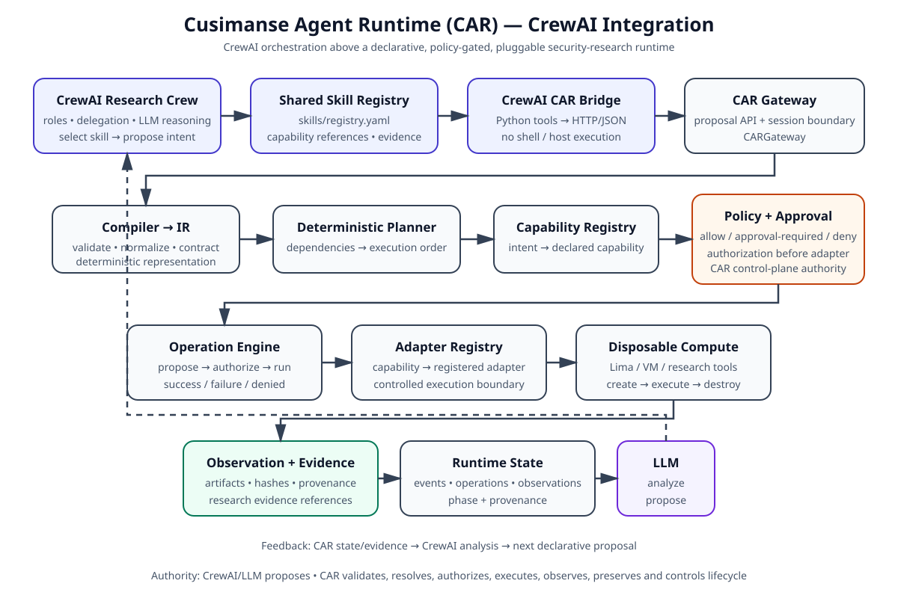

# Cusimanse Agent Runtime (CAR)

CAR is a declarative, LLM-driven security-research runtime. An end user supplies a LinkML-governed research contract; the **mandatory LLM layer** analyzes the research state and proposes typed declarative intents; CAR validates and plans those intents, resolves capabilities, applies policy and approval, executes only through registered adapters, records observations/evidence, and controls disposable compute lifecycle.

**The LLM reasons and proposes. CAR validates, authorizes, executes, observes, preserves evidence, and controls lifecycle.**

## Architecture



The runtime is deliberately split into authority planes:

```text
Research Contract → Compiler → IR → Planner → Capability Registry
                                           ↓
                                   Policy + Approval
                                           ↓
                                   Operation Engine
                                           ↓
                                    Adapter Registry
                                           ↓
                         Lima / Shell / File / Process / npm
                                           ↓
                              Observation + Evidence
                                           ↓
                                      Runtime State
                                           ↓
                              Mandatory LLM Reasoning
                                           ↓
                              Declarative Proposal ↺
```

### Mandatory LLM layer

CAR uses an LLM as its reasoning/proposal layer. The current implementation integrates the model through **Vercel AI SDK 7**, using typed structured output. AI SDK 7 provides a unified TypeScript interface for model calls and structured outputs across providers.

The LLM receives runtime-owned state and returns a constrained proposal such as:

```json
{
  "intent": "collect process observations",
  "capability": "evidence.collect",
  "parameters": { "source": "process-list" },
  "complete": false
}
```

The proposal is **data, not an execution command**. It must pass CAR validation, capability resolution, dependency planning, and policy/approval before an adapter can execute it. The reasoning schema is strict, so undeclared execution fields such as `command` are rejected.

## What CAR does

CAR provides the control plane for repeatable security research:

1. **Contract** — define the research question, scope, intents, dependencies, and operation kinds in YAML/JSON.
2. **Reason** — the mandatory LLM analyzes the current research state and proposes the next declarative intent.
3. **Validate** — CAR validates and normalizes the proposal into its intermediate representation (IR).
4. **Plan** — dependencies are resolved deterministically.
5. **Authorize** — capabilities are resolved and policy decides `allow`, `approval-required`, or `deny`.
6. **Execute** — authorized operations reach adapters such as Lima, shell, file, process, or npm.
7. **Observe** — runtime state records operations, observations, and events.
8. **Preserve** — evidence receives SHA-256 identity, size, URI, and experiment/operation provenance.
9. **Destroy** — disposable compute is destroyed in a `finally` block, including failure paths.
10. **Reason again** — the updated state is returned to the LLM for the next proposal until the research cycle completes.

## Installation

Requirements:

- Node.js 22 or newer
- npm 10 or newer
- A supported LLM provider and credentials for the provider you select
- Lima when using disposable VM experiments

Clone and install the complete dependency tree:

```bash
git clone https://github.com/Opposum0112/Cusimanse.git
cd Cusimanse
git checkout agentic-runtime
npm install
```

For provider-specific LLM use, install the matching AI SDK provider package. For example, OpenAI:

```bash
npm install ai@7 zod @ai-sdk/openai
export OPENAI_API_KEY="<your-key>"
```

Anthropic or Google can be added similarly:

```bash
npm install @ai-sdk/anthropic
npm install @ai-sdk/google
```

Do not put API keys in recipes or source control. Use environment variables or your normal secret manager.

## Run CAR with the LLM

CAR is currently a TypeScript runtime library; this branch does **not** yet provide a `cusimanse` CLI. A host application or harness creates the CAR dependencies, creates a model-backed reasoner, and invokes the runtime.

A minimal Vercel AI SDK 7 reasoner looks like this:

```ts
import { openai } from "@ai-sdk/openai";
import { VercelAIReasoner } from "./src/llm/index.js";

const reasoner = new VercelAIReasoner({
  model: openai("gpt-5.5"),
});
```

CAR then uses the reasoner as part of `RuntimeDependencies`:

```ts
const result = await new RuntimeOrchestrator({
  capabilities,
  policy,
  approvals,
  operations,
  adapters,
  reasoner,
}).run(ir, initialState);

console.log(result.proposals);
console.log(result.state);
```

The reasoner is not an adapter and is not given host execution authority. AI SDK 7 also supports agent/harness integration patterns, allowing external agent runtimes to sit above or alongside CAR while CAR remains the execution-policy boundary.

## Integrate CAR with any agent or harness

CAR should be treated as the **execution kernel/control plane**, not as the agent's private tool implementation.

```text
Any Agent / Harness
        │
        │ research question + CAR contract/state
        ▼
   LLM Reasoning Layer
        │
        │ typed declarative proposal
        ▼
      CAR Runtime
        │
   ┌────┼─────────────┐
   │    │             │
 Policy Ops       Evidence
   │    │             │
   └────┼─────────────┘
        ▼
      Adapters
        ▼
 Disposable VM / tools / APIs
```

A harness integration should:

- give the agent the research goal and relevant CAR state;
- let the LLM produce proposals through the `Reasoner` interface;
- convert approved external-agent decisions into CAR intents rather than direct shell commands;
- submit those intents to the compiler/planner/policy path;
- consume `RuntimeCycleResult` for state, proposals, operation IDs, and pending approvals;
- retrieve preserved evidence through the evidence collector/store;
- repeat the cycle until the LLM returns `complete: true` or policy/approval stops it.

This makes the integration harness-neutral: a custom agent, OpenCode-style harness, Codex-style harness, Claude Code-style harness, CrewAI orchestration layer, or another agent framework can drive CAR without becoming the authority over execution.

## Disposable research cycle

The recommended research pattern is:

```text
Research question / recipe
          ↓
Create disposable Lima VM
          ↓
CAR + mandatory LLM reasoning
          ↓
Validate → plan → policy → approve
          ↓
Execute authorized workload
          ↓
Collect observations + evidence
          ↓
Return state to LLM
          ↓
Next declarative proposal
          ↓
Repeat
          ↓
Preserve evidence
          ↓
Destroy VM
```

Use `DisposableResearchWorkflow` to guarantee VM cleanup:

```ts
const evidence = new EvidenceCollector("npm-install-example");

const workflow = new DisposableResearchWorkflow(lima, {
  capabilities,
  policy,
  approvals,
  operations,
  adapters,
  reasoner,
});

const result = await workflow.run(ir, {
  limaProfile: {
    name: "car-research",
    cpus: 2,
    memory: "4GiB",
  },
  evidence,
});
```

The workflow creates the VM before execution and destroys it in `finally`, even when the runtime throws. Concrete Lima execution remains behind the injected `LimaProvider` boundary.

## Example research recipe

`recipes/examples/npm-install.yaml` demonstrates a declared workload:

```yaml
api_version: v1
kind: ExperimentRecipe
experiment_id: npm-install-example
research_question:
  id: rq-npm-install
  question: What observable process, filesystem, and network behavior occurs during npm install?
operation_kinds: [vm, tool, evidence]
intents:
  - id: provision-research-vm
    capability: vm.create
    parameters:
      provider: lima
      profile: research-default
    depends_on: []
  - id: run-npm-install
    capability: workload.npm.install
    parameters:
      working_directory: /workspace
      package_manager: npm
    depends_on: [provision-research-vm]
```

See [Recipe Authoring](docs/recipe-authoring.md) for the complete contract model and extension guidance.

## What CAR outputs

A runtime cycle returns a `RuntimeCycleResult` containing:

- `state` — current phase, revision, operations, observations, evidence, and append-only runtime events;
- `proposals` — typed LLM proposals for the next research intent;
- `executedOperationIds` — operations that actually reached an adapter and succeeded;
- `pendingApprovalIds` — operations waiting for explicit approval.

Evidence records include:

```json
{
  "id": "ev_<uuid>",
  "kind": "log",
  "uri": "file:///evidence/npm-install.log",
  "sha256": "<64-hex-character digest>",
  "size": 1234,
  "provenance": {
    "experimentId": "npm-install-example",
    "operationId": "op_<uuid>",
    "recordedAt": "2026-09-16T10:00:00.000Z"
  }
}
```

The evidence collector records identity and provenance; it does not itself upload artifacts. A concrete evidence adapter/store can persist the actual files and then register their references.

## Repository structure

```text
schema/                 LinkML contract definitions
recipes/                Example research contracts
docs/                   User and developer guides
src/compiler/           Contract validation and IR compilation
src/ir/                 Normalized runtime representation
src/planner/            Deterministic dependency planning
src/capabilities/       Capability registration and resolution
src/policy/             Policy evaluation and approval state
src/operations/         Operation lifecycle boundary
src/adapters/           Adapter contracts, registry, Lima and workloads
src/evidence/           Evidence identity and provenance
src/state/              Runtime state and events
src/llm/                Mandatory LLM reasoning boundary
src/runtime/            Orchestration and disposable workflow
tests/                  Runtime contract and unit tests
```

## Documentation

- [Getting Started](docs/getting-started.md) — installation and first runtime integration
- [Recipe Authoring](docs/recipe-authoring.md) — write research contracts
- [Architecture](docs/architecture.svg) — visual system architecture
- [Runtime](docs/runtime.md) — orchestration lifecycle
- [Disposable Workflow](docs/workflow.md) — VM lifecycle and cleanup
- [Evidence](docs/evidence.md) — evidence identity and provenance
- [LLM Reasoning](docs/llm.md) — typed reasoning boundary
- [Adapters](docs/adapters.md) — adapter contracts and registry
- [Lima](docs/lima.md) — disposable compute provider boundary
- [Workloads](docs/workloads.md) — shell/file/process/npm contracts
- [Operations](docs/operations.md) — operation state boundary
- [Policy](docs/policy.md) — authorization and approval

## Security boundary

The core invariant is simple: **no adapter receives an executable operation unless CAR has validated the intent, resolved its capability, and passed the policy/approval gate.**

The LLM cannot grant itself privileges, modify policy, access host credentials, bypass approval, or turn untrusted recipe text directly into arbitrary shell commands.
