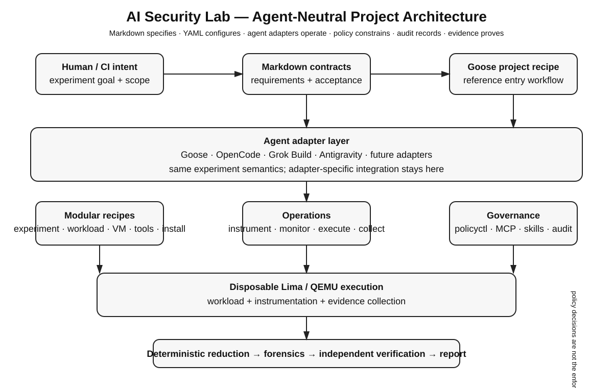

# AI Security Research Lab

> **An agent-neutral, modular, recipe-driven security research lab for controlled experimentation, evidence collection and independent verification.**

Markdown specifies the research contract. YAML configures reusable components. An agent adapter operates the workflow. Goose is the current reference adapter; OpenCode, Grok Build and Antigravity are documented adapter targets. `policyctl` is the only project CLI for host/security policy decisions and the local token-usage web dashboard. Lima/QEMU provide disposable execution isolation; evidence, audit records and independent verification establish what actually happened.



## Project workflow

```text
Human / CI intent → Markdown contract → Goose project recipe
                                      ↓
        Goose / OpenCode / Grok Build / Antigravity adapter
                                      ↓
          modular recipes + policyctl + MCP + skills + audit
                                      ↓
                       disposable Lima / QEMU VM
                                      ↓
          instrument → execute → collect → reduce → forensics
                                      ↓
             independent verification → report → preserve → destroy
```

The project defines **one operator contract**, not one provider-specific implementation. Goose is the maintained reference operator/executor. Other agents are adapters that consume the same Markdown contracts and YAML recipes. Adapters must not change experiment semantics, bypass policy decisions, suppress audit records, or claim unavailable capabilities as success.

## Deploy and run

### Prerequisites

Install/configure the selected agent first. For the reference path, install Goose and the host capabilities required by the experiment, typically Git, Bash, Lima and QEMU. Optional tools are declared by the tools recipe.

### Goose reference deployment

From the repository root:

```bash
./scripts/install.sh
```

This is a convenience bootstrap: it performs preflight and launches the reusable installation recipe. It is **not** a project controller and creates no hidden project state.

Run the complete project:

```bash
goose run --recipe recipes/goose/project.yaml --params experiment=go-install-001 --params section=project
```

Iterate on a numbered section:

```bash
goose run --recipe recipes/goose/project.yaml --params experiment=go-install-001 --params section=07
```

### Goose operator steps

| Step | Purpose |
|---|---|
| Discover | read Markdown contracts, experiment definitions and selected recipes |
| Validate | reject invalid or missing recipe references |
| Preflight | check host, VM and tool capabilities |
| Install | run the declared installation recipe when needed |
| Plan | create the proposed execution sequence |
| Review | use planner/reviewer roles to identify risky actions |
| Approve | obtain required human approval |
| Provision | create the disposable Lima/QEMU environment |
| Instrument | start telemetry before the workload |
| Execute | run only approved workloads and tools |
| Collect | capture runtime artifacts and audit records |
| Reduce | deterministically reduce large evidence where practical |
| Forensics | analyse collected evidence without altering originals |
| Verify | independently test important findings |
| Report | produce findings and the evidence manifest |
| Preserve | hash and preserve evidence before destruction |
| Destroy | remove the disposable VM after evidence is preserved |

Goose is the reference **operator/executor**, not the security boundary. VM isolation, OS permissions, mount controls, credential separation, network controls and approval workflows provide enforcement.

## Agent adapter steps

The shared project contract remains unchanged when another agent is used.

### OpenCode

1. Start OpenCode in the repository.
2. Load `AGENTS.md` and the applicable Markdown contract.
3. Resolve the same `recipes/` composition.
4. Map OpenCode tools, MCP and skills to registry-approved capabilities.
5. Implement the same validate → plan → approve → provision → instrument → execute → collect → verify → report → destroy lifecycle.
6. Emit the same audit and evidence references.

### Grok Build

1. Build the Grok integration as an adapter around the project contracts.
2. Expose only registry-approved tools and MCP servers.
3. Preserve `policyctl`, audit, evidence and approval semantics.
4. Keep Grok-specific prompts/configuration in the adapter layer.
5. Mark unavailable integration as `NOT_DEPLOYED` rather than silently substituting behavior.

### Antigravity

1. Follow `antigravity/README.md` and `11-current-antigravity-reference.md`.
2. Load canonical `.agents/` roles/skills and the MCP registry.
3. Resolve the same experiment, workload, VM, instrumentation and audit recipes.
4. Keep Antigravity-specific wiring outside shared experiment semantics.
5. Apply the same evidence and independent-verification lifecycle.

### Adapter boundary

```text
                 Shared project contracts
              Markdown + recipes + policy
                         ↓
       ┌────────── Agent adapter boundary ──────────┐
       │ Goose | OpenCode | Grok Build | Antigravity│
       └────────────────────┬───────────────────────┘
                            ↓
                 approved tools / MCP / skills
                            ↓
                    Lima / QEMU execution
                            ↓
              audit + evidence + verification
```

## Customize recipes

Recipes are **small, composable configuration units**. Do not turn `recipes/goose/project.yaml` into a monolith. Change the narrowest recipe that expresses the required capability and compose it from the experiment.

### Customization workflow

```text
Experiment
   ↓
Identify what changes
   ├─ workload
   ├─ VM profile
   ├─ host profile
   ├─ tools
   ├─ installation
   ├─ instrumentation / monitoring
   ├─ routing
   ├─ MCP / skills
   └─ stage / reporting
   ↓
Reference the recipe from experiment composition
   ↓
Validate
   ↓
Run through selected adapter
   ↓
Preserve evidence + audit
```

### Recipe schema

Recipe families do not need identical schemas. Each family should expose only the fields needed for its responsibility. A typical composable recipe looks like:

```yaml
version: "1"
title: Example capability
description: What this recipe provides
parameters:
  - key: experiment
    input_type: string
    requirement: required
components:
  - name: vm-profile
    path: ../lima/profiles/security-research.yaml
  - name: instrumentation
    path: ../instrumentation/default.yaml
policy:
  approval: required
execution:
  stages:
    - provision
    - instrument
    - execute
    - collect
evidence:
  preserve_before_destroy: required
```

Think of the schema as **identity → inputs → composition → constraints → execution/evidence requirements**. A workload recipe describes the workload; a VM profile describes VM resources; an instrumentation recipe describes telemetry; an adapter entry recipe describes how an agent consumes the project. Avoid unrelated fields simply for schema uniformity.

### Recipe structure

```text
recipes/
├── goose/              # Goose reference entry adapter
├── experiments/        # experiment composition
├── workloads/          # workload definitions
├── install/            # prerequisites and installation
├── host/               # host profiles
├── lima/profiles/      # disposable VM profiles
├── tools/              # tool inventory
├── instrumentation/    # telemetry profiles
├── agent-monitoring/   # agent/trace observation
├── agents/             # provider-neutral roles
├── orchestration/      # execution composition
├── routing/            # model/harness routing
├── stages/             # stage-to-contract mapping
├── reporting/          # reporting
├── token/              # token telemetry data
├── mcp/                # MCP registry
├── skills/             # skill registry
├── audit/              # audit layer
└── tests/              # deterministic validation
```

Safe customization: read the contract, choose the narrowest family, extend only where capability differs, keep credentials out of YAML/Git, keep privileged operations explicit and policy-controlled, update experiment composition, validate, then run through the selected adapter and preserve evidence.

## policyctl

`policyctl` is intentionally narrow: it owns **host/security policy configuration and the token-usage web dashboard only**. It is not a general project controller, experiment runner, agent harness or sandbox.

```bash
go build ./cmd/policyctl
./policyctl show
./policyctl validate
./policyctl check --action credentials
./policyctl check --action mounts
./policyctl check --action host-root
./policyctl check --action sudo
./policyctl check --action vm
./policyctl check --action network
./policyctl check --action git-write
./policyctl check --action push
./policyctl token-dashboard
```

A policy decision is not itself enforcement; the adapter must honor it and actual enforcement comes from host/VM security controls.

## Lifecycle and evidence

```text
discover → validate → preflight → install → plan → review → approve
→ provision → instrument → execute → collect → reduce → forensics
→ independent verification → report → preserve → destroy
```

Runtime `PASS` requires evidence. Configuration and AI assertions are not proof. Missing capabilities are `NOT_DEPLOYED`.

## MCP, skills and audit

- `recipes/mcp/registry.yaml` declares MCP capabilities and exposure rules.
- `recipes/skills/registry.yaml` declares reviewed reusable instructions.
- `recipes/audit/default.yaml` defines append-only audit records.
- `.agents/` contains provider-neutral roles, skills and MCP configuration.

Skills are instructions, not security boundaries. MCP arguments must not carry secrets. Audit distinguishes requested, approved, executed and observed actions.

## Validation

```bash
bash ./scripts/tests/validate-project.sh
bash ./scripts/tests/validate-recipes.sh
PYTHONPATH=scripts python3 -m unittest discover -s scripts/tests -v
go test ./...
```

GitHub Actions uses the project validation script for pushes and pull requests. CI failures should be investigated; they are not evidence of either security or insecurity.

## AI disclaimer

AI output can be incomplete, incorrect, stale, overconfident or unsafe. Generated plans, commands and findings are not evidence by themselves. Use deterministic tooling, captured telemetry, hashes, manifests and independent verification. Human researchers remain responsible for authorization, scope, approvals and final interpretation.

## Security model

Use the lab only against systems, software and workloads you own or are explicitly authorized to test.

- Untrusted workloads run inside disposable VMs.
- Host credentials and unrestricted host mounts are denied.
- Privileged/destructive operations require approval.
- Instrumentation starts before workload execution.
- Evidence is preserved and hashed before VM destruction.
- Large raw evidence is reduced deterministically before LLM analysis where practical.
- Important findings are independently verified.
- Local services bind to localhost by default.
- Missing controls are `NOT_DEPLOYED`, not success.

## Contribution guidelines

1. Read `AGENTS.md` and the relevant Markdown contract.
2. Prefer reusable contracts and YAML recipes over hard-coded agent logic.
3. Keep experiment semantics independent of the adapter.
4. Keep `policyctl` limited to policy and token-dashboard responsibilities.
5. Do not recreate the retired `labctl` project controller.
6. Never commit credentials, tokens, private keys or unrestricted host mounts.
7. Add/update tests for behavior changes.
8. Run validation before opening a PR.
9. Document adapter limitations and use `NOT_DEPLOYED` where appropriate.
10. For security-sensitive changes, document the threat model, enforcement point and evidence required.

## Documentation map

| Document | Purpose |
|---|---|
| `01-deployment-architecture.md` | architecture and boundaries |
| `02-system-requirements.md` | host and VM prerequisites |
| `03-deployment-runbook.md` | deployment and first run |
| `04-security-model.md` | threats and controls |
| `05-multi-agent-operating-model.md` | roles and handoffs |
| `06-observability-and-evidence.md` | telemetry and evidence |
| `07-experiment-framework.md` | reusable experiment design |
| `08-go-install-001.md` | acceptance experiment |
| `09-operations-and-maintenance.md` | upgrades and recovery |
| `10-validation-and-acceptance.md` | acceptance semantics |
| `11-current-antigravity-reference.md` | Antigravity adapter |
| `AI-DISCLAIMER.md` | AI limitations |
| `CONTRIBUTING.md` | contribution process |
| `SECURITY.md` | security reporting |

## Acceptance semantics

| State | Meaning |
|---|---|
| `PASS` | required runtime behavior demonstrated with evidence |
| `PARTIAL` | capability worked but coverage/evidence is incomplete |
| `FAIL` | required behavior was tested and did not meet the contract |
| `NOT_DEPLOYED` | capability was unavailable or intentionally disabled |

## License

MIT. See `LICENSE` and `NOTICE`.
