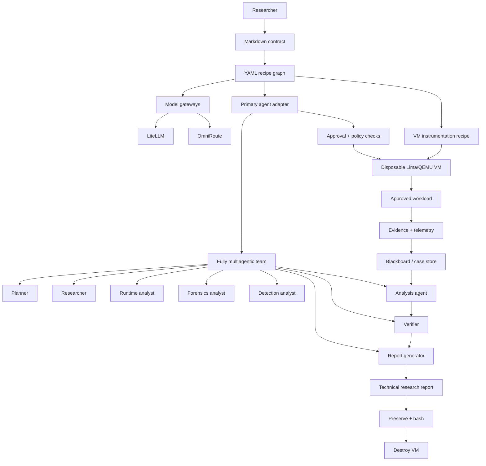

# 🦝 Cusimanse

**Cusimanse is a declarative, fully multiagentic security-research platform for controlled experiments.** Markdown contracts define research intent and safety constraints; YAML recipes define the experiment, agents, roles, skills, instrumentation, VM, gateways and reporting; the installation script is the host front door; `policyctl` is the governance boundary; and Lima/QEMU VMs provide the execution/isolation boundary.

> **Important:** Cusimanse reduces research risk; it is not a security guarantee. VM/OS isolation must be tested and independently assessed.

## Architecture




**One mental model:** contract = why, recipes = what/how, multiagent team = research execution, `policyctl` = governance boundary, VM/OS = execution boundary, instrumentation = VM observation, blackboard = durable evidence, verifier = independent challenge, report = final research output.

## 1. Install and prepare the host

Run these in the **normal host shell**. This is the installation and preparation front door:

```bash
git clone https://github.com/Opposum0112/Cusimanse.git
cd Cusimanse
git checkout architecture-refactor
./scripts/cusimanse-host.sh
exec "$SHELL" -l
```

The installer prepares prerequisites, Lima/QEMU support, the selected primary agent, security-research tools, observability/governance tooling and model gateways. It creates local configuration under `~/.config/cusimanse/`.

Validate the prepared host:

```bash
./policyctl validate
./scripts/agent-preflight.sh
./scripts/tests/production-validation.sh
command -v lima policyctl cusimanse-token-dashboard
```

## 2. Understand the research lifecycle

**You do not have to type every lifecycle word as separate shell commands.** The lifecycle is the execution contract that the agent follows. The researcher starts the agent shell and gives it a prompt that asks it to execute these stages in order. Human approval is required at the declared review/approval gate.

```text
discover
  ↓
validate
  ↓
preflight
  ↓
plan
  ↓
review / human approval
  ↓
provision disposable VM
  ↓
start VM instrumentation
  ↓
run approved workload
  ↓
collect evidence + telemetry
  ↓
hash / preserve evidence
  ↓
analyze evidence
  ↓
independent verification
  ↓
generate research report
  ↓
preserve final outputs
  ↓
destroy disposable VM
```

The agent should report the result of each stage. If a gate fails, the run stops rather than silently skipping it.

## 3. Start the agent/operator shell

The **normal host shell** installs and validates. The **agent/operator shell** is the primary agent CLI that drives the multiagentic research workflow.

For a Goose-based installation:

```bash
goose
```

The exact primary adapter is selected by the agent recipe. Do not run the workload directly from the normal host shell: the approved workload belongs inside the disposable VM.

## 4. Run the Go installation experiment

The repository provides a Go installation example:

```text
experiments/go-install-001/
recipes/experiments/go-install-001.yaml
```

Give the agent this prompt:

```text
Run the Cusimanse go-install-001 research case.

First discover the contract and all referenced YAML recipes. Validate the recipe graph,
preflight the host, identify the multiagent roles, VM profile, workload and VM-only
instrumentation, then produce the execution plan. Stop at the declared human
review/approval gate until I approve it.

After approval, provision the disposable Lima/QEMU VM. Start every instrumentation
component declared for this workload inside the VM before running the workload. Execute
the declared Go installation workload only inside that VM. Capture the declared raw
stdout/stderr, process, filesystem, DNS/network and security telemetry.

Preserve raw evidence and calculate SHA-256 hashes before VM destruction. Have the
analysis agent correlate evidence, have the independent verifier challenge material
findings, and have the report generator produce the technical research report.

Do not treat model output as evidence. Do not mount host credentials. Do not bypass
policy or approval gates. Destroy the VM only after evidence preservation succeeds.
Return the run ID, evidence path, verification path and research-report path.
```

## 5. npm supply-chain research example

For a software-supply-chain use case, use:

```bash
recipes/experiments/npm-install-001.yaml
```

This experiment observes npm installation **inside the disposable VM**. Its instrumentation recipe selects the VM-side process, filesystem, syscall, DNS/network and other approved telemetry. Instrumentation is not intended to run on the host for the workload.

Agent prompt:

```text
Run the Cusimanse npm-install-001 supply-chain research case.

Discover the Markdown contract and YAML recipe graph. Validate the configuration and
preflight the host. Identify all participating agents and roles, the VM profile,
the npm workload, VM-only instrumentation and evidence requirements. Produce the plan
and stop for human approval.

After approval, create the disposable Lima/QEMU VM and start the declared
instrumentation inside that VM before npm executes. Run only the approved npm workload
inside the VM. Capture package metadata and lock information plus the declared
stdout/stderr, process creation, filesystem changes, DNS/network activity, syscalls and
other VM telemetry.

Preserve raw artifacts first and calculate SHA-256 hashes. The analysis agent must
correlate the evidence and distinguish observation from inference. The independent
verifier must challenge each material supply-chain finding. The report generator must
produce a reproducible technical research report with evidence references, timeline,
findings, verification, provenance, hashes, limitations and reproduction steps.

Do not mount host credentials, do not weaken policy, and destroy the VM only after
preservation succeeds. Return the run ID and final artifact locations.
```

The research question is **what happened during installation and what evidence proves it**, not merely whether `npm install` returned success.

## 6. How the fully multiagentic model works

Cusimanse is **fully multiagentic**: the primary agent does not perform every research function as one monolithic role. The configured team delegates work to specialist roles, with durable evidence connecting their outputs.

| Role | Responsibility | Typical point in lifecycle |
|---|---|---|
| Planner | Converts contract/recipe into an executable research plan | discover → plan |
| Researcher | Frames questions, hypotheses, references and research tasks | discover → research |
| Runtime Analyst | Interprets VM execution and runtime telemetry | execution → analysis |
| Forensics Analyst | Correlates filesystem/process/artifact evidence | collection → analysis |
| Detection Analyst | Evaluates security/detection observations | analysis |
| Analysis Agent | Correlates evidence and constructs evidence-bounded conclusions | after collection |
| Verifier | Independently challenges findings and reproduction claims | verification |
| Report Generator | Converts verified findings into the technical research report | final output |

### CrewAI: where and how to use it

CrewAI is an **optional multiagent orchestration implementation**, not the security boundary. Use it when you want explicit role/task sequencing, delegation and specialist collaboration.

The pattern is:

```text
Primary agent adapter
        ↓
CrewAI orchestration layer (optional)
        ↓
Planner / Researcher / Runtime Analyst / Forensics /
Detection / Analysis / Verifier / Report Generator
        ↓
shared case context + blackboard evidence
```

Enable/configure CrewAI through the relevant YAML orchestration recipe rather than hard-coding roles in the workload. CrewAI can coordinate role tasks, but it cannot authorize execution, override `policyctl`, become the VM boundary, or turn model output into evidence. The operator adapter and governance boundary retain those responsibilities.

## 7. How to create a new experiment

A new experiment is **declarative**. Do not embed the experiment definition in the agent prompt.

Create these pieces:

```text
contracts/<case>.md                    # intent, scope, hypothesis, safety, acceptance
recipes/experiments/<case>.yaml        # workload + referenced recipe graph
recipes/instrumentation/<case>.yaml    # VM-side instrumentation/capture set
recipes/lima/<profile>.yaml            # disposable VM profile, if needed
experiments/<case>/                    # case-specific supporting files
```

The experiment YAML composes the required recipes for:

```text
workload
→ VM profile
→ VM-only instrumentation
→ agent adapter
→ specialist roles
→ skills
→ optional CrewAI orchestration
→ MCP/tool plugins
→ model gateway
→ evidence/analysis/reporting
→ governance/token accounting
```

Skills are also declarative: the YAML references the appropriate `SKILL.md`; the skill contains its instructions/scripts/evals/provenance. A candidate learned skill must pass replay/evaluation/independent verification and human approval before promotion.

The normal installation front door is:

```bash
./scripts/cusimanse-host.sh
```

The policy/governance boundary is:

```bash
./policyctl validate
```

**Installation prepares the environment; YAML + Markdown define the research; the agent executes the approved plan; `policyctl` remains outside the agent control plane; the VM/OS enforces execution isolation.**

## 8. Evidence and the research report

The **technical research report is the key human-reviewable output**. It must be generated from preserved evidence and verified findings, not merely from the agent conversation.

A run should produce a structure similar to:

```text
<case>/<run-id>/
├── run.yaml
├── audit/
├── evidence/                 # raw artifacts
├── telemetry/                # VM instrumentation output
├── provenance/               # collectors, timestamps, hashes
├── analysis/                 # evidence correlation
├── findings/                 # evidence-backed claims
├── verification/             # independent verifier output
└── research-report/          # final technical report
```

A report should answer: research question/hypothesis, exact workload and VM, instrumentation used, execution timeline, evidence supporting each finding, verifier conclusions, limitations and reproducibility steps.

## 9. Verify that the experiment really succeeded

Do not use the agent's final sentence or a zero exit code as the only success signal.

First locate the run:

```bash
find evidence blackboard reports -maxdepth 5 -type f | sort
```

Then run the repository verifier:

```bash
./scripts/verify-run.sh <run-directory>
```

It verifies the required run structure and SHA-256 provenance. You can also independently check the hash manifest:

```bash
cd <run-directory>
sha256sum -c provenance/hashes.sha256
```

A completed research run should have:

```text
workload result
+ preserved raw evidence
+ telemetry
+ valid SHA-256 provenance
+ evidence-backed analysis
+ independent verification
+ research report
+ VM destroyed after preservation
= successful research run
```

## 10. See token usage after the experiment

Token accounting is observability/governance data; it does not authorize execution.

After the experiment, from the **normal host shell**, run:

```bash
cusimanse-token-dashboard
```

The dashboard reads the session ledger at:

```text
reports/token-usage/usage.json
```

The default dashboard binds to `127.0.0.1:8787`. If you need to specify the location explicitly:

```bash
CUSIMANSE_TOKEN_DASHBOARD_ADDR=127.0.0.1:8787 \
CUSIMANSE_TOKEN_USAGE_FILE=reports/token-usage/usage.json \
cusimanse-token-dashboard
```

The ledger records session/agent/model input tokens, output tokens, total tokens, tool calls, cache usage, estimated cost and optimization notes when available. Ponytail, Numbat and Miller are optional optimization/observability capabilities; unavailable upstream tools are reported as `NOT_DEPLOYED` rather than treated as installed.

## 11. Where instrumentation runs

**Workload instrumentation is VM-only.** The host installs and prepares instrumentation tooling, but the workload observation itself is executed against the workload inside the disposable Lima/QEMU VM.

```text
HOST
  install / configure
        ↓
LIMA/QEMU VM
  instrumentation starts
        ↓
  workload executes
        ↓
  telemetry + raw evidence
        ↓
  blackboard / evidence store
```

The workload instrumentation set is selected declaratively before execution by the instrumentation recipe referenced by the experiment recipe. The agent must not invent additional instrumentation after execution has started.

## 12. Integration testing this branch

Run static repository validation first:

```bash
./scripts/tests/production-validation.sh
```

Then perform the real disposable-VM integration test on a host with Lima/QEMU:

```bash
export CUSIMANSE_LIMA_PROFILE=recipes/lima/<reviewed-profile>.yaml
./scripts/tests/runtime-integration.sh
```

The runtime test provisions a disposable VM, runs the safe smoke workload, collects evidence, hashes it, optionally exercises npm if available, and destroys the VM on exit. It is intentionally separate from ordinary static CI because GitHub CI may not provide the required Lima/QEMU virtualization environment.

After the runtime test, verify the generated run with:

```bash
./scripts/verify-run.sh <run-directory>
```

**Branch acceptance requires both:** static validation passes **and** a successful Lima/QEMU runtime test on a suitable research host. Do not call the branch production-ready from static CI alone.

## Key paths

```text
contracts/                         Research intent and safety constraints
recipes/                           Declarative configuration
recipes/experiments/               Experiment definitions
recipes/instrumentation/           VM-only workload instrumentation
recipes/roles/                     Specialist roles
recipes/skills/                    Skill references
recipes/gateways/                  LiteLLM / OmniRoute configuration
recipes/lima/                      Disposable VM profiles
experiments/                       Research cases
blackboard/                        Durable evidence/case model
scripts/cusimanse-host.sh          Installation/preparation front door
scripts/verify-run.sh              Run/evidence verification
scripts/tests/production-validation.sh  Static integration validation
scripts/tests/runtime-integration.sh    Disposable-VM runtime validation
policyctl                          Governance/policy boundary
```

## Safety boundary

Keep credentials out of workloads, avoid unsafe host mounts, use appropriately isolated networking, review contracts and recipes before approval, preserve evidence before VM destruction, and independently verify important findings. `policyctl` is outside the agent control plane; neither the model, role, skill, CrewAI, MCP, gateway nor report generator is the security boundary.
