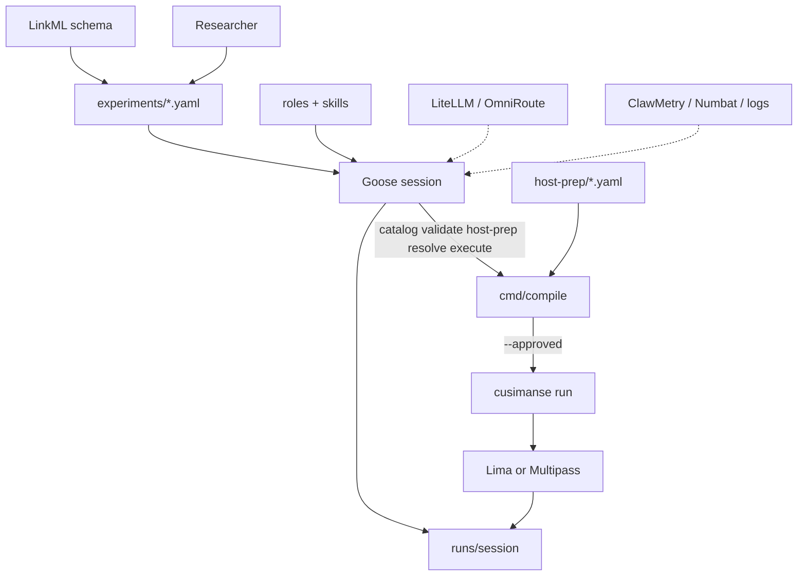

# Cusimanse (`agentic-native-goose`)

Goose-driven, schema-backed security research lab. Write one experiment YAML. Goose plans, orchestrates specialist roles, operates declared host-prep, requests approval, runs the compiler, analyses evidence, and writes the report.

Beta research framework. Not a certified sandbox.

## Table of contents

1. [What this branch is](#what-this-branch-is)
2. [Architecture](#architecture)
3. [Repository structure](#repository-structure)
4. [Which shell to use](#which-shell-to-use)
5. [Install](#install)
6. [Run with Goose](#run-with-goose)
7. [Run with the compiler only](#run-with-the-compiler-only)
8. [Go commands](#go-commands)
9. [Tests and CI](#tests-and-ci)
10. [Safety](#safety)

## What this branch is

| Layer | What it is |
|---|---|
| LinkML + JSON Schema | Contract fields and enums |
| `experiments/*.yaml` | The experiment |
| Goose session recipe | Planner, orchestrator, operator |
| `cmd/compile` | Interprets every declarative YAML Goose is allowed to act on |
| `cmd/cusimanse` | Provision engine the compiler calls after `--approved` |
| Gateway / ClawMetry | External integrations only |

Markdown under `contracts/` is not authoritative.

## Architecture

Goose talks to the compiler. The compiler talks to disposable compute. The model does not invent `limactl` or host `npm`.



Source: `docs/architecture/agentic-native-goose.mmd`.

## Repository structure

```text
schemas/                 contract language
experiments/             experiment YAML (source of truth)
host-prep/               declared host bootstrap
roles/  skills/          specialist roles and SKILL.md
recipes/goose/           one Goose operator recipe
cmd/compile              YAML compiler Goose calls
cmd/cusimanse            existing VM/policy engine
internal/compiler        compile library
internal/policy          policy used at execute time
policies/                policy YAML
scripts/install.sh       host bootstrap helper used by host-prep
scripts/tests/           compiler + integration CI
```

## Which shell to use

| You want | Shell | Why |
|---|---|---|
| Drive the whole experiment | **Goose** (`goose run …`) | Planner and operator |
| CI, debug YAML, no agent | **Normal bash / zsh** + `go run ./cmd/compile` | Same documents, no model |
| Guest workload | **Not your host shell** | Compiler + disposable VM |

Do not run experiment `npm` / `go install` in the same terminal you use for Goose unless you are only compiling or validating YAML.

## Install

Use a normal login shell (bash or zsh), not a Goose session:

```bash
git clone https://github.com/Opposum0112/Cusimanse.git
cd Cusimanse
git checkout agentic-native-goose
./scripts/install.sh
export PATH="$HOME/.local/bin:$HOME/go/bin:$PATH"
go version
goose --version
```

Needs Go 1.22+, Goose, Node/npm for npm experiments, and Lima or Multipass for a live guest.

## Run with Goose

```bash
goose recipe validate recipes/goose/session.yaml
goose run --recipe recipes/goose/session.yaml --params experiment=npm-install-001
```

Goose should call, in order:

```text
go run ./cmd/compile catalog
go run ./cmd/compile validate npm-install-001
go run ./cmd/compile host-prep npm-install-001
go run ./cmd/compile resolve npm-install-001
go run ./cmd/compile execute npm-install-001 --approved
```

Then Summon verifier and reporter.

## Run with the compiler only

Normal shell:

```bash
go run ./cmd/compile catalog
go run ./cmd/compile validate npm-install-001
go run ./cmd/compile host-prep npm-install-001
go run ./cmd/compile resolve npm-install-001
go run ./cmd/compile execute npm-install-001 --approved
```

`execute` without `--approved` must fail. With `--approved` it runs `cusimanse --approved run <id>` if that binary is on `PATH`.

## Go commands

```bash
go test ./internal/compiler ./cmd/compile ./cmd/cusimanse
go build -o /tmp/compile ./cmd/compile
go build -o /tmp/cusimanse ./cmd/cusimanse
```

Validated on this branch:

- `compile catalog` loads experiments, host-prep, roles, bindings, skills
- `compile validate|resolve|host-prep` for all four reference ids
- `compile execute` requires `--approved`

## Tests and CI

```bash
bash ./scripts/tests/validate.sh
bash ./scripts/tests/integration.sh
```

Workflows: `.github/workflows/agentic-native.yml` and `.github/workflows/validate.yml`.

## Safety

Workloads belong in a disposable guest after approval. Host execution of experiment payloads is out of scope. Missing optional observability or gateway tools are `NOT_DEPLOYED`.
